# UML — bootstrap

Generated by `cat-harness/scripts/gen-uml-overview.ts` — do not edit. Every named sub-graph the `bootstrap` instance declares, one box each, with the node schema kinds found in it.

**Sources (same model):** [PlantUML](https://github.com/litlfred/folio-assistant/blob/main/cat-harness/uml/overview/bootstrap.puml) · [Mermaid](https://github.com/litlfred/folio-assistant/blob/main/cat-harness/uml/overview/bootstrap.mmd)

  <fieldset class="fa-uml-view-pick">
    <legend>Layout</legend>
    <input type="radio" name="fa-uml-overview_bootstrap" id="fa-uml-overview_bootstrap-portrait" class="fa-uml-pick-portrait" checked><label for="fa-uml-overview_bootstrap-portrait">Portrait</label>
    <input type="radio" name="fa-uml-overview_bootstrap" id="fa-uml-overview_bootstrap-landscape" class="fa-uml-pick-landscape"><label for="fa-uml-overview_bootstrap-landscape">Landscape</label>
  </fieldset>
  <figure class="bpmn-figure fa-uml-portrait">
    
  </figure>
  <figure class="bpmn-figure fa-uml-landscape">
    
  </figure>

| sub-graph | directory | graph kinds | node schema | nodes | cohesion | in | out |
|---|---|---|---|---|---|---|---|
| `bootstrap/cat-harness` | `bootstrap/skills` | skills | skills: *could not determine* | 8 | 0.32 | 17 | 0 |
| `bootstrap/schemas` | `bootstrap/schemas` | schemas | `schema: discussion.input.schema.json`; `schema: discussion.output.schema.json`; `schema: graph.schema.json` | *not measured* | | | |
| `bootstrap/scenarios` | `bootstrap/scenarios` | scenarios | `RoleGraphSchema` | *not measured* | | | |
| `bootstrap/processes` | `bootstrap/processes` | processes | `ext: omg-bpmn-2.0` | 3 | 0.12 | 0 | 15 |
| `bootstrap/models` | `bootstrap/models` | models | `ModelRegistrySchema` | *not measured* | | | |
| `bootstrap/glossary` | `bootstrap/glossary` | glossary | `ts: Ledger` | *not measured* | | | |
| `bootstrap/bootstrap-translations` | `bootstrap/translations` | translation-sources | `TranslationConfigSchema` | *not measured* | | | |

*Nodes, cohesion, in and out* are the detangler's pinned measurements for the same directory (`bun run kg:detangle`; skill [`graph-detanglement`](https://github.com/litlfred/folio-assistant/blob/main/cat-harness/skills/graph-management/graph-detanglement.md)). *Not measured* means the detangler does not scan that directory, not that it has no edges.

## Sub-graphs

- [bootstrap/cat-harness](bootstrap/cat-harness.html)
- [bootstrap/schemas](bootstrap/schemas.html)
- [bootstrap/scenarios](bootstrap/scenarios.html)
- [bootstrap/processes](bootstrap/processes.html)
- [bootstrap/models](bootstrap/models.html)
- [bootstrap/glossary](bootstrap/glossary.html)
- [bootstrap/bootstrap-translations](bootstrap/bootstrap-translations.html)

## The same model, drawn by Mermaid

Kept so the page renders even where the PlantUML image is missing, and because Mermaid nodes carry the CSS class that colours them from `uml.css`.

```mermaid
classDiagram
  direction LR
  namespace bootstrap__cat_harness {
    class n_bootstrap_cat_harness_skills["skills: no node schema"] {
      <<could not determine>>
    }
  }
  namespace bootstrap__schemas {
    class bootstrap_schemas_discussion_input_schema_json_KnownRepository["KnownRepository"] {
      <<schema: discussion.input.schema.json>>
      url [1] string
      role [1] read-from | written-to
      note [0..1] string
    }
    class bootstrap_schemas_discussion_input_schema_json_Discussion_Input["Discussion Input"] {
      <<schema: discussion.input.schema.json>>
      open [1..*] list~harness | repositories~
      askedOf [1] object
      candidates [0..*] string[]
      knownRepositories [0..*] KnownRepository[]
      context [0..1] string
    }
    class bootstrap_schemas_discussion_output_schema_json_Repository["Repository"] {
      <<schema: discussion.output.schema.json>>
      url [1] string
      role [1] read-from | written-to
      note [0..1] string
    }
    class bootstrap_schemas_discussion_output_schema_json_Exchange["Exchange"] {
      <<schema: discussion.output.schema.json>>
      asked [1] string
      answered [0..1] string
      at [0..1] string~date-time~
    }
    class bootstrap_schemas_discussion_output_schema_json_Discussion_Output["Discussion Output"] {
      <<schema: discussion.output.schema.json>>
      outcome [1] settled | unsettled
      harness [0..1] string
      repositories [0..*] Repository[]
      determinedBy [0..1] asked | assumed
      assumption [0..1] string
      answeredBy [1] object
      exchange [1..*] Exchange[]
      stillOpen [0..*] list~harness | repositories~
    }
    class bootstrap_schemas_graph_schema_json_Directory["Directory"] {
      <<schema: graph.schema.json>>
      id [1] string
      path [1] string
      graphKinds [1..*] string[]
      description [0..1] string
    }
    class bootstrap_schemas_graph_schema_json_Asset["Asset"] {
      <<schema: graph.schema.json>>
      id [1] string
      src [1] string
      role [1] string
    }
    class bootstrap_schemas_graph_schema_json_Knowledge_Graph_declaration["Knowledge Graph declaration"] {
      <<schema: graph.schema.json>>
      name [1] string
      title [0..1] string
      description [0..1] string
      directories [0..*] Directory[]
      assets [0..*] Asset[]
    }
  }
  namespace bootstrap__scenarios {
    class bootstrap_scenarios_Role["Role"] {
      <<json: RoleGraphSchema>>
      persona [0..1] string
      voice [0..1] string
      useCases [0..*] string[]
      id [1] string
      title [1] string
      description [1] string
      actorKinds [1..*] list~person | agent | system | external~
      lanes [0..*] string[]
      skills [0..*] string[]
      inherits [0..*] string[]
      actedUpon [0..1] boolean
      judgementOnly [0..1] boolean
    }
    class bootstrap_scenarios_Actor["Actor"] {
      <<json: RoleGraphSchema>>
      id [1] string
      title [1] string
      kind [1] person | agent | system | external
      description [0..1] string
      roles [0..*] string[]
    }
    class bootstrap_scenarios_RoleGraph["RoleGraph"] {
      <<json: RoleGraphSchema>>
      name [1] string
      roles [0..*] Role[]
      actors [0..*] Actor[]
    }
  }
  namespace bootstrap__processes {
    class bootstrap_processes_omg_bpmn_2_0["Business Process Model and Notation (BPMN)"] {
      <<ext: omg-bpmn-2.0>>
      bpmn:callActivity [0..*] element
      bpmn:collaboration [0..*] element
      bpmn:definitions [0..*] element
      bpmn:documentation [0..*] element
      bpmn:endEvent [0..*] element
      bpmn:exclusiveGateway [0..*] element
      bpmn:extensionElements [0..*] element
      bpmn:flowNodeRef [0..*] element
      bpmn:import [0..*] element
      bpmn:incoming [0..*] element
      bpmn:lane [0..*] element
      bpmn:laneSet [0..*] element
      bpmn:outgoing [0..*] element
      bpmn:parallelGateway [0..*] element
      bpmn:participant [0..*] element
      bpmn:process [0..*] element
      bpmn:sequenceFlow [0..*] element
      bpmn:serviceTask [0..*] element
      bpmn:startEvent [0..*] element
      bpmn:task [0..*] element
      bpmn:timerEventDefinition [0..*] element
      bpmn:userTask [0..*] element
    }
  }
  namespace bootstrap__models {
    class bootstrap_models_Model["Model"] {
      <<json: ModelRegistrySchema>>
      id [1] string
      title [1] string
      preferredLanguages [0..*] string[]
      validation [1] unverified | self-reported | human-validated
      validatedBy [0..1] string
      validatedOn [0..1] string
      note [0..1] string
    }
    class bootstrap_models_ModelRegistry["ModelRegistry"] {
      <<json: ModelRegistrySchema>>
      $schema [1] 'folio-model-registry/v1'
      models [0..*] Model[]
    }
  }
  namespace bootstrap__glossary {
    class bootstrap_glossary_folio_glossary_ledger_v1["folio-glossary-ledger/v1"] {
      <<ts: Ledger>>
      $schema [1] string
      instance [1] string
      concepts [1] Record~string, LedgerEntry~
    }
  }
  namespace bootstrap__bootstrap_translations {
    class bootstrap_bootstrap_translations_TranslationConfig["TranslationConfig"] {
      <<json: TranslationConfigSchema>>
      defaultLocale [0..1] string
      supportedLocales [0..*] string[]
      translationDir [0..1] string
      potGranularity [0..1] block | chapter | folio
      officialRequired [0..1] boolean
    }
  }
  cssClass "n_bootstrap_cat_harness_skills" fa_uml_kind_skills
  cssClass "n_bootstrap_cat_harness_skills" fa_uml_undetermined
  bootstrap_schemas_discussion_input_schema_json_Discussion_Input *-- "0..*" bootstrap_schemas_discussion_input_schema_json_KnownRepository : knownRepositories
  bootstrap_schemas_discussion_output_schema_json_Discussion_Output *-- "0..*" bootstrap_schemas_discussion_output_schema_json_Repository : repositories
  bootstrap_schemas_discussion_output_schema_json_Discussion_Output *-- "1..*" bootstrap_schemas_discussion_output_schema_json_Exchange : exchange
  bootstrap_schemas_graph_schema_json_Knowledge_Graph_declaration *-- "0..*" bootstrap_schemas_graph_schema_json_Directory : directories
  bootstrap_schemas_graph_schema_json_Knowledge_Graph_declaration *-- "0..*" bootstrap_schemas_graph_schema_json_Asset : assets
  cssClass "bootstrap_schemas_discussion_input_schema_json_KnownRepository" fa_uml_kind_schemas
  cssClass "bootstrap_schemas_discussion_input_schema_json_Discussion_Input" fa_uml_kind_schemas
  cssClass "bootstrap_schemas_discussion_output_schema_json_Repository" fa_uml_kind_schemas
  cssClass "bootstrap_schemas_discussion_output_schema_json_Exchange" fa_uml_kind_schemas
  cssClass "bootstrap_schemas_discussion_output_schema_json_Discussion_Output" fa_uml_kind_schemas
  cssClass "bootstrap_schemas_graph_schema_json_Directory" fa_uml_kind_schemas
  cssClass "bootstrap_schemas_graph_schema_json_Asset" fa_uml_kind_schemas
  cssClass "bootstrap_schemas_graph_schema_json_Knowledge_Graph_declaration" fa_uml_kind_schemas
  bootstrap_scenarios_RoleGraph *-- "0..*" bootstrap_scenarios_Role : roles
  bootstrap_scenarios_RoleGraph *-- "0..*" bootstrap_scenarios_Actor : actors
  cssClass "bootstrap_scenarios_Role" fa_uml_kind_scenarios
  cssClass "bootstrap_scenarios_Actor" fa_uml_kind_scenarios
  cssClass "bootstrap_scenarios_RoleGraph" fa_uml_kind_scenarios
  cssClass "bootstrap_processes_omg_bpmn_2_0" fa_uml_kind_processes
  bootstrap_models_ModelRegistry *-- "0..*" bootstrap_models_Model : models
  cssClass "bootstrap_models_Model" fa_uml_kind_models
  cssClass "bootstrap_models_ModelRegistry" fa_uml_kind_models
  cssClass "bootstrap_glossary_folio_glossary_ledger_v1" fa_uml_kind_glossary
  cssClass "bootstrap_bootstrap_translations_TranslationConfig" fa_uml_kind_translation_sources
```

