# UML — bootstrap

Generated by `cat-harness/scripts/gen-uml-overview.ts` — do not edit. Every named sub-graph the `bootstrap` harness declares, one box each, with the node schema kinds found in it.

**Sources (same model):** [PlantUML](https://github.com/litlfred/folio-assistant/blob/main/cat-harness/uml/overview/bootstrap.puml) · [Mermaid](https://github.com/litlfred/folio-assistant/blob/main/cat-harness/uml/overview/bootstrap.mmd)

```mermaid
classDiagram
  direction TB
  namespace bootstrap__cat_harness {
    class bootstrap_cat_harness_folio_voice_v1_Source["Source"] {
      <<json: VoiceProfileSchema>>
    }
    class bootstrap_cat_harness_folio_voice_v1_Pattern["Pattern"] {
      <<json: VoiceProfileSchema>>
    }
    class bootstrap_cat_harness_folio_voice_v1_Terminology["Terminology"] {
      <<json: VoiceProfileSchema>>
    }
    class bootstrap_cat_harness_folio_voice_v1_Rule["Rule"] {
      <<json: VoiceProfileSchema>>
    }
    class bootstrap_cat_harness_folio_voice_v1_folio_voice_v1["folio-voice/v1"] {
      <<json: VoiceProfileSchema>>
    }
    class bootstrap_cat_harness_folio_voice_skill_v1_Source["Source"] {
      <<json: VoiceSkillSchema>>
    }
    class bootstrap_cat_harness_folio_voice_skill_v1_Pattern["Pattern"] {
      <<json: VoiceSkillSchema>>
    }
    class bootstrap_cat_harness_folio_voice_skill_v1_Terminology["Terminology"] {
      <<json: VoiceSkillSchema>>
    }
    class bootstrap_cat_harness_folio_voice_skill_v1_Rule["Rule"] {
      <<json: VoiceSkillSchema>>
    }
    class bootstrap_cat_harness_folio_voice_skill_v1_folio_voice_skill_v1["folio-voice-skill/v1"] {
      <<json: VoiceSkillSchema>>
    }
    class bootstrap_cat_harness_kg_qa_manifest_v1_kg_qa_manifest_v1["kg-qa-manifest/v1"] {
      <<json: KgQaManifestSchema>>
    }
  }
  namespace bootstrap__schemas {
    class bootstrap_schemas_http___json_schema_org_draft_07_schema_["JSON Schema draft-07"] {
      <<ext: JSON Schema draft-07>>
    }
    class bootstrap_schemas_https___json_schema_org_draft_2020_12_schema["JSON Schema 2020-12"] {
      <<ext: JSON Schema 2020-12>>
    }
    class bootstrap_schemas_folio_source_descriptor_v1_Identifier["Identifier"] {
      <<json: SourceDescriptorSchema>>
    }
    class bootstrap_schemas_folio_source_descriptor_v1_folio_source_descriptor_v1["folio-source-descriptor/v1"] {
      <<json: SourceDescriptorSchema>>
    }
  }
  namespace bootstrap__scenarios {
    class bootstrap_scenarios_Role["Role"] {
      <<json: RoleGraphSchema>>
    }
    class bootstrap_scenarios_Actor["Actor"] {
      <<json: RoleGraphSchema>>
    }
    class bootstrap_scenarios_RoleGraph["RoleGraph"] {
      <<json: RoleGraphSchema>>
    }
  }
  namespace bootstrap__processes {
    class bootstrap_processes_omg_bpmn_2_0["Business Process Model and Notation (BPMN)"] {
      <<ext: omg-bpmn-2.0>>
    }
  }
  namespace bootstrap__models {
    class bootstrap_models_Model["Model"] {
      <<json: ModelRegistrySchema>>
    }
    class bootstrap_models_ModelRegistry["ModelRegistry"] {
      <<json: ModelRegistrySchema>>
    }
  }
  namespace bootstrap__glossary {
    class bootstrap_glossary_folio_glossary_ledger_v1["folio-glossary-ledger/v1"] {
      <<ts: Ledger>>
    }
  }
  namespace bootstrap__bootstrap_translations {
    class bootstrap_bootstrap_translations_TranslationConfig["TranslationConfig"] {
      <<json: TranslationConfigSchema>>
    }
  }
  bootstrap_cat_harness_folio_voice_v1_folio_voice_v1 *-- "1..*" bootstrap_cat_harness_folio_voice_v1_Source : sources
  bootstrap_cat_harness_folio_voice_v1_Rule *-- "0..*" bootstrap_cat_harness_folio_voice_v1_Pattern : patterns
  bootstrap_cat_harness_folio_voice_v1_Rule *-- "0..*" bootstrap_cat_harness_folio_voice_v1_Terminology : terminology
  bootstrap_cat_harness_folio_voice_v1_folio_voice_v1 *-- "1..*" bootstrap_cat_harness_folio_voice_v1_Rule : rules
  bootstrap_cat_harness_folio_voice_skill_v1_folio_voice_skill_v1 *-- "0..*" bootstrap_cat_harness_folio_voice_skill_v1_Source : sources
  bootstrap_cat_harness_folio_voice_skill_v1_Rule *-- "0..*" bootstrap_cat_harness_folio_voice_skill_v1_Pattern : patterns
  bootstrap_cat_harness_folio_voice_skill_v1_Rule *-- "0..*" bootstrap_cat_harness_folio_voice_skill_v1_Terminology : terminology
  bootstrap_cat_harness_folio_voice_skill_v1_folio_voice_skill_v1 *-- "1..*" bootstrap_cat_harness_folio_voice_skill_v1_Rule : rules
  cssClass "bootstrap_cat_harness_folio_voice_v1_Source" fa_uml_kind_skills
  cssClass "bootstrap_cat_harness_folio_voice_v1_Pattern" fa_uml_kind_skills
  cssClass "bootstrap_cat_harness_folio_voice_v1_Terminology" fa_uml_kind_skills
  cssClass "bootstrap_cat_harness_folio_voice_v1_Rule" fa_uml_kind_skills
  cssClass "bootstrap_cat_harness_folio_voice_v1_folio_voice_v1" fa_uml_kind_skills
  cssClass "bootstrap_cat_harness_folio_voice_skill_v1_Source" fa_uml_kind_skills
  cssClass "bootstrap_cat_harness_folio_voice_skill_v1_Pattern" fa_uml_kind_skills
  cssClass "bootstrap_cat_harness_folio_voice_skill_v1_Terminology" fa_uml_kind_skills
  cssClass "bootstrap_cat_harness_folio_voice_skill_v1_Rule" fa_uml_kind_skills
  cssClass "bootstrap_cat_harness_folio_voice_skill_v1_folio_voice_skill_v1" fa_uml_kind_skills
  cssClass "bootstrap_cat_harness_kg_qa_manifest_v1_kg_qa_manifest_v1" fa_uml_kind_skills
  bootstrap_schemas_folio_source_descriptor_v1_folio_source_descriptor_v1 *-- "1..*" bootstrap_schemas_folio_source_descriptor_v1_Identifier : identifiers
  cssClass "bootstrap_schemas_http___json_schema_org_draft_07_schema_" fa_uml_kind_schemas
  cssClass "bootstrap_schemas_https___json_schema_org_draft_2020_12_schema" fa_uml_kind_schemas
  cssClass "bootstrap_schemas_folio_source_descriptor_v1_Identifier" fa_uml_kind_schemas
  cssClass "bootstrap_schemas_folio_source_descriptor_v1_folio_source_descriptor_v1" fa_uml_kind_schemas
  bootstrap_scenarios_RoleGraph *-- "0..*" bootstrap_scenarios_Role : roles
  bootstrap_scenarios_RoleGraph *-- "0..*" bootstrap_scenarios_Actor : actors
  cssClass "bootstrap_scenarios_Role" fa_uml_kind_scenarios
  cssClass "bootstrap_scenarios_Actor" fa_uml_kind_scenarios
  cssClass "bootstrap_scenarios_RoleGraph" fa_uml_kind_scenarios
  cssClass "bootstrap_processes_omg_bpmn_2_0" fa_uml_kind_processes
  bootstrap_models_ModelRegistry *-- "0..*" bootstrap_models_Model : models
  cssClass "bootstrap_models_Model" fa_uml_kind_models
  cssClass "bootstrap_models_ModelRegistry" fa_uml_kind_models
  cssClass "bootstrap_glossary_folio_glossary_ledger_v1" fa_uml_kind_glossary
  cssClass "bootstrap_bootstrap_translations_TranslationConfig" fa_uml_kind_translation_sources
```

| sub-graph | directory | graph kinds | node schema |
|---|---|---|---|
| `bootstrap/cat-harness` | `bootstrap/skills` | skills | `VoiceProfileSchema`; `VoiceSkillSchema`; `KgQaManifestSchema` |
| `bootstrap/schemas` | `bootstrap/schemas` | schemas | `ext: JSON Schema draft-07`; `ext: JSON Schema 2020-12`; `SourceDescriptorSchema` |
| `bootstrap/scenarios` | `bootstrap/scenarios` | scenarios | `RoleGraphSchema` |
| `bootstrap/processes` | `bootstrap/processes` | processes | `ext: omg-bpmn-2.0` |
| `bootstrap/models` | `bootstrap/models` | models | `ModelRegistrySchema` |
| `bootstrap/glossary` | `bootstrap/glossary` | glossary | `ts: Ledger` |
| `bootstrap/bootstrap-translations` | `bootstrap/translations` | translation-sources | `TranslationConfigSchema` |

## Sub-graphs

- [bootstrap/cat-harness](bootstrap/cat-harness.html)
- [bootstrap/schemas](bootstrap/schemas.html)
- [bootstrap/scenarios](bootstrap/scenarios.html)
- [bootstrap/processes](bootstrap/processes.html)
- [bootstrap/models](bootstrap/models.html)
- [bootstrap/glossary](bootstrap/glossary.html)
- [bootstrap/bootstrap-translations](bootstrap/bootstrap-translations.html)
