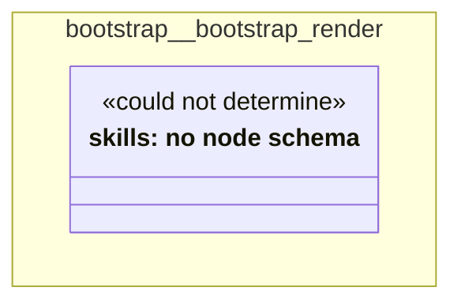

# UML — bootstrap/bootstrap-render

Generated by `cat-harness/scripts/gen-uml-overview.ts` — do not edit. The `bootstrap-render` sub-graph of `bootstrap` (`bootstrap/tools`), with every attribute read from its node schema.

**Sources (same model):** [PlantUML](https://github.com/litlfred/folio-assistant/blob/main/cat-harness/uml/overview/bootstrap/bootstrap-render.puml) · [Mermaid](https://github.com/litlfred/folio-assistant/blob/main/cat-harness/uml/overview/bootstrap/bootstrap-render.mmd)

| sub-graph | directory | graph kinds | node schema |
|---|---|---|---|
| `bootstrap/bootstrap-render` | `bootstrap/tools` | skills | skills: *could not determine* |

## Sub-graphs

- [← all of bootstrap](../bootstrap.html)
