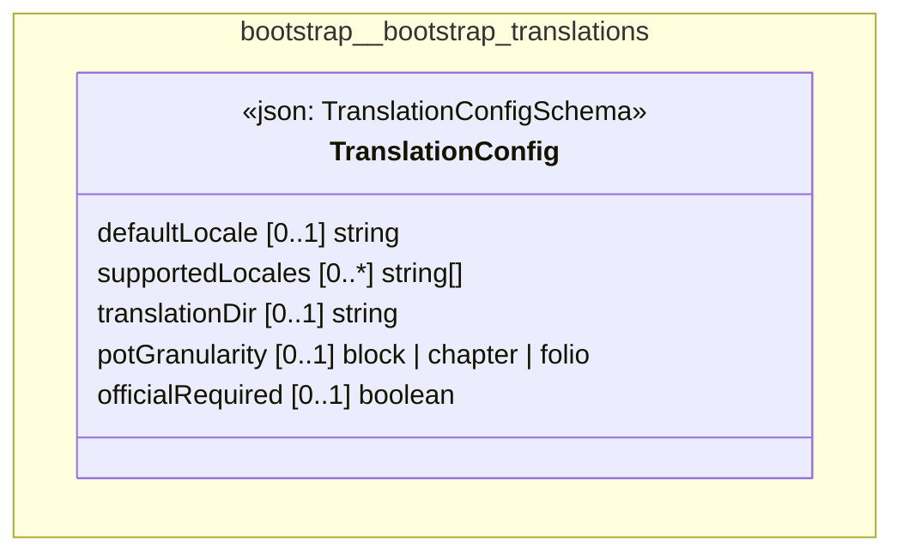

# UML — bootstrap/bootstrap-translations

Generated by `cat-harness/scripts/gen-uml-overview.ts` — do not edit. The `bootstrap-translations` sub-graph of `bootstrap` (`bootstrap/translations`), with every attribute read from its node schema.

**Sources (same model):** [PlantUML](https://github.com/litlfred/folio-assistant/blob/main/cat-harness/uml/overview/bootstrap/bootstrap-translations.puml) · [Mermaid](https://github.com/litlfred/folio-assistant/blob/main/cat-harness/uml/overview/bootstrap/bootstrap-translations.mmd)

| sub-graph | directory | graph kinds | node schema |
|---|---|---|---|
| `bootstrap/bootstrap-translations` | `bootstrap/translations` | translation-sources | `TranslationConfigSchema` |

## Sub-graphs

- [← all of bootstrap](../bootstrap.html)
