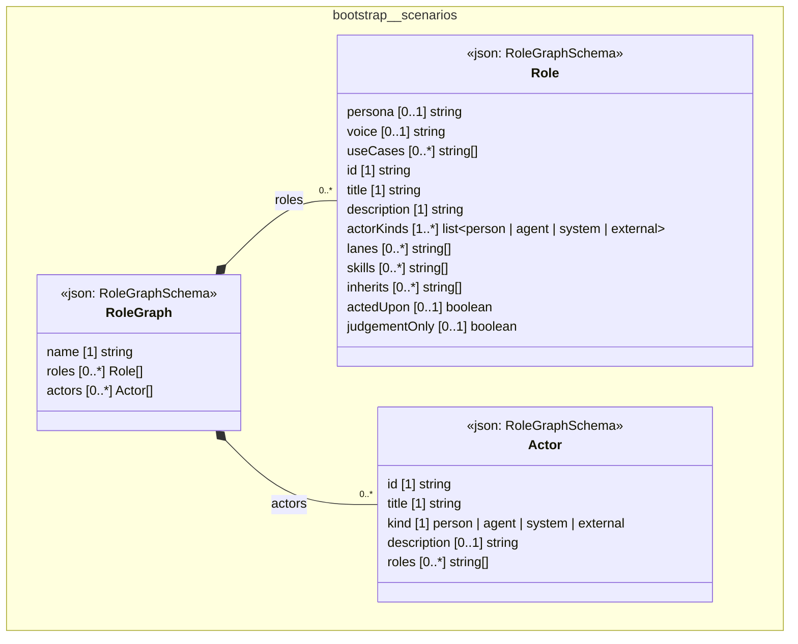

# UML — bootstrap/scenarios

Generated by `cat-harness/scripts/gen-uml-overview.ts` — do not edit. The `scenarios` sub-graph of `bootstrap` (`bootstrap/scenarios`), with every attribute read from its node schema.

**Sources (same model):** [PlantUML](https://github.com/litlfred/folio-assistant/blob/main/cat-harness/uml/overview/bootstrap/scenarios.puml) · [Mermaid](https://github.com/litlfred/folio-assistant/blob/main/cat-harness/uml/overview/bootstrap/scenarios.mmd)

  <fieldset class="fa-uml-view-pick">
    <legend>Layout</legend>
    <input type="radio" name="fa-uml-overview_bootstrap_scenarios" id="fa-uml-overview_bootstrap_scenarios-portrait" class="fa-uml-pick-portrait" checked><label for="fa-uml-overview_bootstrap_scenarios-portrait">Portrait</label>
    <input type="radio" name="fa-uml-overview_bootstrap_scenarios" id="fa-uml-overview_bootstrap_scenarios-landscape" class="fa-uml-pick-landscape"><label for="fa-uml-overview_bootstrap_scenarios-landscape">Landscape</label>
  </fieldset>
  <figure class="bpmn-figure fa-uml-portrait">
    
  </figure>
  <figure class="bpmn-figure fa-uml-landscape">
    
  </figure>

| sub-graph | directory | graph kinds | node schema |
|---|---|---|---|
| `bootstrap/scenarios` | `bootstrap/scenarios` | scenarios | `RoleGraphSchema` |

## Sub-graphs

- [← all of bootstrap](../bootstrap.html)

## The same model, drawn by Mermaid

Kept so the page renders even where the PlantUML image is missing, and because Mermaid nodes carry the CSS class that colours them from `uml.css`.

