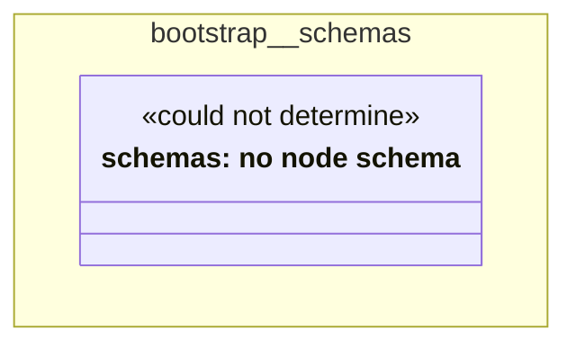

# UML — bootstrap/schemas

Generated by `cat-harness/scripts/gen-uml-overview.ts` — do not edit. The `schemas` sub-graph of `bootstrap` (`bootstrap/schemas`), with every attribute read from its node schema.

**Sources (same model):** [PlantUML](https://github.com/litlfred/folio-assistant/blob/main/cat-harness/uml/overview/bootstrap/schemas.puml) · [Mermaid](https://github.com/litlfred/folio-assistant/blob/main/cat-harness/uml/overview/bootstrap/schemas.mmd)

| sub-graph | directory | graph kinds | node schema |
|---|---|---|---|
| `bootstrap/schemas` | `bootstrap/schemas` | schemas | schemas: *could not determine* |

## Sub-graphs

- [← all of bootstrap](../bootstrap.html)
