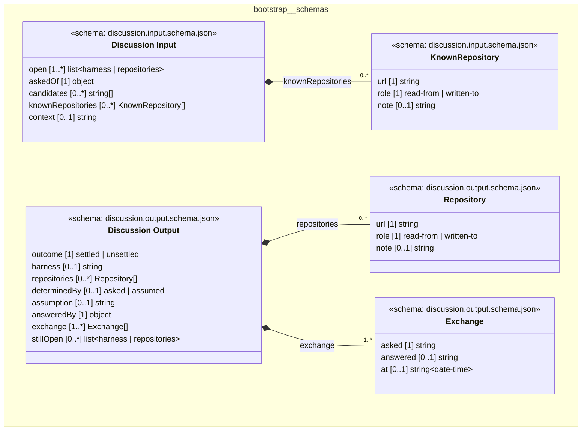

# UML — bootstrap/schemas

Generated by `cat-harness/scripts/gen-uml-overview.ts` — do not edit. The `schemas` sub-graph of `bootstrap` (`bootstrap/schemas`), with every attribute read from its node schema.

**Sources (same model):** [PlantUML](https://github.com/litlfred/folio-assistant/blob/main/cat-harness/uml/overview/bootstrap/schemas.puml) · [Mermaid](https://github.com/litlfred/folio-assistant/blob/main/cat-harness/uml/overview/bootstrap/schemas.mmd)

<figure class="bpmn-figure">
  
</figure>

| sub-graph | directory | graph kinds | node schema |
|---|---|---|---|
| `bootstrap/schemas` | `bootstrap/schemas` | schemas | `schema: discussion.input.schema.json`; `schema: discussion.output.schema.json` |

## Sub-graphs

- [← all of bootstrap](../bootstrap.html)

## The same model, drawn by Mermaid

Kept so the page renders even where the PlantUML image is missing, and because Mermaid nodes carry the CSS class that colours them from `uml.css`.

