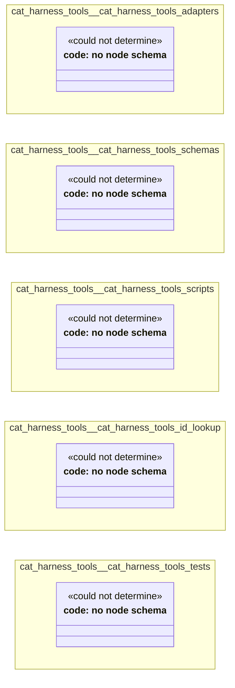

# UML — cat-harness-tools

Generated by `cat-harness/scripts/gen-uml-overview.ts` — do not edit. Every named sub-graph the `cat-harness-tools` instance declares, one box each, with the node schema kinds found in it.

**Sources (same model):** [PlantUML](https://github.com/litlfred/folio-assistant/blob/main/cat-harness/uml/overview/cat-harness-tools.puml) · [Mermaid](https://github.com/litlfred/folio-assistant/blob/main/cat-harness/uml/overview/cat-harness-tools.mmd)

  <fieldset class="fa-uml-view-pick">
    <legend>Layout</legend>
    <input type="radio" name="fa-uml-overview_cat_harness_tools" id="fa-uml-overview_cat_harness_tools-portrait" class="fa-uml-pick-portrait" checked><label for="fa-uml-overview_cat_harness_tools-portrait">Portrait</label>
    <input type="radio" name="fa-uml-overview_cat_harness_tools" id="fa-uml-overview_cat_harness_tools-landscape" class="fa-uml-pick-landscape"><label for="fa-uml-overview_cat_harness_tools-landscape">Landscape</label>
  </fieldset>
  <figure class="bpmn-figure fa-uml-portrait">
    
  </figure>
  <figure class="bpmn-figure fa-uml-landscape">
    
  </figure>

| sub-graph | directory | graph kinds | node schema | nodes | cohesion | in | out |
|---|---|---|---|---|---|---|---|
| `cat-harness-tools/cat-harness-tools-adapters` | `cat-harness-tools/adapters` | code | code: *could not determine* | *not measured* | | | |
| `cat-harness-tools/cat-harness-tools-schemas` | `cat-harness-tools/schemas` | code | code: *could not determine* | *not measured* | | | |
| `cat-harness-tools/cat-harness-tools-scripts` | `cat-harness-tools/scripts` | code | code: *could not determine* | *not measured* | | | |
| `cat-harness-tools/cat-harness-tools-id-lookup` | `cat-harness-tools/id-lookup` | code | code: *could not determine* | *not measured* | | | |
| `cat-harness-tools/cat-harness-tools-tests` | `cat-harness-tools/test` | code | code: *could not determine* | *not measured* | | | |

*Nodes, cohesion, in and out* are the detangler's pinned measurements for the same directory (`bun run kg:detangle`; skill [`graph-detanglement`](https://github.com/litlfred/folio-assistant/blob/main/cat-harness/skills/kg/graph-management/graph-detanglement.md)). *Not measured* means the detangler does not scan that directory, not that it has no edges.

## Sub-graphs

- [cat-harness-tools/cat-harness-tools-adapters](cat-harness-tools/cat-harness-tools-adapters.html)
- [cat-harness-tools/cat-harness-tools-schemas](cat-harness-tools/cat-harness-tools-schemas.html)
- [cat-harness-tools/cat-harness-tools-scripts](cat-harness-tools/cat-harness-tools-scripts.html)
- [cat-harness-tools/cat-harness-tools-id-lookup](cat-harness-tools/cat-harness-tools-id-lookup.html)
- [cat-harness-tools/cat-harness-tools-tests](cat-harness-tools/cat-harness-tools-tests.html)

## The same model, drawn by Mermaid

Kept so the page renders even where the PlantUML image is missing, and because Mermaid nodes carry the CSS class that colours them from `uml.css`.

