# UML — cat-harness

Generated by `cat-harness/scripts/gen-uml-overview.ts` — do not edit. Every named sub-graph the `cat-harness` harness declares, one box each, with the node schema kinds found in it.

**Sources (same model):** [PlantUML](https://github.com/litlfred/folio-assistant/blob/main/cat-harness/uml/overview/cat-harness.puml) · [Mermaid](https://github.com/litlfred/folio-assistant/blob/main/cat-harness/uml/overview/cat-harness.mmd)

```mermaid
classDiagram
  direction TB
  namespace cat_harness__tools {
    class cat_harness_tools_Maintain["Maintain"] {
      <<json: ToolDefinitionSchema>>
    }
    class cat_harness_tools_ToolDefinition["ToolDefinition"] {
      <<json: ToolDefinitionSchema>>
    }
  }
  namespace cat_harness__external_schemas {
    class n_cat_harness_external_schemas_external_schema["external-schema: no node schema"] {
      <<could not determine>>
    }
  }
  namespace cat_harness__schemas {
    class n_cat_harness_schemas_schemas["schemas: no node schema"] {
      <<could not determine>>
    }
    class n_cat_harness_schemas_cat_harness["cat-harness: no node schema"] {
      <<could not determine>>
    }
  }
  namespace cat_harness__uml {
    class n_cat_harness_uml_uml["uml: no node schema"] {
      <<could not determine>>
    }
  }
  namespace cat_harness__bootstrap_render {
    class n_cat_harness_bootstrap_render_skills["skills: no node schema"] {
      <<could not determine>>
    }
  }
  namespace cat_harness__cat_harness {
    class n_cat_harness_cat_harness_skills["skills: no node schema"] {
      <<could not determine>>
    }
  }
  namespace cat_harness__scenarios {
    class cat_harness_scenarios_Role["Role"] {
      <<json: RoleGraphSchema>>
    }
    class cat_harness_scenarios_Actor["Actor"] {
      <<json: RoleGraphSchema>>
    }
    class cat_harness_scenarios_RoleGraph["RoleGraph"] {
      <<json: RoleGraphSchema>>
    }
  }
  namespace cat_harness__processes {
    class cat_harness_processes_omg_bpmn_2_0["Business Process Model and Notation (BPMN)"] {
      <<ext: omg-bpmn-2.0>>
    }
  }
  namespace cat_harness__methodology_raci {
    class n_cat_harness_methodology_raci_skills["skills: no node schema"] {
      <<could not determine>>
    }
  }
  namespace cat_harness__methodology_crdm {
    class n_cat_harness_methodology_crdm_skills["skills: no node schema"] {
      <<could not determine>>
    }
  }
  namespace cat_harness__methodology_crdm_processes {
    class cat_harness_methodology_crdm_processes_omg_bpmn_2_0["Business Process Model and Notation (BPMN)"] {
      <<ext: omg-bpmn-2.0>>
    }
  }
  namespace cat_harness__methodologies {
    class n_cat_harness_methodologies_methodology["methodology: no node schema"] {
      <<could not determine>>
    }
  }
  namespace cat_harness__qa {
    class cat_harness_qa_qa_shape["qa"] {
      <<schema: content/pipeline/qa-witness.ts>>
    }
  }
  namespace cat_harness__fsh_guts {
    class n_cat_harness_fsh_guts_fsh_guts["fsh-guts: no node schema"] {
      <<could not determine>>
    }
  }
  namespace cat_harness__health {
    class cat_harness_health_Threshold["Threshold"] {
      <<json: HealthReportSchema>>
    }
    class cat_harness_health_Measurement["Measurement"] {
      <<json: HealthReportSchema>>
    }
    class cat_harness_health_Finding["Finding"] {
      <<json: HealthReportSchema>>
    }
    class cat_harness_health_Check["Check"] {
      <<json: HealthReportSchema>>
    }
    class cat_harness_health_HealthReport["HealthReport"] {
      <<json: HealthReportSchema>>
    }
  }
  namespace cat_harness__beans {
    class n_cat_harness_beans_beans["beans: no node schema"] {
      <<could not determine>>
    }
  }
  namespace cat_harness__todos {
    class n_cat_harness_todos_todos["todos: no node schema"] {
      <<could not determine>>
    }
  }
  namespace cat_harness__memory {
    class cat_harness_memory_AlsoAbout["AlsoAbout"] {
      <<json: MemoryNodeSchema>>
    }
    class cat_harness_memory_MemoryNode["MemoryNode"] {
      <<json: MemoryNodeSchema>>
    }
    class cat_harness_memory_WaiverNode["WaiverNode"] {
      <<json: WaiverNodeSchema>>
    }
  }
  namespace cat_harness__interaction {
    class cat_harness_interaction_interaction_shape["interaction"] {
      <<schema: schemas/harness-config.ts>>
    }
  }
  namespace cat_harness__issue_marks {
    class cat_harness_issue_marks_issue_marks_shape["issue-marks"] {
      <<schema: src/issue-watch/seen-comments.ts>>
    }
  }
  namespace cat_harness__uploads {
    class n_cat_harness_uploads_uploads["uploads: no node schema"] {
      <<could not determine>>
    }
  }
  namespace cat_harness__library {
    class n_cat_harness_library_library["library: no node schema"] {
      <<could not determine>>
    }
  }
  namespace cat_harness__who_iris_library {
    class n_cat_harness_who_iris_library_library["library: no node schema"] {
      <<could not determine>>
    }
  }
  namespace cat_harness__agent_skills_library {
    class n_cat_harness_agent_skills_library_library["library: no node schema"] {
      <<could not determine>>
    }
  }
  namespace cat_harness__folio_assistant_sci_library {
    class n_cat_harness_folio_assistant_sci_library_library["library: no node schema"] {
      <<could not determine>>
    }
  }
  namespace cat_harness__smart_base_library {
    class n_cat_harness_smart_base_library_library["library: no node schema"] {
      <<could not determine>>
    }
  }
  namespace cat_harness__translation_sources {
    class cat_harness_translation_sources_TranslationConfig["TranslationConfig"] {
      <<json: TranslationConfigSchema>>
    }
  }
  namespace cat_harness__folio {
    class n_cat_harness_folio_folio["folio: no node schema"] {
      <<could not determine>>
    }
  }
  namespace cat_harness__smart_kg_methodologies {
    class n_cat_harness_smart_kg_methodologies_methodology["methodology: no node schema"] {
      <<could not determine>>
    }
  }
  namespace cat_harness__smart_base_methodologies {
    class n_cat_harness_smart_base_methodologies_methodology["methodology: no node schema"] {
      <<could not determine>>
    }
  }
  namespace cat_harness__smart_base_processes {
    class cat_harness_smart_base_processes_omg_bpmn_2_0["Business Process Model and Notation (BPMN)"] {
      <<ext: omg-bpmn-2.0>>
    }
  }
  namespace cat_harness__docs {
    class n_cat_harness_docs_docs["docs: no node schema"] {
      <<could not determine>>
    }
  }
  namespace cat_harness__root_docs {
    class n_cat_harness_root_docs_docs["docs: no node schema"] {
      <<could not determine>>
    }
  }
  namespace cat_harness__folio_assist_core_schemas {
    class n_cat_harness_folio_assist_core_schemas_schemas["schemas: no node schema"] {
      <<could not determine>>
    }
    class n_cat_harness_folio_assist_core_schemas_cat_harness["cat-harness: no node schema"] {
      <<could not determine>>
    }
  }
  namespace cat_harness__kg_navigation {
    class n_cat_harness_kg_navigation_skills["skills: no node schema"] {
      <<could not determine>>
    }
  }
  namespace cat_harness__large_datasets_skills {
    class n_cat_harness_large_datasets_skills_skills["skills: no node schema"] {
      <<could not determine>>
    }
  }
  namespace cat_harness__who_iris_skills {
    class n_cat_harness_who_iris_skills_skills["skills: no node schema"] {
      <<could not determine>>
    }
  }
  namespace cat_harness__large_datasets_schemas {
    class n_cat_harness_large_datasets_schemas_schemas["schemas: no node schema"] {
      <<could not determine>>
    }
    class n_cat_harness_large_datasets_schemas_cat_harness["cat-harness: no node schema"] {
      <<could not determine>>
    }
  }
  namespace cat_harness__detangle_schemas {
    class n_cat_harness_detangle_schemas_schemas["schemas: no node schema"] {
      <<could not determine>>
    }
    class n_cat_harness_detangle_schemas_cat_harness["cat-harness: no node schema"] {
      <<could not determine>>
    }
  }
  namespace cat_harness__bootstrap_tools_schemas {
    class n_cat_harness_bootstrap_tools_schemas_schemas["schemas: no node schema"] {
      <<could not determine>>
    }
    class n_cat_harness_bootstrap_tools_schemas_cat_harness["cat-harness: no node schema"] {
      <<could not determine>>
    }
  }
  namespace cat_harness__glossary {
    class n_cat_harness_glossary_glossary["glossary: no node schema"] {
      <<could not determine>>
    }
  }
  namespace cat_harness__cat_harness_scripts {
    class n_cat_harness_cat_harness_scripts_code["code: no node schema"] {
      <<could not determine>>
    }
  }
  namespace cat_harness__cat_harness_src {
    class n_cat_harness_cat_harness_src_code["code: no node schema"] {
      <<could not determine>>
    }
  }
  namespace cat_harness__cat_harness_adapters {
    class n_cat_harness_cat_harness_adapters_code["code: no node schema"] {
      <<could not determine>>
    }
  }
  namespace cat_harness__cat_harness_tests {
    class n_cat_harness_cat_harness_tests_code["code: no node schema"] {
      <<could not determine>>
    }
  }
  cat_harness_tools_ToolDefinition *-- "0..*" cat_harness_tools_Maintain : maintains
  cssClass "cat_harness_tools_Maintain" fa_uml_kind_tools
  cssClass "cat_harness_tools_ToolDefinition" fa_uml_kind_tools
  cssClass "n_cat_harness_external_schemas_external_schema" fa_uml_kind_external_schema
  cssClass "n_cat_harness_external_schemas_external_schema" fa_uml_undetermined
  cssClass "n_cat_harness_schemas_schemas" fa_uml_kind_schemas
  cssClass "n_cat_harness_schemas_schemas" fa_uml_undetermined
  cssClass "n_cat_harness_schemas_cat_harness" fa_uml_kind_cat_harness
  cssClass "n_cat_harness_schemas_cat_harness" fa_uml_undetermined
  cssClass "n_cat_harness_uml_uml" fa_uml_kind_uml
  cssClass "n_cat_harness_uml_uml" fa_uml_undetermined
  cssClass "n_cat_harness_bootstrap_render_skills" fa_uml_kind_skills
  cssClass "n_cat_harness_bootstrap_render_skills" fa_uml_undetermined
  cssClass "n_cat_harness_cat_harness_skills" fa_uml_kind_skills
  cssClass "n_cat_harness_cat_harness_skills" fa_uml_undetermined
  cat_harness_scenarios_RoleGraph *-- "0..*" cat_harness_scenarios_Role : roles
  cat_harness_scenarios_RoleGraph *-- "0..*" cat_harness_scenarios_Actor : actors
  cssClass "cat_harness_scenarios_Role" fa_uml_kind_scenarios
  cssClass "cat_harness_scenarios_Actor" fa_uml_kind_scenarios
  cssClass "cat_harness_scenarios_RoleGraph" fa_uml_kind_scenarios
  cssClass "cat_harness_processes_omg_bpmn_2_0" fa_uml_kind_processes
  cssClass "n_cat_harness_methodology_raci_skills" fa_uml_kind_skills
  cssClass "n_cat_harness_methodology_raci_skills" fa_uml_undetermined
  cssClass "n_cat_harness_methodology_crdm_skills" fa_uml_kind_skills
  cssClass "n_cat_harness_methodology_crdm_skills" fa_uml_undetermined
  cssClass "cat_harness_methodology_crdm_processes_omg_bpmn_2_0" fa_uml_kind_processes
  cssClass "n_cat_harness_methodologies_methodology" fa_uml_kind_methodology
  cssClass "n_cat_harness_methodologies_methodology" fa_uml_undetermined
  cssClass "cat_harness_qa_qa_shape" fa_uml_kind_qa
  cssClass "n_cat_harness_fsh_guts_fsh_guts" fa_uml_kind_fsh_guts
  cssClass "n_cat_harness_fsh_guts_fsh_guts" fa_uml_undetermined
  cat_harness_health_Check *-- "0..*" cat_harness_health_Threshold : thresholds
  cat_harness_health_Check *-- "0..*" cat_harness_health_Measurement : measurements
  cat_harness_health_Check *-- "0..*" cat_harness_health_Finding : findings
  cat_harness_health_HealthReport *-- "1..*" cat_harness_health_Check : checks
  cssClass "cat_harness_health_Threshold" fa_uml_kind_health
  cssClass "cat_harness_health_Measurement" fa_uml_kind_health
  cssClass "cat_harness_health_Finding" fa_uml_kind_health
  cssClass "cat_harness_health_Check" fa_uml_kind_health
  cssClass "cat_harness_health_HealthReport" fa_uml_kind_health
  cssClass "n_cat_harness_beans_beans" fa_uml_kind_beans
  cssClass "n_cat_harness_beans_beans" fa_uml_undetermined
  cssClass "n_cat_harness_todos_todos" fa_uml_kind_todos
  cssClass "n_cat_harness_todos_todos" fa_uml_undetermined
  cat_harness_memory_MemoryNode *-- "0..*" cat_harness_memory_AlsoAbout : alsoAbout
  cssClass "cat_harness_memory_AlsoAbout" fa_uml_kind_memory
  cssClass "cat_harness_memory_MemoryNode" fa_uml_kind_memory
  cssClass "cat_harness_memory_WaiverNode" fa_uml_kind_waiver
  cssClass "cat_harness_interaction_interaction_shape" fa_uml_kind_interaction
  cssClass "cat_harness_issue_marks_issue_marks_shape" fa_uml_kind_issue_marks
  cssClass "n_cat_harness_uploads_uploads" fa_uml_kind_uploads
  cssClass "n_cat_harness_uploads_uploads" fa_uml_undetermined
  cssClass "n_cat_harness_library_library" fa_uml_kind_library
  cssClass "n_cat_harness_library_library" fa_uml_undetermined
  cssClass "n_cat_harness_who_iris_library_library" fa_uml_kind_library
  cssClass "n_cat_harness_who_iris_library_library" fa_uml_undetermined
  cssClass "n_cat_harness_agent_skills_library_library" fa_uml_kind_library
  cssClass "n_cat_harness_agent_skills_library_library" fa_uml_undetermined
  cssClass "n_cat_harness_folio_assistant_sci_library_library" fa_uml_kind_library
  cssClass "n_cat_harness_folio_assistant_sci_library_library" fa_uml_undetermined
  cssClass "n_cat_harness_smart_base_library_library" fa_uml_kind_library
  cssClass "n_cat_harness_smart_base_library_library" fa_uml_undetermined
  cssClass "cat_harness_translation_sources_TranslationConfig" fa_uml_kind_translation_sources
  cssClass "n_cat_harness_folio_folio" fa_uml_kind_folio
  cssClass "n_cat_harness_folio_folio" fa_uml_undetermined
  cssClass "n_cat_harness_smart_kg_methodologies_methodology" fa_uml_kind_methodology
  cssClass "n_cat_harness_smart_kg_methodologies_methodology" fa_uml_undetermined
  cssClass "n_cat_harness_smart_base_methodologies_methodology" fa_uml_kind_methodology
  cssClass "n_cat_harness_smart_base_methodologies_methodology" fa_uml_undetermined
  cssClass "cat_harness_smart_base_processes_omg_bpmn_2_0" fa_uml_kind_processes
  cssClass "n_cat_harness_docs_docs" fa_uml_kind_docs
  cssClass "n_cat_harness_docs_docs" fa_uml_undetermined
  cssClass "n_cat_harness_root_docs_docs" fa_uml_kind_docs
  cssClass "n_cat_harness_root_docs_docs" fa_uml_undetermined
  cssClass "n_cat_harness_folio_assist_core_schemas_schemas" fa_uml_kind_schemas
  cssClass "n_cat_harness_folio_assist_core_schemas_schemas" fa_uml_undetermined
  cssClass "n_cat_harness_folio_assist_core_schemas_cat_harness" fa_uml_kind_cat_harness
  cssClass "n_cat_harness_folio_assist_core_schemas_cat_harness" fa_uml_undetermined
  cssClass "n_cat_harness_kg_navigation_skills" fa_uml_kind_skills
  cssClass "n_cat_harness_kg_navigation_skills" fa_uml_undetermined
  cssClass "n_cat_harness_large_datasets_skills_skills" fa_uml_kind_skills
  cssClass "n_cat_harness_large_datasets_skills_skills" fa_uml_undetermined
  cssClass "n_cat_harness_who_iris_skills_skills" fa_uml_kind_skills
  cssClass "n_cat_harness_who_iris_skills_skills" fa_uml_undetermined
  cssClass "n_cat_harness_large_datasets_schemas_schemas" fa_uml_kind_schemas
  cssClass "n_cat_harness_large_datasets_schemas_schemas" fa_uml_undetermined
  cssClass "n_cat_harness_large_datasets_schemas_cat_harness" fa_uml_kind_cat_harness
  cssClass "n_cat_harness_large_datasets_schemas_cat_harness" fa_uml_undetermined
  cssClass "n_cat_harness_detangle_schemas_schemas" fa_uml_kind_schemas
  cssClass "n_cat_harness_detangle_schemas_schemas" fa_uml_undetermined
  cssClass "n_cat_harness_detangle_schemas_cat_harness" fa_uml_kind_cat_harness
  cssClass "n_cat_harness_detangle_schemas_cat_harness" fa_uml_undetermined
  cssClass "n_cat_harness_bootstrap_tools_schemas_schemas" fa_uml_kind_schemas
  cssClass "n_cat_harness_bootstrap_tools_schemas_schemas" fa_uml_undetermined
  cssClass "n_cat_harness_bootstrap_tools_schemas_cat_harness" fa_uml_kind_cat_harness
  cssClass "n_cat_harness_bootstrap_tools_schemas_cat_harness" fa_uml_undetermined
  cssClass "n_cat_harness_glossary_glossary" fa_uml_kind_glossary
  cssClass "n_cat_harness_glossary_glossary" fa_uml_undetermined
  cssClass "n_cat_harness_cat_harness_scripts_code" fa_uml_kind_code
  cssClass "n_cat_harness_cat_harness_scripts_code" fa_uml_undetermined
  cssClass "n_cat_harness_cat_harness_src_code" fa_uml_kind_code
  cssClass "n_cat_harness_cat_harness_src_code" fa_uml_undetermined
  cssClass "n_cat_harness_cat_harness_adapters_code" fa_uml_kind_code
  cssClass "n_cat_harness_cat_harness_adapters_code" fa_uml_undetermined
  cssClass "n_cat_harness_cat_harness_tests_code" fa_uml_kind_code
  cssClass "n_cat_harness_cat_harness_tests_code" fa_uml_undetermined
```

| sub-graph | directory | graph kinds | node schema |
|---|---|---|---|
| `cat-harness/tools` | `cat-harness/tools` | tools | `ToolDefinitionSchema` |
| `cat-harness/external-schemas` | `cat-harness/external-schemas` | external-schema | external-schema: *could not determine* |
| `cat-harness/schemas` | `cat-harness/schemas` | schemas, cat-harness | schemas: *could not determine*; cat-harness: *could not determine* |
| `cat-harness/uml` | `cat-harness/uml` | uml | uml: *could not determine* |
| `cat-harness/bootstrap-render` | `cat-harness/bootstrap/tools` | skills | skills: *could not determine* |
| `cat-harness/cat-harness` | `cat-harness/skills` | skills | skills: *could not determine* |
| `cat-harness/scenarios` | `cat-harness/scenarios` | scenarios | `RoleGraphSchema` |
| `cat-harness/processes` | `cat-harness/processes` | processes | `ext: omg-bpmn-2.0` |
| `cat-harness/methodology-raci` | `cat-harness/methodologies/raci` | skills | skills: *could not determine* |
| `cat-harness/methodology-crdm` | `cat-harness/methodologies/crdm` | skills | skills: *could not determine* |
| `cat-harness/methodology-crdm-processes` | `cat-harness/methodologies/crdm/processes` | processes | `ext: omg-bpmn-2.0` |
| `cat-harness/methodologies` | `cat-harness/methodologies` | methodology | methodology: *could not determine* |
| `cat-harness/qa` | `cat-harness/test/results` | qa | `schema: content/pipeline/qa-witness.ts` |
| `cat-harness/fsh-guts` | `cat-harness/fsh-guts` | fsh-guts | fsh-guts: *could not determine* |
| `cat-harness/health` | `cat-harness/test/health/results` | health | `HealthReportSchema` |
| `cat-harness/beans` | `cat-harness/beans` | beans | beans: *could not determine* |
| `cat-harness/todos` | `cat-harness/todos` | todos | todos: *could not determine* |
| `cat-harness/memory` | `cat-harness/memory` | memory, waiver | `MemoryNodeSchema`; `WaiverNodeSchema` |
| `cat-harness/interaction` | `cat-harness/interaction` | interaction | `schema: schemas/harness-config.ts` |
| `cat-harness/issue-marks` | `cat-harness/issue-marks` | issue-marks | `schema: src/issue-watch/seen-comments.ts` |
| `cat-harness/uploads` | `cat-harness/uploads` | uploads | uploads: *could not determine* |
| `cat-harness/library` | `cat-harness/library` | library | library: *could not determine* |
| `cat-harness/who-iris-library` | `cat-harness/who-iris/library` | library | library: *could not determine* |
| `cat-harness/agent-skills-library` | `cat-harness/agent-skills/library` | library | library: *could not determine* |
| `cat-harness/folio-assistant-sci-library` | `cat-harness/folio-assistant-sci/library` | library | library: *could not determine* |
| `cat-harness/smart-base-library` | `cat-harness/smart-base/library` | library | library: *could not determine* |
| `cat-harness/translation-sources` | `cat-harness/translations` | translation-sources | `TranslationConfigSchema` |
| `cat-harness/folio` | `cat-harness/folio` | folio | folio: *could not determine* |
| `cat-harness/smart-kg-methodologies` | `cat-harness/smart-kg/methodologies` | methodology | methodology: *could not determine* |
| `cat-harness/smart-base-methodologies` | `cat-harness/smart-base/methodologies` | methodology | methodology: *could not determine* |
| `cat-harness/smart-base-processes` | `cat-harness/smart-base/methodologies/processes` | processes | `ext: omg-bpmn-2.0` |
| `cat-harness/docs` | `cat-harness/docs` | docs | docs: *could not determine* |
| `cat-harness/root-docs` | `cat-harness/docs` | docs | docs: *could not determine* |
| `cat-harness/folio-assist-core-schemas` | `cat-harness/folio-assistant-core/schemas` | schemas, cat-harness | schemas: *could not determine*; cat-harness: *could not determine* |
| `cat-harness/kg-navigation` | `cat-harness/kg-navigation/skills` | skills | skills: *could not determine* |
| `cat-harness/large-datasets-skills` | `cat-harness/large-datasets/skills` | skills | skills: *could not determine* |
| `cat-harness/who-iris-skills` | `cat-harness/who-iris/skills` | skills | skills: *could not determine* |
| `cat-harness/large-datasets-schemas` | `cat-harness/large-datasets/schemas` | schemas, cat-harness | schemas: *could not determine*; cat-harness: *could not determine* |
| `cat-harness/detangle-schemas` | `cat-harness/detangle/schemas` | schemas, cat-harness | schemas: *could not determine*; cat-harness: *could not determine* |
| `cat-harness/bootstrap-tools-schemas` | `cat-harness/bootstrap-tools/schemas` | schemas, cat-harness | schemas: *could not determine*; cat-harness: *could not determine* |
| `cat-harness/glossary` | `cat-harness/glossary` | glossary | glossary: *could not determine* |
| `cat-harness/cat-harness-scripts` | `cat-harness/scripts` | code | code: *could not determine* |
| `cat-harness/cat-harness-src` | `cat-harness/src` | code | code: *could not determine* |
| `cat-harness/cat-harness-adapters` | `cat-harness/adapters` | code | code: *could not determine* |
| `cat-harness/cat-harness-tests` | `cat-harness/test` | code | code: *could not determine* |

## Sub-graphs

- [cat-harness/tools](cat-harness/tools.html)
- [cat-harness/external-schemas](cat-harness/external-schemas.html)
- [cat-harness/schemas](cat-harness/schemas.html)
- [cat-harness/uml](cat-harness/uml.html)
- [cat-harness/bootstrap-render](cat-harness/bootstrap-render.html)
- [cat-harness/cat-harness](cat-harness/cat-harness.html)
- [cat-harness/scenarios](cat-harness/scenarios.html)
- [cat-harness/processes](cat-harness/processes.html)
- [cat-harness/methodology-raci](cat-harness/methodology-raci.html)
- [cat-harness/methodology-crdm](cat-harness/methodology-crdm.html)
- [cat-harness/methodology-crdm-processes](cat-harness/methodology-crdm-processes.html)
- [cat-harness/methodologies](cat-harness/methodologies.html)
- [cat-harness/qa](cat-harness/qa.html)
- [cat-harness/fsh-guts](cat-harness/fsh-guts.html)
- [cat-harness/health](cat-harness/health.html)
- [cat-harness/beans](cat-harness/beans.html)
- [cat-harness/todos](cat-harness/todos.html)
- [cat-harness/memory](cat-harness/memory.html)
- [cat-harness/interaction](cat-harness/interaction.html)
- [cat-harness/issue-marks](cat-harness/issue-marks.html)
- [cat-harness/uploads](cat-harness/uploads.html)
- [cat-harness/library](cat-harness/library.html)
- [cat-harness/who-iris-library](cat-harness/who-iris-library.html)
- [cat-harness/agent-skills-library](cat-harness/agent-skills-library.html)
- [cat-harness/folio-assistant-sci-library](cat-harness/folio-assistant-sci-library.html)
- [cat-harness/smart-base-library](cat-harness/smart-base-library.html)
- [cat-harness/translation-sources](cat-harness/translation-sources.html)
- [cat-harness/folio](cat-harness/folio.html)
- [cat-harness/smart-kg-methodologies](cat-harness/smart-kg-methodologies.html)
- [cat-harness/smart-base-methodologies](cat-harness/smart-base-methodologies.html)
- [cat-harness/smart-base-processes](cat-harness/smart-base-processes.html)
- [cat-harness/docs](cat-harness/docs.html)
- [cat-harness/root-docs](cat-harness/root-docs.html)
- [cat-harness/folio-assist-core-schemas](cat-harness/folio-assist-core-schemas.html)
- [cat-harness/kg-navigation](cat-harness/kg-navigation.html)
- [cat-harness/large-datasets-skills](cat-harness/large-datasets-skills.html)
- [cat-harness/who-iris-skills](cat-harness/who-iris-skills.html)
- [cat-harness/large-datasets-schemas](cat-harness/large-datasets-schemas.html)
- [cat-harness/detangle-schemas](cat-harness/detangle-schemas.html)
- [cat-harness/bootstrap-tools-schemas](cat-harness/bootstrap-tools-schemas.html)
- [cat-harness/glossary](cat-harness/glossary.html)
- [cat-harness/cat-harness-scripts](cat-harness/cat-harness-scripts.html)
- [cat-harness/cat-harness-src](cat-harness/cat-harness-src.html)
- [cat-harness/cat-harness-adapters](cat-harness/cat-harness-adapters.html)
- [cat-harness/cat-harness-tests](cat-harness/cat-harness-tests.html)
