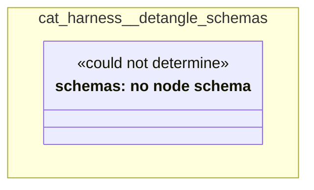

# UML — cat-harness/detangle-schemas

Generated by `cat-harness/scripts/gen-uml-overview.ts` — do not edit. The `detangle-schemas` sub-graph of `cat-harness` (`cat-harness/detangle/schemas`), with every attribute read from its node schema.

**Sources (same model):** [PlantUML](https://github.com/litlfred/folio-assistant/blob/main/cat-harness/uml/overview/cat-harness/detangle-schemas.puml) · [Mermaid](https://github.com/litlfred/folio-assistant/blob/main/cat-harness/uml/overview/cat-harness/detangle-schemas.mmd)

  <fieldset class="fa-uml-view-pick">
    <legend>Layout</legend>
    <input type="radio" name="fa-uml-overview_cat_harness_detangle_schemas" id="fa-uml-overview_cat_harness_detangle_schemas-portrait" class="fa-uml-pick-portrait" checked><label for="fa-uml-overview_cat_harness_detangle_schemas-portrait">Portrait</label>
    <input type="radio" name="fa-uml-overview_cat_harness_detangle_schemas" id="fa-uml-overview_cat_harness_detangle_schemas-landscape" class="fa-uml-pick-landscape"><label for="fa-uml-overview_cat_harness_detangle_schemas-landscape">Landscape</label>
  </fieldset>
  <figure class="bpmn-figure fa-uml-portrait">
    
  </figure>
  <figure class="bpmn-figure fa-uml-landscape">
    
  </figure>

| sub-graph | directory | graph kinds | node schema |
|---|---|---|---|
| `cat-harness/detangle-schemas` | `cat-harness/detangle/schemas` | schemas, cat-harness | schemas: *could not determine* |

## Sub-graphs

- [← all of cat-harness](../cat-harness.html)

## The same model, drawn by Mermaid

Kept so the page renders even where the PlantUML image is missing, and because Mermaid nodes carry the CSS class that colours them from `uml.css`.

