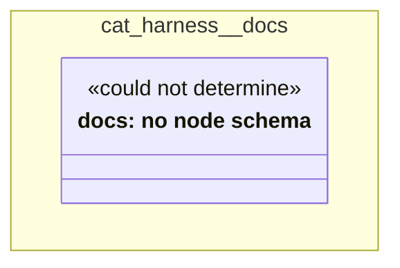

# UML — cat-harness/docs

Generated by `cat-harness/scripts/gen-uml-overview.ts` — do not edit. The `docs` sub-graph of `cat-harness` (`cat-harness/docs`), with every attribute read from its node schema.

**Sources (same model):** [PlantUML](https://github.com/litlfred/folio-assistant/blob/main/cat-harness/uml/overview/cat-harness/docs.puml) · [Mermaid](https://github.com/litlfred/folio-assistant/blob/main/cat-harness/uml/overview/cat-harness/docs.mmd)

| sub-graph | directory | graph kinds | node schema |
|---|---|---|---|
| `cat-harness/docs` | `cat-harness/docs` | docs | docs: *could not determine* |

## Sub-graphs

- [← all of cat-harness](../cat-harness.html)
