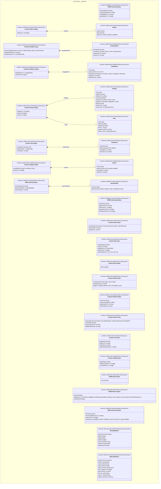

# UML — cat-harness/schemas

Generated by `cat-harness/scripts/gen-uml-overview.ts` — do not edit. The `schemas` sub-graph of `cat-harness` (`cat-harness/schemas`), with every attribute read from its node schema.

**Sources (same model):** [PlantUML](https://github.com/litlfred/folio-assistant/blob/main/cat-harness/uml/overview/cat-harness/schemas.puml) · [Mermaid](https://github.com/litlfred/folio-assistant/blob/main/cat-harness/uml/overview/cat-harness/schemas.mmd)

  <fieldset class="fa-uml-view-pick">
    <legend>Layout</legend>
    <input type="radio" name="fa-uml-overview_cat_harness_schemas" id="fa-uml-overview_cat_harness_schemas-portrait" class="fa-uml-pick-portrait" checked><label for="fa-uml-overview_cat_harness_schemas-portrait">Portrait</label>
    <input type="radio" name="fa-uml-overview_cat_harness_schemas" id="fa-uml-overview_cat_harness_schemas-landscape" class="fa-uml-pick-landscape"><label for="fa-uml-overview_cat_harness_schemas-landscape">Landscape</label>
  </fieldset>
  <figure class="bpmn-figure fa-uml-portrait">
    
  </figure>
  <figure class="bpmn-figure fa-uml-landscape">
    
  </figure>

| sub-graph | directory | graph typologies | node schema | nodes | cohesion | in | out |
|---|---|---|---|---|---|---|---|
| `cat-harness/schemas` | `cat-harness/schemas` | schemas, cat-harness | `schema: skills/bpmn-authoring/input.schema.json`; `schema: skills/bpmn-authoring/output.schema.json`; `schema: skills/content-author/input.schema.json`; `schema: skills/content-author/output.schema.json`; `schema: skills/content-feedback/input.schema.json`; `schema: skills/content-feedback/output.schema.json`; `schema: skills/content-plan/input.schema.json`; `schema: skills/content-plan/output.schema.json`; `schema: skills/content-publish/input.schema.json`; `schema: skills/content-publish/output.schema.json`; `schema: skills/content-review/input.schema.json`; `schema: skills/content-review/output.schema.json`; `schema: skills/content-test/input.schema.json`; `schema: skills/content-test/output.schema.json`; `schema: skills/content-validate/input.schema.json`; `schema: skills/content-validate/output.schema.json`; `schema: skills/crdm-detect/input.schema.json`; `schema: skills/crdm-detect/output.schema.json`; `schema: skills/dmn-authoring/input.schema.json`; `schema: skills/dmn-authoring/output.schema.json`; `schema: block-qa-schema/schema/block-qa.schema.json`; `schema: block-qa-schema/schema/qa-script.schema.json` | 262 | 0.88 | 44 | 0 |

*Nodes, cohesion, in and out* are the detangler's pinned measurements for the same directory (`bun run kg:detangle`; skill [`graph-detanglement`](https://github.com/litlfred/folio-assistant/blob/main/cat-harness/skills/kg/graph-management/graph-detanglement.md)). *Not measured* means the detangler does not scan that directory, not that it has no edges.

## Sub-graphs

- [← all of cat-harness](../cat-harness.html)

## The same model, drawn by Mermaid

Kept so the page renders even where the PlantUML image is missing, and because Mermaid nodes carry the CSS class that colours them from `uml.css`.

```mermaid
classDiagram
  direction TB
  namespace cat_harness__schemas {
    class cat_harness_schemas_skills_bpmn_authoring_input_schema_json_BPMN_Authoring_Input["BPMN Authoring Input"] {
      <<schema: skills/bpmn-authoring/input.schema.json>>
      processName [1] string
      sourceWorkflow [0..1] string
      existingBpmn [0..1] string
      participants [0..*] string[]
    }
    class cat_harness_schemas_skills_bpmn_authoring_output_schema_json_BPMN_Authoring_Output["BPMN Authoring Output"] {
      <<schema: skills/bpmn-authoring/output.schema.json>>
      bpmnFile [1] string
      diagramFile [0..1] string
      taskCount [0..1] integer
      gatewayCount [0..1] integer
      participantCount [0..1] integer
    }
    class cat_harness_schemas_skills_content_author_input_schema_json_Content_Author_Input["Content Author Input"] {
      <<schema: skills/content-author/input.schema.json>>
      contentType [1] document | fhir-ig | lean-proof | bpmn | data-dictionary
      sourceRef [0..1] string
      outputDir [0..1] string
    }
    class cat_harness_schemas_skills_content_author_output_schema_json_Artifact["Artifact"] {
      <<schema: skills/content-author/output.schema.json>>
      path [1] string
      type [1] string
      status [0..1] draft | ready-for-validation
    }
    class cat_harness_schemas_skills_content_author_output_schema_json_Content_Author_Output["Content Author Output"] {
      <<schema: skills/content-author/output.schema.json>>
      artifacts [0..*] Artifact[]
    }
    class cat_harness_schemas_skills_content_feedback_input_schema_json_FeedbackItem["FeedbackItem"] {
      <<schema: skills/content-feedback/input.schema.json>>
      description [1] string
      severity [0..1] critical | major | minor | enhancement
      component [0..1] string
      reporter [0..1] string
    }
    class cat_harness_schemas_skills_content_feedback_input_schema_json_Content_Feedback_Input["Content Feedback Input"] {
      <<schema: skills/content-feedback/input.schema.json>>
      source [1] github-issues | survey | implementation-report | clinical-review
      publishedVersion [0..1] string
      feedbackItems [0..*] FeedbackItem[]
    }
    class cat_harness_schemas_skills_content_feedback_output_schema_json_TriagedItem["TriagedItem"] {
      <<schema: skills/content-feedback/output.schema.json>>
      id [1] string
      priority [1] P0 | P1 | P2 | P3
      disposition [1] backlog | next-sprint | wont-fix | duplicate | needs-info
      assignee [0..1] string
      linkedIssue [0..1] string
    }
    class cat_harness_schemas_skills_content_feedback_output_schema_json_Content_Feedback_Output["Content Feedback Output"] {
      <<schema: skills/content-feedback/output.schema.json>>
      triagedItems [0..*] TriagedItem[]
      summary [0..1] object
    }
    class cat_harness_schemas_skills_content_plan_input_schema_json_Content_Plan_Input["Content Plan Input"] {
      <<schema: skills/content-plan/input.schema.json>>
      projectName [1] string
      scope [0..1] string
      targetDate [0..1] string~date~
      teamSize [0..1] integer
      sprintDuration [0..1] 1w | 2w | 3w | 4w
    }
    class cat_harness_schemas_skills_content_plan_output_schema_json_Content_Plan_Output["Content Plan Output"] {
      <<schema: skills/content-plan/output.schema.json>>
      plan [1] object
    }
    class cat_harness_schemas_skills_content_publish_input_schema_json_Content_Publish_Input["Content Publish Input"] {
      <<schema: skills/content-publish/input.schema.json>>
      versionIncrement [1] major | minor | patch
      releaseNotes [0..1] string
      target [0..1] github-release | npm | fhir-registry | arxiv
    }
    class cat_harness_schemas_skills_content_publish_output_schema_json_Content_Publish_Output["Content Publish Output"] {
      <<schema: skills/content-publish/output.schema.json>>
      version [1] string
      status [1] published | failed
      publishedUrl [0..1] string
      releaseTag [0..1] string
    }
    class cat_harness_schemas_skills_content_review_input_schema_json_Content_Review_Input["Content Review Input"] {
      <<schema: skills/content-review/input.schema.json>>
      reviewType [1] l2-to-l3-gate | l3-to-publish-gate | change-assessment | final-signoff
      contentRef [1] string
      previousVersion [0..1] string
      validationReport [0..1] string
    }
    class cat_harness_schemas_skills_content_review_output_schema_json_Finding["Finding"] {
      <<schema: skills/content-review/output.schema.json>>
      id [1] string
      subject [1] string
      criterion [0..1] string
      reviewer [1] object
      severity [0..1] critical | major | minor
      weight [0..1] blocking | suggestion | praise
      detail [1] string
      evidence [0..*] any[]
      raised_at [0..1] string~date-time~
    }
    class cat_harness_schemas_skills_content_review_output_schema_json_Note["Note"] {
      <<schema: skills/content-review/output.schema.json>>
      id [1] string
      author [1] object
      rationale [1] string
      cites [1..*] any[]
      proposed_by [0..1] string
      written_at [0..1] string~date-time~
    }
    class cat_harness_schemas_skills_content_review_output_schema_json_Content_Review_Output["Content Review Output"] {
      <<schema: skills/content-review/output.schema.json>>
      findings [0..*] Finding[]
      decision [1] object
      notes [0..*] Note[]
    }
    class cat_harness_schemas_skills_content_test_input_schema_json_Content_Test_Input["Content Test Input"] {
      <<schema: skills/content-test/input.schema.json>>
      targetPath [1] string
      testPlan [0..1] string
      testData [0..1] string
      regressionBaseline [0..1] string
    }
    class cat_harness_schemas_skills_content_test_output_schema_json_TestResult["TestResult"] {
      <<schema: skills/content-test/output.schema.json>>
      testId [1] string
      status [1] pass | fail | skipped
      message [0..1] string
      duration [0..1] number
    }
    class cat_harness_schemas_skills_content_test_output_schema_json_Content_Test_Output["Content Test Output"] {
      <<schema: skills/content-test/output.schema.json>>
      overallStatus [1] pass | fail
      testResults [0..*] TestResult[]
      coverage [0..1] object
    }
    class cat_harness_schemas_skills_content_validate_input_schema_json_Content_Validate_Input["Content Validate Input"] {
      <<schema: skills/content-validate/input.schema.json>>
      targetPath [1] string
      validationRules [0..*] string[]
      schemaRefs [0..*] string[]
    }
    class cat_harness_schemas_skills_content_validate_output_schema_json_Result["Result"] {
      <<schema: skills/content-validate/output.schema.json>>
      rule [1] string
      status [1] pass | fail | warning | skipped
      message [0..1] string
      location [0..1] string
    }
    class cat_harness_schemas_skills_content_validate_output_schema_json_Content_Validate_Output["Content Validate Output"] {
      <<schema: skills/content-validate/output.schema.json>>
      overallStatus [1] pass | warnings | errors
      results [0..*] Result[]
    }
    class cat_harness_schemas_skills_crdm_detect_input_schema_json_CRDM_Detect_Input["CRDM Detect Input"] {
      <<schema: skills/crdm-detect/input.schema.json>>
      text [1] string
    }
    class cat_harness_schemas_skills_crdm_detect_output_schema_json_CRDM_Detect_Output["CRDM Detect Output"] {
      <<schema: skills/crdm-detect/output.schema.json>>
      fires [1] boolean
      categories [0..*] list~direct-capability | workflow-gap | platform-change | cross-cutting | review-surfaced | self-declared-genre~
      excluded [1] boolean
    }
    class cat_harness_schemas_skills_dmn_authoring_input_schema_json_InputVariable["InputVariable"] {
      <<schema: skills/dmn-authoring/input.schema.json>>
      name [1] string
      type [1] string | integer | boolean | date | codeable-concept
    }
    class cat_harness_schemas_skills_dmn_authoring_input_schema_json_DMN_Authoring_Input["DMN Authoring Input"] {
      <<schema: skills/dmn-authoring/input.schema.json>>
      decisionName [1] string
      inputVariables [0..*] InputVariable[]
      sourceLogic [0..1] string
    }
    class cat_harness_schemas_skills_dmn_authoring_output_schema_json_DMN_Authoring_Output["DMN Authoring Output"] {
      <<schema: skills/dmn-authoring/output.schema.json>>
      dmnFile [1] string
      decisionTableCount [0..1] integer
      ruleCount [0..1] integer
      hitPolicy [0..1] UNIQUE | FIRST | PRIORITY | ANY | COLLECT | RULE ORDER
    }
    class cat_harness_schemas_block_qa_schema_schema_block_qa_schema_json_BlockQaReport["BlockQaReport"] {
      <<schema: block-qa-schema/schema/block-qa.schema.json>>
      $schema [1] 'block-qa/v1'
      label [1] string
      kind [1] string
      paths [1] object
      source_hashes [1] any
      criteria [1] map~any[]~
      updated_at [1] string
    }
    class cat_harness_schemas_block_qa_schema_schema_qa_script_schema_json_QaScriptSidecar["QaScriptSidecar"] {
      <<schema: block-qa-schema/schema/qa-script.schema.json>>
      $schema [1] 'qa-script/v1'
      criterion_id [1] string
      source_file [1] string
      script_hash [1] string
      script_commit_sha [1] string
      extra_inputs [0..*] string[]
      deps_hash [0..1] string
      last_run_at [1] string
      last_run_sha [1] string
      engine_version [0..1] string
    }
  }
  cat_harness_schemas_skills_content_author_output_schema_json_Content_Author_Output *-- "0..*" cat_harness_schemas_skills_content_author_output_schema_json_Artifact : artifacts
  cat_harness_schemas_skills_content_feedback_input_schema_json_Content_Feedback_Input *-- "0..*" cat_harness_schemas_skills_content_feedback_input_schema_json_FeedbackItem : feedbackItems
  cat_harness_schemas_skills_content_feedback_output_schema_json_Content_Feedback_Output *-- "0..*" cat_harness_schemas_skills_content_feedback_output_schema_json_TriagedItem : triagedItems
  cat_harness_schemas_skills_content_review_output_schema_json_Content_Review_Output *-- "0..*" cat_harness_schemas_skills_content_review_output_schema_json_Finding : findings
  cat_harness_schemas_skills_content_review_output_schema_json_Content_Review_Output *-- "0..*" cat_harness_schemas_skills_content_review_output_schema_json_Note : notes
  cat_harness_schemas_skills_content_test_output_schema_json_Content_Test_Output *-- "0..*" cat_harness_schemas_skills_content_test_output_schema_json_TestResult : testResults
  cat_harness_schemas_skills_content_validate_output_schema_json_Content_Validate_Output *-- "0..*" cat_harness_schemas_skills_content_validate_output_schema_json_Result : results
  cat_harness_schemas_skills_dmn_authoring_input_schema_json_DMN_Authoring_Input *-- "0..*" cat_harness_schemas_skills_dmn_authoring_input_schema_json_InputVariable : inputVariables
  cssClass "cat_harness_schemas_skills_bpmn_authoring_input_schema_json_BPMN_Authoring_Input" fa_uml_kind_schemas
  cssClass "cat_harness_schemas_skills_bpmn_authoring_output_schema_json_BPMN_Authoring_Output" fa_uml_kind_schemas
  cssClass "cat_harness_schemas_skills_content_author_input_schema_json_Content_Author_Input" fa_uml_kind_schemas
  cssClass "cat_harness_schemas_skills_content_author_output_schema_json_Artifact" fa_uml_kind_schemas
  cssClass "cat_harness_schemas_skills_content_author_output_schema_json_Content_Author_Output" fa_uml_kind_schemas
  cssClass "cat_harness_schemas_skills_content_feedback_input_schema_json_FeedbackItem" fa_uml_kind_schemas
  cssClass "cat_harness_schemas_skills_content_feedback_input_schema_json_Content_Feedback_Input" fa_uml_kind_schemas
  cssClass "cat_harness_schemas_skills_content_feedback_output_schema_json_TriagedItem" fa_uml_kind_schemas
  cssClass "cat_harness_schemas_skills_content_feedback_output_schema_json_Content_Feedback_Output" fa_uml_kind_schemas
  cssClass "cat_harness_schemas_skills_content_plan_input_schema_json_Content_Plan_Input" fa_uml_kind_schemas
  cssClass "cat_harness_schemas_skills_content_plan_output_schema_json_Content_Plan_Output" fa_uml_kind_schemas
  cssClass "cat_harness_schemas_skills_content_publish_input_schema_json_Content_Publish_Input" fa_uml_kind_schemas
  cssClass "cat_harness_schemas_skills_content_publish_output_schema_json_Content_Publish_Output" fa_uml_kind_schemas
  cssClass "cat_harness_schemas_skills_content_review_input_schema_json_Content_Review_Input" fa_uml_kind_schemas
  cssClass "cat_harness_schemas_skills_content_review_output_schema_json_Finding" fa_uml_kind_schemas
  cssClass "cat_harness_schemas_skills_content_review_output_schema_json_Note" fa_uml_kind_schemas
  cssClass "cat_harness_schemas_skills_content_review_output_schema_json_Content_Review_Output" fa_uml_kind_schemas
  cssClass "cat_harness_schemas_skills_content_test_input_schema_json_Content_Test_Input" fa_uml_kind_schemas
  cssClass "cat_harness_schemas_skills_content_test_output_schema_json_TestResult" fa_uml_kind_schemas
  cssClass "cat_harness_schemas_skills_content_test_output_schema_json_Content_Test_Output" fa_uml_kind_schemas
  cssClass "cat_harness_schemas_skills_content_validate_input_schema_json_Content_Validate_Input" fa_uml_kind_schemas
  cssClass "cat_harness_schemas_skills_content_validate_output_schema_json_Result" fa_uml_kind_schemas
  cssClass "cat_harness_schemas_skills_content_validate_output_schema_json_Content_Validate_Output" fa_uml_kind_schemas
  cssClass "cat_harness_schemas_skills_crdm_detect_input_schema_json_CRDM_Detect_Input" fa_uml_kind_schemas
  cssClass "cat_harness_schemas_skills_crdm_detect_output_schema_json_CRDM_Detect_Output" fa_uml_kind_schemas
  cssClass "cat_harness_schemas_skills_dmn_authoring_input_schema_json_InputVariable" fa_uml_kind_schemas
  cssClass "cat_harness_schemas_skills_dmn_authoring_input_schema_json_DMN_Authoring_Input" fa_uml_kind_schemas
  cssClass "cat_harness_schemas_skills_dmn_authoring_output_schema_json_DMN_Authoring_Output" fa_uml_kind_schemas
  cssClass "cat_harness_schemas_block_qa_schema_schema_block_qa_schema_json_BlockQaReport" fa_uml_kind_schemas
  cssClass "cat_harness_schemas_block_qa_schema_schema_qa_script_schema_json_QaScriptSidecar" fa_uml_kind_schemas
```
