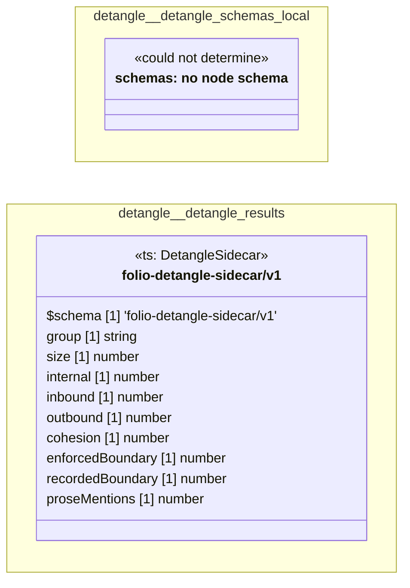

# UML — detangle

Generated by `cat-harness/scripts/gen-uml-overview.ts` — do not edit. Every named sub-graph the `detangle` harness declares, one box each, with the node schema kinds found in it.

**Sources (same model):** [PlantUML](https://github.com/litlfred/folio-assistant/blob/main/cat-harness/uml/overview/detangle.puml) · [Mermaid](https://github.com/litlfred/folio-assistant/blob/main/cat-harness/uml/overview/detangle.mmd)

| sub-graph | directory | graph kinds | node schema |
|---|---|---|---|
| `detangle/detangle-schemas-local` | `detangle/schemas` | schemas, cat-harness | schemas: *could not determine* |
| `detangle/detangle-results` | `detangle/results` | qa | `ts: DetangleSidecar` |

## Sub-graphs

- [detangle/detangle-schemas-local](detangle/detangle-schemas-local.html)
- [detangle/detangle-results](detangle/detangle-results.html)
