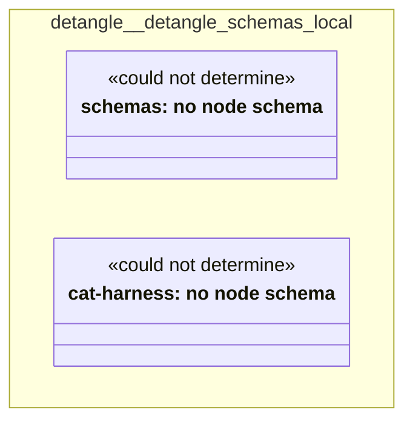

# UML — detangle/detangle-schemas-local

Generated by `cat-harness/scripts/gen-uml-overview.ts` — do not edit. The `detangle-schemas-local` sub-graph of `detangle` (`detangle/schemas`), with every attribute read from its node schema.

**Sources (same model):** [PlantUML](https://github.com/litlfred/folio-assistant/blob/main/cat-harness/uml/overview/detangle/detangle-schemas-local.puml) · [Mermaid](https://github.com/litlfred/folio-assistant/blob/main/cat-harness/uml/overview/detangle/detangle-schemas-local.mmd)

| sub-graph | directory | graph kinds | node schema |
|---|---|---|---|
| `detangle/detangle-schemas-local` | `detangle/schemas` | schemas, cat-harness | schemas: *could not determine*; cat-harness: *could not determine* |

## Sub-graphs

- [← all of detangle](../detangle.html)
