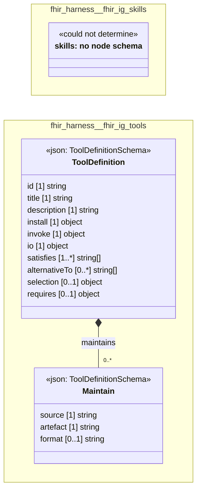

# UML — fhir-harness

Generated by `cat-harness/scripts/gen-uml-overview.ts` — do not edit. Every named sub-graph the `fhir-harness` harness declares, one box each, with the node schema kinds found in it.

**Sources (same model):** [PlantUML](https://github.com/litlfred/folio-assistant/blob/main/cat-harness/uml/overview/fhir-harness.puml) · [Mermaid](https://github.com/litlfred/folio-assistant/blob/main/cat-harness/uml/overview/fhir-harness.mmd)

| sub-graph | directory | graph kinds | node schema |
|---|---|---|---|
| `fhir-harness/fhir-ig-skills` | `fhir-harness/skills` | skills | skills: *could not determine* |
| `fhir-harness/fhir-ig-tools` | `fhir-harness/tools` | tools | `ToolDefinitionSchema` |

## Sub-graphs

- [fhir-harness/fhir-ig-skills](fhir-harness/fhir-ig-skills.html)
- [fhir-harness/fhir-ig-tools](fhir-harness/fhir-ig-tools.html)
