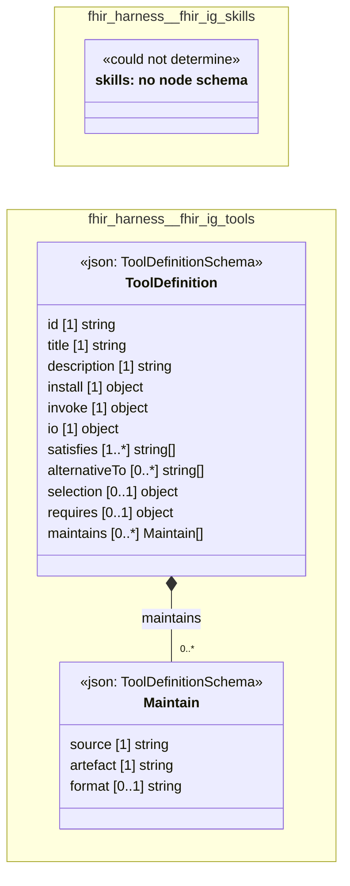

# UML — fhir-harness

Generated by `cat-harness/scripts/gen-uml-overview.ts` — do not edit. Every named sub-graph the `fhir-harness` harness declares, one box each, with the node schema kinds found in it.

**Sources (same model):** [PlantUML](https://github.com/litlfred/folio-assistant/blob/main/cat-harness/uml/overview/fhir-harness.puml) · [Mermaid](https://github.com/litlfred/folio-assistant/blob/main/cat-harness/uml/overview/fhir-harness.mmd)

  <fieldset class="fa-uml-view-pick">
    <legend>Layout</legend>
    <input type="radio" name="fa-uml-overview_fhir_harness" id="fa-uml-overview_fhir_harness-portrait" class="fa-uml-pick-portrait" checked><label for="fa-uml-overview_fhir_harness-portrait">Portrait</label>
    <input type="radio" name="fa-uml-overview_fhir_harness" id="fa-uml-overview_fhir_harness-landscape" class="fa-uml-pick-landscape"><label for="fa-uml-overview_fhir_harness-landscape">Landscape</label>
  </fieldset>
  <figure class="bpmn-figure fa-uml-portrait">
    
  </figure>
  <figure class="bpmn-figure fa-uml-landscape">
    
  </figure>

| sub-graph | directory | graph kinds | node schema |
|---|---|---|---|
| `fhir-harness/fhir-ig-skills` | `fhir-harness/skills` | skills | skills: *could not determine* |
| `fhir-harness/fhir-ig-tools` | `fhir-harness/tools` | tools | `ToolDefinitionSchema` |

## Sub-graphs

- [fhir-harness/fhir-ig-skills](fhir-harness/fhir-ig-skills.html)
- [fhir-harness/fhir-ig-tools](fhir-harness/fhir-ig-tools.html)

## The same model, drawn by Mermaid

Kept so the page renders even where the PlantUML image is missing, and because Mermaid nodes carry the CSS class that colours them from `uml.css`.

