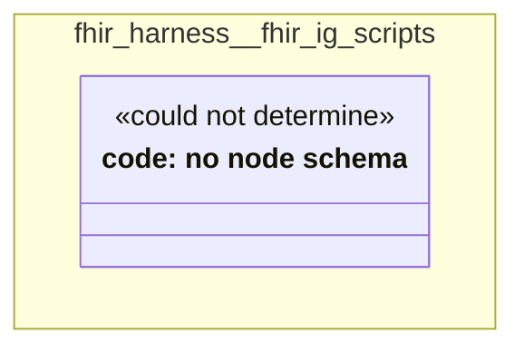

# UML — fhir-harness/fhir-ig-scripts

Generated by `cat-harness/scripts/gen-uml-overview.ts` — do not edit. The `fhir-ig-scripts` sub-graph of `fhir-harness` (`fhir-harness/scripts`), with every attribute read from its node schema.

**Sources (same model):** [PlantUML](https://github.com/litlfred/folio-assistant/blob/main/cat-harness/uml/overview/fhir-harness/fhir-ig-scripts.puml) · [Mermaid](https://github.com/litlfred/folio-assistant/blob/main/cat-harness/uml/overview/fhir-harness/fhir-ig-scripts.mmd)

  <fieldset class="fa-uml-view-pick">
    <legend>Layout</legend>
    <input type="radio" name="fa-uml-overview_fhir_harness_fhir_ig_scripts" id="fa-uml-overview_fhir_harness_fhir_ig_scripts-portrait" class="fa-uml-pick-portrait" checked><label for="fa-uml-overview_fhir_harness_fhir_ig_scripts-portrait">Portrait</label>
    <input type="radio" name="fa-uml-overview_fhir_harness_fhir_ig_scripts" id="fa-uml-overview_fhir_harness_fhir_ig_scripts-landscape" class="fa-uml-pick-landscape"><label for="fa-uml-overview_fhir_harness_fhir_ig_scripts-landscape">Landscape</label>
  </fieldset>
  <figure class="bpmn-figure fa-uml-portrait">
    
  </figure>
  <figure class="bpmn-figure fa-uml-landscape">
    
  </figure>

| sub-graph | directory | graph typologies | node schema | nodes | cohesion | in | out |
|---|---|---|---|---|---|---|---|
| `fhir-harness/fhir-ig-scripts` | `fhir-harness/scripts` | code | code: *could not determine* | *not measured* | | | |

*Nodes, cohesion, in and out* are the detangler's pinned measurements for the same directory (`bun run kg:detangle`; skill [`graph-detanglement`](https://github.com/litlfred/folio-assistant/blob/main/cat-harness/skills/kg/graph-management/graph-detanglement.md)). *Not measured* means the detangler does not scan that directory, not that it has no edges.

## Sub-graphs

- [← all of fhir-harness](../fhir-harness.html)

## The same model, drawn by Mermaid

Kept so the page renders even where the PlantUML image is missing, and because Mermaid nodes carry the CSS class that colours them from `uml.css`.

