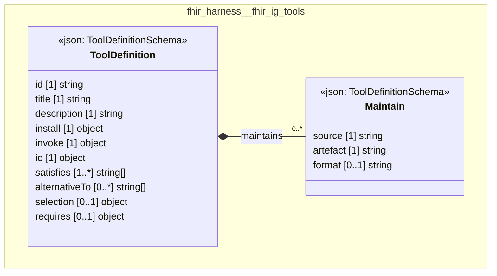

# UML — fhir-harness/fhir-ig-tools

Generated by `cat-harness/scripts/gen-uml-overview.ts` — do not edit. The `fhir-ig-tools` sub-graph of `fhir-harness` (`fhir-harness/tools`), with every attribute read from its node schema.

**Sources (same model):** [PlantUML](https://github.com/litlfred/folio-assistant/blob/main/cat-harness/uml/overview/fhir-harness/fhir-ig-tools.puml) · [Mermaid](https://github.com/litlfred/folio-assistant/blob/main/cat-harness/uml/overview/fhir-harness/fhir-ig-tools.mmd)

| sub-graph | directory | graph kinds | node schema |
|---|---|---|---|
| `fhir-harness/fhir-ig-tools` | `fhir-harness/tools` | tools | `ToolDefinitionSchema` |

## Sub-graphs

- [← all of fhir-harness](../fhir-harness.html)
