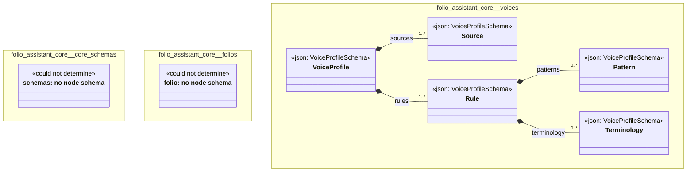

# UML — folio-assistant-core

Generated by `cat-harness/scripts/gen-uml-overview.ts` — do not edit. Every named sub-graph the `folio-assistant-core` harness declares, one box each, with the node schema kinds found in it.

**Sources (same model):** [PlantUML](https://github.com/litlfred/folio-assistant/blob/main/cat-harness/uml/overview/folio-assistant-core.puml) · [Mermaid](https://github.com/litlfred/folio-assistant/blob/main/cat-harness/uml/overview/folio-assistant-core.mmd)

| sub-graph | directory | graph kinds | node schema |
|---|---|---|---|
| `folio-assistant-core/core-schemas` | `folio-assistant-core/schemas` | schemas, cat-harness | schemas: *could not determine* |
| `folio-assistant-core/folios` | `folio-assistant-core/folios` | folio | folio: *could not determine* |
| `folio-assistant-core/voices` | `folio-assistant-core/skills/voices` | voices | `VoiceProfileSchema` |

## Sub-graphs

- [folio-assistant-core/core-schemas](folio-assistant-core/core-schemas.html)
- [folio-assistant-core/folios](folio-assistant-core/folios.html)
- [folio-assistant-core/voices](folio-assistant-core/voices.html)
