# UML — folio-assistant-core

Generated by `cat-harness/scripts/gen-uml-overview.ts` — do not edit. Every named sub-graph the `folio-assistant-core` instance declares, one box each, with the node schema kinds found in it.

**Sources (same model):** [PlantUML](https://github.com/litlfred/folio-assistant/blob/main/cat-harness/uml/overview/folio-assistant-core.puml) · [Mermaid](https://github.com/litlfred/folio-assistant/blob/main/cat-harness/uml/overview/folio-assistant-core.mmd)

  <fieldset class="fa-uml-view-pick">
    <legend>Layout</legend>
    <input type="radio" name="fa-uml-overview_folio_assistant_core" id="fa-uml-overview_folio_assistant_core-portrait" class="fa-uml-pick-portrait" checked><label for="fa-uml-overview_folio_assistant_core-portrait">Portrait</label>
    <input type="radio" name="fa-uml-overview_folio_assistant_core" id="fa-uml-overview_folio_assistant_core-landscape" class="fa-uml-pick-landscape"><label for="fa-uml-overview_folio_assistant_core-landscape">Landscape</label>
  </fieldset>
  <figure class="bpmn-figure fa-uml-portrait">
    
  </figure>
  <figure class="bpmn-figure fa-uml-landscape">
    
  </figure>

| sub-graph | directory | graph kinds | node schema | nodes | cohesion | in | out |
|---|---|---|---|---|---|---|---|
| `folio-assistant-core/core-schemas` | `folio-assistant-core/schemas` | schemas, cat-harness | schemas: *could not determine* | 22 | 0.64 | 0 | 9 |
| `folio-assistant-core/folios` | `folio-assistant-core/folios` | folio | folio: *could not determine* | *not measured* | | | |
| `folio-assistant-core/glossary` | `folio-assistant-core/glossary` | glossary | glossary: *could not determine* | *not measured* | | | |
| `folio-assistant-core/voices` | `folio-assistant-core/skills/voices` | voices | `VoiceProfileSchema` | *not measured* | | | |
| `folio-assistant-core/core-tools` | `folio-assistant-core/tools` | tools | `ToolDefinitionSchema` | *not measured* | | | |
| `folio-assistant-core/core-scripts` | `folio-assistant-core/scripts` | code | code: *could not determine* | *not measured* | | | |
| `folio-assistant-core/core-library` | `folio-assistant-core/library` | library | library: *could not determine* | *not measured* | | | |
| `folio-assistant-core/core-methodologies` | `folio-assistant-core/methodologies` | methodology | methodology: *could not determine* | *not measured* | | | |
| `folio-assistant-core/core-skills` | `folio-assistant-core/skills` | skills | `VoiceProfileSchema` | *not measured* | | | |
| `folio-assistant-core/core-processes` | `folio-assistant-core/processes` | processes | `ext: omg-bpmn-2.0` | *not measured* | | | |

*Nodes, cohesion, in and out* are the detangler's pinned measurements for the same directory (`bun run kg:detangle`; skill [`graph-detanglement`](https://github.com/litlfred/folio-assistant/blob/main/cat-harness/skills/graph-management/graph-detanglement.md)). *Not measured* means the detangler does not scan that directory, not that it has no edges.

## Sub-graphs

- [folio-assistant-core/core-schemas](folio-assistant-core/core-schemas.html)
- [folio-assistant-core/folios](folio-assistant-core/folios.html)
- [folio-assistant-core/glossary](folio-assistant-core/glossary.html)
- [folio-assistant-core/voices](folio-assistant-core/voices.html)
- [folio-assistant-core/core-tools](folio-assistant-core/core-tools.html)
- [folio-assistant-core/core-scripts](folio-assistant-core/core-scripts.html)
- [folio-assistant-core/core-library](folio-assistant-core/core-library.html)
- [folio-assistant-core/core-methodologies](folio-assistant-core/core-methodologies.html)
- [folio-assistant-core/core-skills](folio-assistant-core/core-skills.html)
- [folio-assistant-core/core-processes](folio-assistant-core/core-processes.html)

## The same model, drawn by Mermaid

Kept so the page renders even where the PlantUML image is missing, and because Mermaid nodes carry the CSS class that colours them from `uml.css`.

```mermaid
classDiagram
  direction LR
  namespace folio_assistant_core__core_schemas {
    class n_folio_assistant_core_core_schemas_schemas["schemas: no node schema"] {
      <<could not determine>>
    }
  }
  namespace folio_assistant_core__folios {
    class n_folio_assistant_core_folios_folio["folio: no node schema"] {
      <<could not determine>>
    }
  }
  namespace folio_assistant_core__glossary {
    class n_folio_assistant_core_glossary_glossary["glossary: no node schema"] {
      <<could not determine>>
    }
  }
  namespace folio_assistant_core__voices {
    class folio_assistant_core_voices_Source["Source"] {
      <<json: VoiceProfileSchema>>
      title [1] string
      instance [0..1] string
      libraryId [0..1] string
      kgRef [0..1] string
      url [0..1] string~uri~
      year [0..1] integer
    }
    class folio_assistant_core_voices_Pattern["Pattern"] {
      <<json: VoiceProfileSchema>>
      regex [1] string
      caseSensitive [0..1] boolean
      message [1] string
    }
    class folio_assistant_core_voices_Terminology["Terminology"] {
      <<json: VoiceProfileSchema>>
      correct [1] string
      incorrect [1] string | string[]
      context [0..1] string
    }
    class folio_assistant_core_voices_Rule["Rule"] {
      <<json: VoiceProfileSchema>>
      id [1] string
      title [1] string
      description [1] string
      category [1] enum(13)
      severity [1] critical | major | minor
      source [1] object
      patterns [0..*] Pattern[]
      terminology [0..*] Terminology[]
      judgementOnly [0..1] boolean
    }
    class folio_assistant_core_voices_VoiceProfile["VoiceProfile"] {
      <<json: VoiceProfileSchema>>
      $schema [1] 'folio-voice/v1' | 'folio-voice-skill/v1'
      id [1] string
      title [1] string
      description [1] string
      sources [1..*] Source[]
      rules [1..*] Rule[]
      overlaySeverity [0..1] critical | major | minor
      appliesTo [0..*] string[]
      provenance [1] assertion | evidence | house
      extends [0..1] object
      activeIn [0..1] object
      superseded [0..1] object
    }
  }
  namespace folio_assistant_core__core_tools {
    class folio_assistant_core_core_tools_Maintain["Maintain"] {
      <<json: ToolDefinitionSchema>>
      source [1] string
      artefact [1] string
      format [0..1] string
    }
    class folio_assistant_core_core_tools_ToolDefinition["ToolDefinition"] {
      <<json: ToolDefinitionSchema>>
      id [1] string
      title [1] string
      description [1] string
      install [1] object
      invoke [1] object
      io [1] object
      satisfies [1..*] string[]
      alternativeTo [0..*] string[]
      selection [0..1] object
      requires [0..1] object
      maintains [0..*] Maintain[]
    }
  }
  namespace folio_assistant_core__core_scripts {
    class n_folio_assistant_core_core_scripts_code["code: no node schema"] {
      <<could not determine>>
    }
  }
  namespace folio_assistant_core__core_library {
    class n_folio_assistant_core_core_library_library["library: no node schema"] {
      <<could not determine>>
    }
  }
  namespace folio_assistant_core__core_methodologies {
    class n_folio_assistant_core_core_methodologies_methodology["methodology: no node schema"] {
      <<could not determine>>
    }
  }
  namespace folio_assistant_core__core_skills {
    class folio_assistant_core_core_skills_folio_voice_v1_Source["Source"] {
      <<json: VoiceProfileSchema>>
      title [1] string
      instance [0..1] string
      libraryId [0..1] string
      kgRef [0..1] string
      url [0..1] string~uri~
      year [0..1] integer
    }
    class folio_assistant_core_core_skills_folio_voice_v1_Pattern["Pattern"] {
      <<json: VoiceProfileSchema>>
      regex [1] string
      caseSensitive [0..1] boolean
      message [1] string
    }
    class folio_assistant_core_core_skills_folio_voice_v1_Terminology["Terminology"] {
      <<json: VoiceProfileSchema>>
      correct [1] string
      incorrect [1] string | string[]
      context [0..1] string
    }
    class folio_assistant_core_core_skills_folio_voice_v1_Rule["Rule"] {
      <<json: VoiceProfileSchema>>
      id [1] string
      title [1] string
      description [1] string
      category [1] enum(13)
      severity [1] critical | major | minor
      source [1] object
      patterns [0..*] Pattern[]
      terminology [0..*] Terminology[]
      judgementOnly [0..1] boolean
    }
    class folio_assistant_core_core_skills_folio_voice_v1_folio_voice_v1["folio-voice/v1"] {
      <<json: VoiceProfileSchema>>
      $schema [1] 'folio-voice/v1' | 'folio-voice-skill/v1'
      id [1] string
      title [1] string
      description [1] string
      sources [1..*] Source[]
      rules [1..*] Rule[]
      overlaySeverity [0..1] critical | major | minor
      appliesTo [0..*] string[]
      provenance [1] assertion | evidence | house
      extends [0..1] object
      activeIn [0..1] object
      superseded [0..1] object
    }
  }
  namespace folio_assistant_core__core_processes {
    class folio_assistant_core_core_processes_omg_bpmn_2_0["Business Process Model and Notation (BPMN)"] {
      <<ext: omg-bpmn-2.0>>
      bpmn:callActivity [0..*] element
      bpmn:collaboration [0..*] element
      bpmn:definitions [0..*] element
      bpmn:documentation [0..*] element
      bpmn:endEvent [0..*] element
      bpmn:exclusiveGateway [0..*] element
      bpmn:extensionElements [0..*] element
      bpmn:flowNodeRef [0..*] element
      bpmn:import [0..*] element
      bpmn:incoming [0..*] element
      bpmn:lane [0..*] element
      bpmn:laneSet [0..*] element
      bpmn:outgoing [0..*] element
      bpmn:parallelGateway [0..*] element
      bpmn:participant [0..*] element
      bpmn:process [0..*] element
      bpmn:sequenceFlow [0..*] element
      bpmn:serviceTask [0..*] element
      bpmn:startEvent [0..*] element
      bpmn:task [0..*] element
      bpmn:timerEventDefinition [0..*] element
      bpmn:userTask [0..*] element
    }
  }
  cssClass "n_folio_assistant_core_core_schemas_schemas" fa_uml_kind_schemas
  cssClass "n_folio_assistant_core_core_schemas_schemas" fa_uml_undetermined
  cssClass "n_folio_assistant_core_folios_folio" fa_uml_kind_folio
  cssClass "n_folio_assistant_core_folios_folio" fa_uml_undetermined
  cssClass "n_folio_assistant_core_glossary_glossary" fa_uml_kind_glossary
  cssClass "n_folio_assistant_core_glossary_glossary" fa_uml_undetermined
  folio_assistant_core_voices_VoiceProfile *-- "1..*" folio_assistant_core_voices_Source : sources
  folio_assistant_core_voices_Rule *-- "0..*" folio_assistant_core_voices_Pattern : patterns
  folio_assistant_core_voices_Rule *-- "0..*" folio_assistant_core_voices_Terminology : terminology
  folio_assistant_core_voices_VoiceProfile *-- "1..*" folio_assistant_core_voices_Rule : rules
  cssClass "folio_assistant_core_voices_Source" fa_uml_kind_voices
  cssClass "folio_assistant_core_voices_Pattern" fa_uml_kind_voices
  cssClass "folio_assistant_core_voices_Terminology" fa_uml_kind_voices
  cssClass "folio_assistant_core_voices_Rule" fa_uml_kind_voices
  cssClass "folio_assistant_core_voices_VoiceProfile" fa_uml_kind_voices
  folio_assistant_core_core_tools_ToolDefinition *-- "0..*" folio_assistant_core_core_tools_Maintain : maintains
  cssClass "folio_assistant_core_core_tools_Maintain" fa_uml_kind_tools
  cssClass "folio_assistant_core_core_tools_ToolDefinition" fa_uml_kind_tools
  cssClass "n_folio_assistant_core_core_scripts_code" fa_uml_kind_code
  cssClass "n_folio_assistant_core_core_scripts_code" fa_uml_undetermined
  cssClass "n_folio_assistant_core_core_library_library" fa_uml_kind_library
  cssClass "n_folio_assistant_core_core_library_library" fa_uml_undetermined
  cssClass "n_folio_assistant_core_core_methodologies_methodology" fa_uml_kind_methodology
  cssClass "n_folio_assistant_core_core_methodologies_methodology" fa_uml_undetermined
  folio_assistant_core_core_skills_folio_voice_v1_folio_voice_v1 *-- "1..*" folio_assistant_core_core_skills_folio_voice_v1_Source : sources
  folio_assistant_core_core_skills_folio_voice_v1_Rule *-- "0..*" folio_assistant_core_core_skills_folio_voice_v1_Pattern : patterns
  folio_assistant_core_core_skills_folio_voice_v1_Rule *-- "0..*" folio_assistant_core_core_skills_folio_voice_v1_Terminology : terminology
  folio_assistant_core_core_skills_folio_voice_v1_folio_voice_v1 *-- "1..*" folio_assistant_core_core_skills_folio_voice_v1_Rule : rules
  cssClass "folio_assistant_core_core_skills_folio_voice_v1_Source" fa_uml_kind_skills
  cssClass "folio_assistant_core_core_skills_folio_voice_v1_Pattern" fa_uml_kind_skills
  cssClass "folio_assistant_core_core_skills_folio_voice_v1_Terminology" fa_uml_kind_skills
  cssClass "folio_assistant_core_core_skills_folio_voice_v1_Rule" fa_uml_kind_skills
  cssClass "folio_assistant_core_core_skills_folio_voice_v1_folio_voice_v1" fa_uml_kind_skills
  cssClass "folio_assistant_core_core_processes_omg_bpmn_2_0" fa_uml_kind_processes
```

