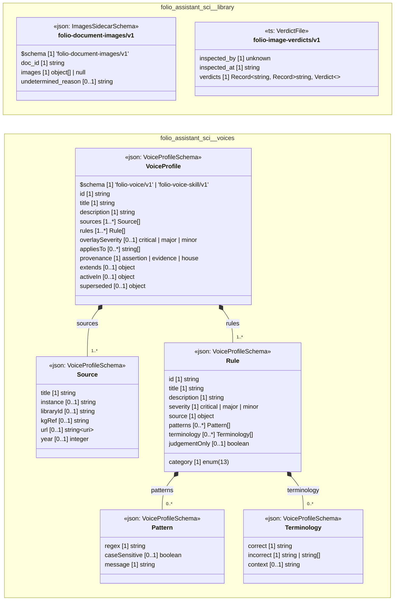

# UML — folio-assistant-sci

Generated by `cat-harness/scripts/gen-uml-overview.ts` — do not edit. Every named sub-graph the `folio-assistant-sci` harness declares, one box each, with the node schema kinds found in it.

**Sources (same model):** [PlantUML](https://github.com/litlfred/folio-assistant/blob/main/cat-harness/uml/overview/folio-assistant-sci.puml) · [Mermaid](https://github.com/litlfred/folio-assistant/blob/main/cat-harness/uml/overview/folio-assistant-sci.mmd)

  <fieldset class="fa-uml-view-pick">
    <legend>Layout</legend>
    <input type="radio" name="fa-uml-overview_folio_assistant_sci" id="fa-uml-overview_folio_assistant_sci-portrait" class="fa-uml-pick-portrait" checked><label for="fa-uml-overview_folio_assistant_sci-portrait">Portrait</label>
    <input type="radio" name="fa-uml-overview_folio_assistant_sci" id="fa-uml-overview_folio_assistant_sci-landscape" class="fa-uml-pick-landscape"><label for="fa-uml-overview_folio_assistant_sci-landscape">Landscape</label>
  </fieldset>
  <figure class="bpmn-figure fa-uml-portrait">
    
  </figure>
  <figure class="bpmn-figure fa-uml-landscape">
    
  </figure>

| sub-graph | directory | graph kinds | node schema |
|---|---|---|---|
| `folio-assistant-sci/library` | `folio-assistant-sci/library` | library | `ImagesSidecarSchema`; `ts: VerdictFile` |
| `folio-assistant-sci/voices` | `folio-assistant-sci/skills/voices` | voices | `VoiceProfileSchema` |

## Sub-graphs

- [folio-assistant-sci/library](folio-assistant-sci/library.html)
- [folio-assistant-sci/voices](folio-assistant-sci/voices.html)

## The same model, drawn by Mermaid

Kept so the page renders even where the PlantUML image is missing, and because Mermaid nodes carry the CSS class that colours them from `uml.css`.

