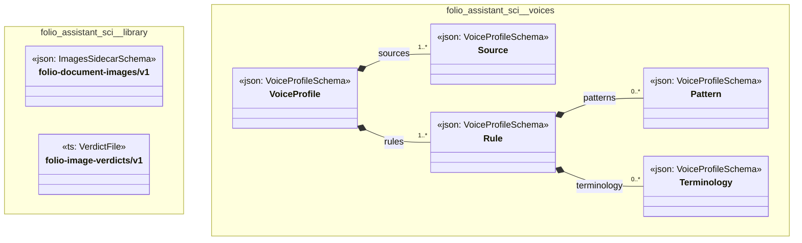

# UML — folio-assistant-sci

Generated by `cat-harness/scripts/gen-uml-overview.ts` — do not edit. Every named sub-graph the `folio-assistant-sci` harness declares, one box each, with the node schema kinds found in it.

**Sources (same model):** [PlantUML](https://github.com/litlfred/folio-assistant/blob/main/cat-harness/uml/overview/folio-assistant-sci.puml) · [Mermaid](https://github.com/litlfred/folio-assistant/blob/main/cat-harness/uml/overview/folio-assistant-sci.mmd)

| sub-graph | directory | graph kinds | node schema |
|---|---|---|---|
| `folio-assistant-sci/library` | `folio-assistant-sci/library` | library | `ImagesSidecarSchema`; `ts: VerdictFile` |
| `folio-assistant-sci/voices` | `folio-assistant-sci/skills/voices` | voices | `VoiceProfileSchema` |

## Sub-graphs

- [folio-assistant-sci/library](folio-assistant-sci/library.html)
- [folio-assistant-sci/voices](folio-assistant-sci/voices.html)
