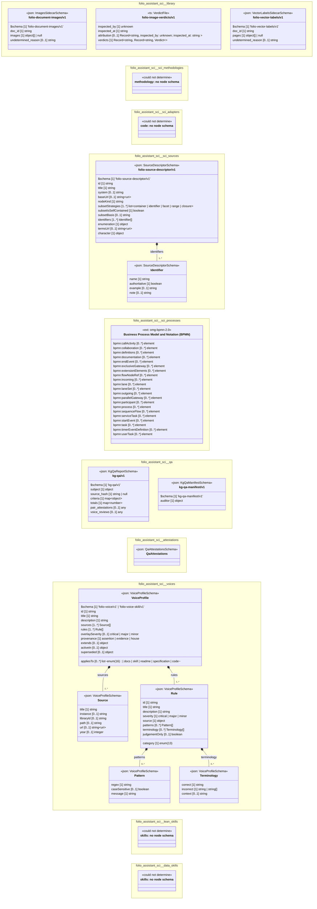

# UML — folio-assistant-sci

Generated by `cat-harness/scripts/gen-uml-overview.ts` — do not edit. Every named sub-graph the `folio-assistant-sci` instance declares, one box each, with the node schema kinds found in it.

**Sources (same model):** [PlantUML](https://github.com/litlfred/folio-assistant/blob/main/cat-harness/uml/overview/folio-assistant-sci.puml) · [Mermaid](https://github.com/litlfred/folio-assistant/blob/main/cat-harness/uml/overview/folio-assistant-sci.mmd)

  <fieldset class="fa-uml-view-pick">
    <legend>Layout</legend>
    <input type="radio" name="fa-uml-overview_folio_assistant_sci" id="fa-uml-overview_folio_assistant_sci-portrait" class="fa-uml-pick-portrait" checked><label for="fa-uml-overview_folio_assistant_sci-portrait">Portrait</label>
    <input type="radio" name="fa-uml-overview_folio_assistant_sci" id="fa-uml-overview_folio_assistant_sci-landscape" class="fa-uml-pick-landscape"><label for="fa-uml-overview_folio_assistant_sci-landscape">Landscape</label>
  </fieldset>
  <figure class="bpmn-figure fa-uml-portrait">
    
  </figure>
  <figure class="bpmn-figure fa-uml-landscape">
    
  </figure>

| sub-graph | directory | graph kinds | node schema | nodes | cohesion | in | out |
|---|---|---|---|---|---|---|---|
| `folio-assistant-sci/library` | `folio-assistant-sci/library` | library | `ImagesSidecarSchema`; `ts: VerdictFile`; `VectorLabelsSidecarSchema` | *not measured* | | | |
| `folio-assistant-sci/sci-methodologies` | `folio-assistant-sci/methodologies` | methodology | methodology: *could not determine* | *not measured* | | | |
| `folio-assistant-sci/sci-adapters` | `folio-assistant-sci/adapters` | code | code: *could not determine* | *not measured* | | | |
| `folio-assistant-sci/sci-sources` | `folio-assistant-sci/sources` | schemas | `SourceDescriptorSchema` | *not measured* | | | |
| `folio-assistant-sci/sci-processes` | `folio-assistant-sci/processes` | processes | `ext: omg-bpmn-2.0` | *not measured* | | | |
| `folio-assistant-sci/qa` | `folio-assistant-sci/test/results` | qa | `KgQaReportSchema`; `KgQaManifestSchema` | *not measured* | | | |
| `folio-assistant-sci/attestations` | `folio-assistant-sci/test/attestations` | attestations | `QaAttestationsSchema` | *not measured* | | | |
| `folio-assistant-sci/voices` | `folio-assistant-sci/skills/voices` | voices | `VoiceProfileSchema` | 2 | 0.00 | 0 | 0 |
| `folio-assistant-sci/lean-skills` | `folio-assistant-sci/skills/lean` | skills | skills: *could not determine* | 1 | 0.00 | 0 | 0 |
| `folio-assistant-sci/data-skills` | `folio-assistant-sci/skills/data` | skills | skills: *could not determine* | 1 | 0.00 | 0 | 0 |

*Nodes, cohesion, in and out* are the detangler's pinned measurements for the same directory (`bun run kg:detangle`; skill [`graph-detanglement`](https://github.com/litlfred/folio-assistant/blob/main/cat-harness/skills/kg/graph-management/graph-detanglement.md)). *Not measured* means the detangler does not scan that directory, not that it has no edges.

## Sub-graphs

- [folio-assistant-sci/library](folio-assistant-sci/library.html)
- [folio-assistant-sci/sci-methodologies](folio-assistant-sci/sci-methodologies.html)
- [folio-assistant-sci/sci-adapters](folio-assistant-sci/sci-adapters.html)
- [folio-assistant-sci/sci-sources](folio-assistant-sci/sci-sources.html)
- [folio-assistant-sci/sci-processes](folio-assistant-sci/sci-processes.html)
- [folio-assistant-sci/qa](folio-assistant-sci/qa.html)
- [folio-assistant-sci/attestations](folio-assistant-sci/attestations.html)
- [folio-assistant-sci/voices](folio-assistant-sci/voices.html)
- [folio-assistant-sci/lean-skills](folio-assistant-sci/lean-skills.html)
- [folio-assistant-sci/data-skills](folio-assistant-sci/data-skills.html)

## The same model, drawn by Mermaid

Kept so the page renders even where the PlantUML image is missing, and because Mermaid nodes carry the CSS class that colours them from `uml.css`.

```mermaid
classDiagram
  direction LR
  namespace folio_assistant_sci__library {
    class folio_assistant_sci_library_folio_document_images_v1_folio_document_images_v1["folio-document-images/v1"] {
      <<json: ImagesSidecarSchema>>
      $schema [1] 'folio-document-images/v1'
      doc_id [1] string
      images [1] object[] | null
      undetermined_reason [0..1] string
    }
    class folio_assistant_sci_library_folio_image_verdicts_v1["folio-image-verdicts/v1"] {
      <<ts: VerdictFile>>
      inspected_by [1] unknown
      inspected_at [1] string
      attribution [0..1] Record~string,  inspected_by: unknown; inspected_at: string ~
      verdicts [1] Record~string, Record~string, Verdict~~
    }
    class folio_assistant_sci_library_folio_vector_labels_v1_folio_vector_labels_v1["folio-vector-labels/v1"] {
      <<json: VectorLabelsSidecarSchema>>
      $schema [1] 'folio-vector-labels/v1'
      doc_id [1] string
      pages [1] object[] | null
      undetermined_reason [0..1] string
    }
  }
  namespace folio_assistant_sci__sci_methodologies {
    class n_folio_assistant_sci_sci_methodologies_methodology["methodology: no node schema"] {
      <<could not determine>>
    }
  }
  namespace folio_assistant_sci__sci_adapters {
    class n_folio_assistant_sci_sci_adapters_code["code: no node schema"] {
      <<could not determine>>
    }
  }
  namespace folio_assistant_sci__sci_sources {
    class folio_assistant_sci_sci_sources_folio_source_descriptor_v1_Identifier["Identifier"] {
      <<json: SourceDescriptorSchema>>
      name [1] string
      authoritative [1] boolean
      example [0..1] string
      note [0..1] string
    }
    class folio_assistant_sci_sci_sources_folio_source_descriptor_v1_folio_source_descriptor_v1["folio-source-descriptor/v1"] {
      <<json: SourceDescriptorSchema>>
      $schema [1] 'folio-source-descriptor/v1'
      id [1] string
      title [1] string
      system [0..1] string
      baseUrl [0..1] string~uri~
      nodeKind [1] string
      subsetStrategies [1..*] list~container | identifier | facet | range | closure~
      subsetIsSelfContained [1] boolean
      subsetBasis [0..1] string
      identifiers [1..*] Identifier[]
      enumeration [1] object
      termsUrl [0..1] string~uri~
      character [1] object
    }
  }
  namespace folio_assistant_sci__sci_processes {
    class folio_assistant_sci_sci_processes_omg_bpmn_2_0["Business Process Model and Notation (BPMN)"] {
      <<ext: omg-bpmn-2.0>>
      bpmn:callActivity [0..*] element
      bpmn:collaboration [0..*] element
      bpmn:definitions [0..*] element
      bpmn:documentation [0..*] element
      bpmn:endEvent [0..*] element
      bpmn:exclusiveGateway [0..*] element
      bpmn:extensionElements [0..*] element
      bpmn:flowNodeRef [0..*] element
      bpmn:incoming [0..*] element
      bpmn:lane [0..*] element
      bpmn:laneSet [0..*] element
      bpmn:outgoing [0..*] element
      bpmn:parallelGateway [0..*] element
      bpmn:participant [0..*] element
      bpmn:process [0..*] element
      bpmn:sequenceFlow [0..*] element
      bpmn:serviceTask [0..*] element
      bpmn:startEvent [0..*] element
      bpmn:task [0..*] element
      bpmn:timerEventDefinition [0..*] element
      bpmn:userTask [0..*] element
    }
  }
  namespace folio_assistant_sci__qa {
    class folio_assistant_sci_qa_kg_qa_v1_kg_qa_v1["kg-qa/v1"] {
      <<json: KgQaReportSchema>>
      $schema [1] 'kg-qa/v1'
      subject [1] object
      source_hash [1] string | null
      criteria [1] map~object~
      totals [1] map~number~
      pair_attestations [0..1] any
      voice_reviews [0..1] any
    }
    class folio_assistant_sci_qa_kg_qa_manifest_v1_kg_qa_manifest_v1["kg-qa-manifest/v1"] {
      <<json: KgQaManifestSchema>>
      $schema [1] 'kg-qa-manifest/v1'
      auditor [1] object
    }
  }
  namespace folio_assistant_sci__attestations {
    class folio_assistant_sci_attestations_QaAttestations["QaAttestations"] {
      <<json: QaAttestationsSchema>>
    }
  }
  namespace folio_assistant_sci__voices {
    class folio_assistant_sci_voices_Source["Source"] {
      <<json: VoiceProfileSchema>>
      title [1] string
      instance [0..1] string
      libraryId [0..1] string
      path [0..1] string
      url [0..1] string~uri~
      year [0..1] integer
    }
    class folio_assistant_sci_voices_Pattern["Pattern"] {
      <<json: VoiceProfileSchema>>
      regex [1] string
      caseSensitive [0..1] boolean
      message [1] string
    }
    class folio_assistant_sci_voices_Terminology["Terminology"] {
      <<json: VoiceProfileSchema>>
      correct [1] string
      incorrect [1] string | string[]
      context [0..1] string
    }
    class folio_assistant_sci_voices_Rule["Rule"] {
      <<json: VoiceProfileSchema>>
      id [1] string
      title [1] string
      description [1] string
      category [1] enum(13)
      severity [1] critical | major | minor
      source [1] object
      patterns [0..*] Pattern[]
      terminology [0..*] Terminology[]
      judgementOnly [0..1] boolean
    }
    class folio_assistant_sci_voices_VoiceProfile["VoiceProfile"] {
      <<json: VoiceProfileSchema>>
      $schema [1] 'folio-voice/v1' | 'folio-voice-skill/v1'
      id [1] string
      title [1] string
      description [1] string
      sources [1..*] Source[]
      rules [1..*] Rule[]
      overlaySeverity [0..1] critical | major | minor
      appliesTo [0..*] list~enum(16) | docs | skill | readme | specification | code~
      provenance [1] assertion | evidence | house
      extends [0..1] object
      activeIn [0..1] object
      superseded [0..1] object
    }
  }
  namespace folio_assistant_sci__lean_skills {
    class n_folio_assistant_sci_lean_skills_skills["skills: no node schema"] {
      <<could not determine>>
    }
  }
  namespace folio_assistant_sci__data_skills {
    class n_folio_assistant_sci_data_skills_skills["skills: no node schema"] {
      <<could not determine>>
    }
  }
  cssClass "folio_assistant_sci_library_folio_document_images_v1_folio_document_images_v1" fa_uml_kind_library
  cssClass "folio_assistant_sci_library_folio_image_verdicts_v1" fa_uml_kind_library
  cssClass "folio_assistant_sci_library_folio_vector_labels_v1_folio_vector_labels_v1" fa_uml_kind_library
  cssClass "n_folio_assistant_sci_sci_methodologies_methodology" fa_uml_kind_methodology
  cssClass "n_folio_assistant_sci_sci_methodologies_methodology" fa_uml_undetermined
  cssClass "n_folio_assistant_sci_sci_adapters_code" fa_uml_kind_code
  cssClass "n_folio_assistant_sci_sci_adapters_code" fa_uml_undetermined
  folio_assistant_sci_sci_sources_folio_source_descriptor_v1_folio_source_descriptor_v1 *-- "1..*" folio_assistant_sci_sci_sources_folio_source_descriptor_v1_Identifier : identifiers
  cssClass "folio_assistant_sci_sci_sources_folio_source_descriptor_v1_Identifier" fa_uml_kind_schemas
  cssClass "folio_assistant_sci_sci_sources_folio_source_descriptor_v1_folio_source_descriptor_v1" fa_uml_kind_schemas
  cssClass "folio_assistant_sci_sci_processes_omg_bpmn_2_0" fa_uml_kind_processes
  cssClass "folio_assistant_sci_qa_kg_qa_v1_kg_qa_v1" fa_uml_kind_qa
  cssClass "folio_assistant_sci_qa_kg_qa_manifest_v1_kg_qa_manifest_v1" fa_uml_kind_qa
  cssClass "folio_assistant_sci_attestations_QaAttestations" fa_uml_kind_attestations
  folio_assistant_sci_voices_VoiceProfile *-- "1..*" folio_assistant_sci_voices_Source : sources
  folio_assistant_sci_voices_Rule *-- "0..*" folio_assistant_sci_voices_Pattern : patterns
  folio_assistant_sci_voices_Rule *-- "0..*" folio_assistant_sci_voices_Terminology : terminology
  folio_assistant_sci_voices_VoiceProfile *-- "1..*" folio_assistant_sci_voices_Rule : rules
  cssClass "folio_assistant_sci_voices_Source" fa_uml_kind_voices
  cssClass "folio_assistant_sci_voices_Pattern" fa_uml_kind_voices
  cssClass "folio_assistant_sci_voices_Terminology" fa_uml_kind_voices
  cssClass "folio_assistant_sci_voices_Rule" fa_uml_kind_voices
  cssClass "folio_assistant_sci_voices_VoiceProfile" fa_uml_kind_voices
  cssClass "n_folio_assistant_sci_lean_skills_skills" fa_uml_kind_skills
  cssClass "n_folio_assistant_sci_lean_skills_skills" fa_uml_undetermined
  cssClass "n_folio_assistant_sci_data_skills_skills" fa_uml_kind_skills
  cssClass "n_folio_assistant_sci_data_skills_skills" fa_uml_undetermined
```
