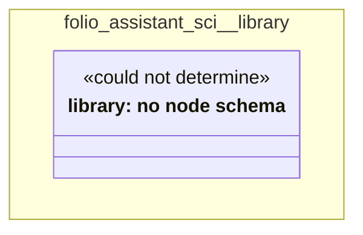

# UML — folio-assistant-sci/library

Generated by `cat-harness/scripts/gen-uml-overview.ts` — do not edit. The `library` sub-graph of `folio-assistant-sci` (`folio-assistant-sci/library`), with every attribute read from its node schema.

**Sources (same model):** [PlantUML](https://github.com/litlfred/folio-assistant/blob/main/cat-harness/uml/overview/folio-assistant-sci/library.puml) · [Mermaid](https://github.com/litlfred/folio-assistant/blob/main/cat-harness/uml/overview/folio-assistant-sci/library.mmd)

| sub-graph | directory | graph kinds | node schema |
|---|---|---|---|
| `folio-assistant-sci/library` | `folio-assistant-sci/library` | library | library: *could not determine* |

## Sub-graphs

- [← all of folio-assistant-sci](../folio-assistant-sci.html)
