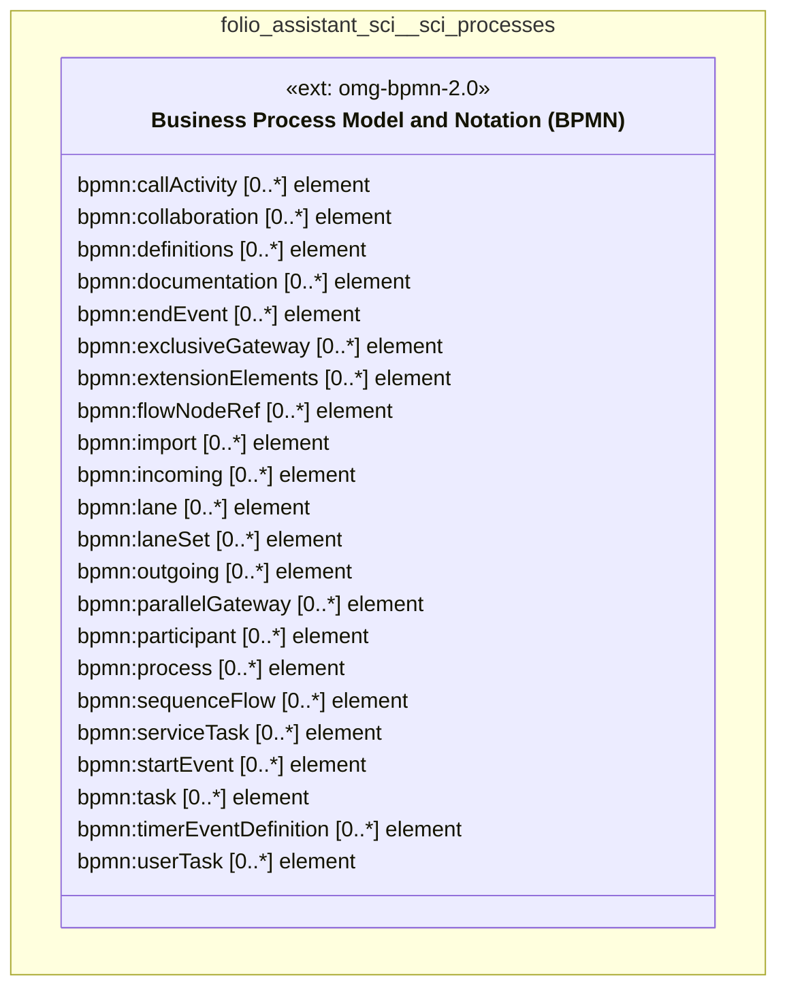

# UML — folio-assistant-sci/sci-processes

Generated by `cat-harness/scripts/gen-uml-overview.ts` — do not edit. The `sci-processes` sub-graph of `folio-assistant-sci` (`folio-assistant-sci/processes`), with every attribute read from its node schema.

**Sources (same model):** [PlantUML](https://github.com/litlfred/folio-assistant/blob/main/cat-harness/uml/overview/folio-assistant-sci/sci-processes.puml) · [Mermaid](https://github.com/litlfred/folio-assistant/blob/main/cat-harness/uml/overview/folio-assistant-sci/sci-processes.mmd)

  <fieldset class="fa-uml-view-pick">
    <legend>Layout</legend>
    <input type="radio" name="fa-uml-overview_folio_assistant_sci_sci_processes" id="fa-uml-overview_folio_assistant_sci_sci_processes-portrait" class="fa-uml-pick-portrait" checked><label for="fa-uml-overview_folio_assistant_sci_sci_processes-portrait">Portrait</label>
    <input type="radio" name="fa-uml-overview_folio_assistant_sci_sci_processes" id="fa-uml-overview_folio_assistant_sci_sci_processes-landscape" class="fa-uml-pick-landscape"><label for="fa-uml-overview_folio_assistant_sci_sci_processes-landscape">Landscape</label>
  </fieldset>
  <figure class="bpmn-figure fa-uml-portrait">
    
  </figure>
  <figure class="bpmn-figure fa-uml-landscape">
    
  </figure>

| sub-graph | directory | graph kinds | node schema | nodes | cohesion | in | out |
|---|---|---|---|---|---|---|---|
| `folio-assistant-sci/sci-processes` | `folio-assistant-sci/processes` | processes | `ext: omg-bpmn-2.0` | *not measured* | | | |

*Nodes, cohesion, in and out* are the detangler's pinned measurements for the same directory (`bun run kg:detangle`; skill [`graph-detanglement`](https://github.com/litlfred/folio-assistant/blob/main/cat-harness/skills/kg/graph-management/graph-detanglement.md)). *Not measured* means the detangler does not scan that directory, not that it has no edges.

## Sub-graphs

- [← all of folio-assistant-sci](../folio-assistant-sci.html)

## The same model, drawn by Mermaid

Kept so the page renders even where the PlantUML image is missing, and because Mermaid nodes carry the CSS class that colours them from `uml.css`.

