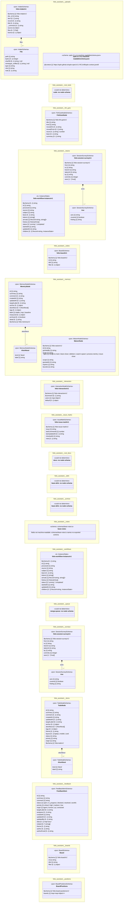

# UML — folio-assistant

Generated by `cat-harness/scripts/gen-uml-overview.ts` — do not edit. Every named sub-graph the `folio-assistant` instance declares, one box each, with the node schema kinds found in it.

**Sources (same model):** [PlantUML](https://github.com/litlfred/folio-assistant/blob/main/cat-harness/uml/overview/folio-assistant.puml) · [Mermaid](https://github.com/litlfred/folio-assistant/blob/main/cat-harness/uml/overview/folio-assistant.mmd)

  <fieldset class="fa-uml-view-pick">
    <legend>Layout</legend>
    <input type="radio" name="fa-uml-overview_folio_assistant" id="fa-uml-overview_folio_assistant-portrait" class="fa-uml-pick-portrait" checked><label for="fa-uml-overview_folio_assistant-portrait">Portrait</label>
    <input type="radio" name="fa-uml-overview_folio_assistant" id="fa-uml-overview_folio_assistant-landscape" class="fa-uml-pick-landscape"><label for="fa-uml-overview_folio_assistant-landscape">Landscape</label>
  </fieldset>
  <figure class="bpmn-figure fa-uml-portrait">
    
  </figure>
  <figure class="bpmn-figure fa-uml-landscape">
    
  </figure>

| sub-graph | directory | graph kinds | node schema | nodes | cohesion | in | out |
|---|---|---|---|---|---|---|---|
| `folio-assistant/uploads` | `uploads` | uploads | `IntakeSchema`; `schema: spdx-3-1-rc1-machine-readable/schema.json` | *not measured* | | | |
| `folio-assistant/root-tools` | `tools` | code | code: *could not determine* | *not measured* | | | |
| `folio-assistant/fsh-guts` | `fsh-guts` | fsh-guts | `FshGutsNodeSchema` | *not measured* | | | |
| `folio-assistant/beans` | `beans` | beans | `ts: InstanceState`; `SessionSurveySchema` | *not measured* | | | |
| `folio-assistant/todos` | `todos` | todos | `BoardSchema` | *not measured* | | | |
| `folio-assistant/memory` | `memory` | memory, waiver | `MemoryNodeSchema`; `WaiverNodeSchema` | *not measured* | | | |
| `folio-assistant/interaction` | `interaction` | interaction | `InteractionNodeSchema` | *not measured* | | | |
| `folio-assistant/issue-marks` | `issue-marks` | issue-marks | `IssueMarkSchema` | *not measured* | | | |
| `folio-assistant/root-docs` | `docs` | docs | docs: *could not determine* | *not measured* | | | |
| `folio-assistant/defs` | `beans/defs` | bean-defs | bean-defs: *could not determine* | *not measured* | | | |
| `folio-assistant/archive` | `beans/defs/archive` | bean-defs | bean-defs: *could not determine* | *not measured* | | | |
| `folio-assistant/notes` | `beans/notes` | bean-notes | `schema: schemas/bean-note.ts` | *not measured* | | | |
| `folio-assistant/workflows` | `beans/workflows` | workflow-state | `ts: InstanceState` | *not measured* | | | |
| `folio-assistant/queue` | `beans/queue` | merge-queue | merge-queue: *could not determine* | *not measured* | | | |
| `folio-assistant/surveys` | `beans/surveys` | session-survey | `SessionSurveySchema` | *not measured* | | | |
| `folio-assistant/items` | `todos/items` | todo-items | `TodoNodeSchema` | *not measured* | | | |
| `folio-assistant/feedback` | `todos/feedback` | todo-feedback | `FeedbackItemSchema` | *not measured* | | | |
| `folio-assistant/boards` | `todos/boards` | boards | `BoardSchema` | *not measured* | | | |
| `folio-assistant/positions` | `todos/boards` | board-positions | `BoardPositionsSchema` | *not measured* | | | |

*Nodes, cohesion, in and out* are the detangler's pinned measurements for the same directory (`bun run kg:detangle`; skill [`graph-detanglement`](https://github.com/litlfred/folio-assistant/blob/main/cat-harness/skills/kg/graph-management/graph-detanglement.md)). *Not measured* means the detangler does not scan that directory, not that it has no edges.

## Sub-graphs

- [folio-assistant/uploads](folio-assistant/uploads.html)
- [folio-assistant/root-tools](folio-assistant/root-tools.html)
- [folio-assistant/fsh-guts](folio-assistant/fsh-guts.html)
- [folio-assistant/beans](folio-assistant/beans.html)
- [folio-assistant/todos](folio-assistant/todos.html)
- [folio-assistant/memory](folio-assistant/memory.html)
- [folio-assistant/interaction](folio-assistant/interaction.html)
- [folio-assistant/issue-marks](folio-assistant/issue-marks.html)
- [folio-assistant/root-docs](folio-assistant/root-docs.html)
- [folio-assistant/defs](folio-assistant/defs.html)
- [folio-assistant/archive](folio-assistant/archive.html)
- [folio-assistant/notes](folio-assistant/notes.html)
- [folio-assistant/workflows](folio-assistant/workflows.html)
- [folio-assistant/queue](folio-assistant/queue.html)
- [folio-assistant/surveys](folio-assistant/surveys.html)
- [folio-assistant/items](folio-assistant/items.html)
- [folio-assistant/feedback](folio-assistant/feedback.html)
- [folio-assistant/boards](folio-assistant/boards.html)
- [folio-assistant/positions](folio-assistant/positions.html)

## The same model, drawn by Mermaid

Kept so the page renders even where the PlantUML image is missing, and because Mermaid nodes carry the CSS class that colours them from `uml.css`.

```mermaid
classDiagram
  direction LR
  namespace folio_assistant__uploads {
    class folio_assistant_uploads_folio_intake_v1_File["File"] {
      <<json: IntakeSchema>>
      path [1] string
      bytes [0..1] integer
      sha256 [0..1] string | null
      mimetype_sniffed [0..1] string | null
      type [1] string
      role [1] string
      note [0..1] string
    }
    class folio_assistant_uploads_folio_intake_v1_folio_intake_v1["folio-intake/v1"] {
      <<json: IntakeSchema>>
      $schema [1] 'folio-intake/v1'
      doc_id [1] string
      item [0..1] string
      record [0..1] string
      title [0..1] string
      _comment [0..1] string
      source [1] object
      files [0..*] File[]
      licence [0..1] object
    }
    class folio_assistant_uploads_spdx_3_1_rc1_machine_readable_schema_json_spdx_3_1_rc1_machine_readable_schema_json["spdx-3-1-rc1-machine-readable/schema.json"] {
      <<schema: spdx-3-1-rc1-machine-readable/schema.json>>
      @context [1] 'https://spdx.github.io/spdx-spec/v3.1-RC1/rdf/spdx-context.jsonld'
    }
  }
  namespace folio_assistant__root_tools {
    class n_folio_assistant_root_tools_code["code: no node schema"] {
      <<could not determine>>
    }
  }
  namespace folio_assistant__fsh_guts {
    class folio_assistant_fsh_guts_FshGutsNode["FshGutsNode"] {
      <<json: FshGutsNodeSchema>>
      $schema [1] 'folio-fsh-guts/v1'
      title [1] string
      kind [1] string
      movedOn [0..1] string
      movedFrom [0..1] string
      issue [0..1] string | number
      bean [0..1] string
      summary [0..1] string
    }
  }
  namespace folio_assistant__beans {
    class folio_assistant_beans_folio_workflow_instance_v1["folio-workflow-instance/v1"] {
      <<ts: InstanceState>>
      $schema [0..1] string
      id [1] string
      processId [1] string
      source [1] string
      subject [1] string
      bean [0..1] string
      tokens [1] string[]
      arrivals [1] Record~string, string[]~
      history [1] HistoryEntry[]
      status [1] 'running' | 'completed'
      startedAt [1] string
      updatedAt [1] string
      children [0..1] Record~string, InstanceState~
    }
    class folio_assistant_beans_folio_session_survey_v1_Axe["Axe"] {
      <<json: SessionSurveySchema>>
      axis [1] string
      covered [1] boolean
      finding [1] string
    }
    class folio_assistant_beans_folio_session_survey_v1_folio_session_survey_v1["folio-session-survey/v1"] {
      <<json: SessionSurveySchema>>
      $schema [1] 'folio-session-survey/v1'
      from [1] string
      to [1] string
      branch [1] string
      takenAt [1] string
      by [1] string
      commits [1] integer
      axes [1..*] Axe[]
    }
  }
  namespace folio_assistant__todos {
    class folio_assistant_todos_folio_board_v1_folio_board_v1["folio-board/v1"] {
      <<json: BoardSchema>>
      $schema [1] 'folio-board/v1'
      id [1] string
      title [1] string
      filter [0..1] object
    }
  }
  namespace folio_assistant__memory {
    class folio_assistant_memory_AlsoAbout["AlsoAbout"] {
      <<json: MemoryNodeSchema>>
      kind [1] 'block'
      label [1] string
    }
    class folio_assistant_memory_MemoryNode["MemoryNode"] {
      <<json: MemoryNodeSchema>>
      id [1] string
      summary [1] string
      comment [0..1] string
      createdAt [1] string
      updatedAt [0..1] string
      targetLabel [0..1] string
      anchor [0..1] object
      alsoAbout [0..*] AlsoAbout[]
      tags [0..1] object
      label [1] stable | trap | baseline
      measured [0..1] object
      archived [0..1] boolean
      detail [0..1] string
      $schema [1] 'folio-memory/v1'
    }
    class folio_assistant_memory_WaiverNode["WaiverNode"] {
      <<json: WaiverNodeSchema>>
      $schema [1] 'folio-waiver/v1'
      id [1] string
      grantedBy [1] string
      quote [1] string
      gate [1] merge-to-main | bean-close | deletion | swarm-spawn | process-reentry | issue-close
      scope [1] string
      grantedAt [1] string
      expires [1] string
      bounds [1] string
    }
  }
  namespace folio_assistant__interaction {
    class folio_assistant_interaction_folio_interaction_v1_folio_interaction_v1["folio-interaction/v1"] {
      <<json: InteractionNodeSchema>>
      $schema [1] 'folio-interaction/v1'
      $comment [0..1] string
      users [1] map~object~
      default [0..1] object
    }
  }
  namespace folio_assistant__issue_marks {
    class folio_assistant_issue_marks_folio_issue_mark_v1_folio_issue_mark_v1["folio-issue-mark/v1"] {
      <<json: IssueMarkSchema>>
      $schema [1] 'folio-issue-mark/v1'
      issue [1] string
      lastCommentId [1] number
      lastUpdatedAt [0..1] string
      checkedAt [1] string
      note [0..1] string
    }
  }
  namespace folio_assistant__root_docs {
    class n_folio_assistant_root_docs_docs["docs: no node schema"] {
      <<could not determine>>
    }
  }
  namespace folio_assistant__defs {
    class n_folio_assistant_defs_bean_defs["bean-defs: no node schema"] {
      <<could not determine>>
    }
  }
  namespace folio_assistant__archive {
    class n_folio_assistant_archive_bean_defs["bean-defs: no node schema"] {
      <<could not determine>>
    }
  }
  namespace folio_assistant__notes {
    class folio_assistant_notes_bean_notes_shape["bean-notes"] {
      <<schema: schemas/bean-note.ts>>
      fields not machine-readable: schemas/bean-note.ts names no exported schema
    }
  }
  namespace folio_assistant__workflows {
    class folio_assistant_workflows_folio_workflow_instance_v1["folio-workflow-instance/v1"] {
      <<ts: InstanceState>>
      $schema [0..1] string
      id [1] string
      processId [1] string
      source [1] string
      subject [1] string
      bean [0..1] string
      tokens [1] string[]
      arrivals [1] Record~string, string[]~
      history [1] HistoryEntry[]
      status [1] 'running' | 'completed'
      startedAt [1] string
      updatedAt [1] string
      children [0..1] Record~string, InstanceState~
    }
  }
  namespace folio_assistant__queue {
    class n_folio_assistant_queue_merge_queue["merge-queue: no node schema"] {
      <<could not determine>>
    }
  }
  namespace folio_assistant__surveys {
    class folio_assistant_surveys_folio_session_survey_v1_Axe["Axe"] {
      <<json: SessionSurveySchema>>
      axis [1] string
      covered [1] boolean
      finding [1] string
    }
    class folio_assistant_surveys_folio_session_survey_v1_folio_session_survey_v1["folio-session-survey/v1"] {
      <<json: SessionSurveySchema>>
      $schema [1] 'folio-session-survey/v1'
      from [1] string
      to [1] string
      branch [1] string
      takenAt [1] string
      by [1] string
      commits [1] integer
      axes [1..*] Axe[]
    }
  }
  namespace folio_assistant__items {
    class folio_assistant_items_AlsoAbout["AlsoAbout"] {
      <<json: TodoNodeSchema>>
      kind [1] 'block'
      label [1] string
    }
    class folio_assistant_items_TodoNode["TodoNode"] {
      <<json: TodoNodeSchema>>
      id [1] string
      summary [1] string
      comment [0..1] string
      createdAt [1] string
      updatedAt [0..1] string
      targetLabel [0..1] string
      anchor [0..1] object
      alsoAbout [0..*] AlsoAbout[]
      tags [0..1] object
      theme [0..1] string
      layout [0..1] laptop | mobile | card
      status [1] string
      priority [1] string
      origin [1] string
      $schema [1] 'folio-todo/v1'
    }
  }
  namespace folio_assistant__feedback {
    class folio_assistant_feedback_FeedbackItem["FeedbackItem"] {
      <<json: FeedbackItemSchema>>
      id [1] string
      summary [1] string
      comment [1] string
      status [1] open | in_progress | blocked | resolved | wontfix
      priority [1] critical | high | medium | low
      origin [1] agent | human | qc | extracted
      targetLabel [0..1] string
      assignee [0..1] string
      createdAt [1] string
      updatedAt [0..1] string
      updatedBy [0..1] string
      data [0..1] map~any~
      related [0..*] string[]
      theme [0..1] string
      author [0..1] string
      authorEmail [0..1] string
    }
  }
  namespace folio_assistant__boards {
    class folio_assistant_boards_Board["Board"] {
      <<json: BoardSchema>>
      $schema [1] 'folio-board/v1'
      id [1] string
      title [1] string
      filter [0..1] object
    }
  }
  namespace folio_assistant__positions {
    class folio_assistant_positions_BoardPositions["BoardPositions"] {
      <<json: BoardPositionsSchema>>
      $schema [1] 'folio-board-positions/v1'
      boards [1] map~map~object~~
    }
  }
  folio_assistant_uploads_folio_intake_v1_folio_intake_v1 *-- "0..*" folio_assistant_uploads_folio_intake_v1_File : files
  cssClass "folio_assistant_uploads_folio_intake_v1_File" fa_uml_kind_uploads
  cssClass "folio_assistant_uploads_folio_intake_v1_folio_intake_v1" fa_uml_kind_uploads
  cssClass "folio_assistant_uploads_spdx_3_1_rc1_machine_readable_schema_json_spdx_3_1_rc1_machine_readable_schema_json" fa_uml_kind_uploads
  cssClass "n_folio_assistant_root_tools_code" fa_uml_kind_code
  cssClass "n_folio_assistant_root_tools_code" fa_uml_undetermined
  cssClass "folio_assistant_fsh_guts_FshGutsNode" fa_uml_kind_fsh_guts
  folio_assistant_beans_folio_session_survey_v1_folio_session_survey_v1 *-- "1..*" folio_assistant_beans_folio_session_survey_v1_Axe : axes
  cssClass "folio_assistant_beans_folio_workflow_instance_v1" fa_uml_kind_beans
  cssClass "folio_assistant_beans_folio_session_survey_v1_Axe" fa_uml_kind_beans
  cssClass "folio_assistant_beans_folio_session_survey_v1_folio_session_survey_v1" fa_uml_kind_beans
  cssClass "folio_assistant_todos_folio_board_v1_folio_board_v1" fa_uml_kind_todos
  folio_assistant_memory_MemoryNode *-- "0..*" folio_assistant_memory_AlsoAbout : alsoAbout
  cssClass "folio_assistant_memory_AlsoAbout" fa_uml_kind_memory
  cssClass "folio_assistant_memory_MemoryNode" fa_uml_kind_memory
  cssClass "folio_assistant_memory_WaiverNode" fa_uml_kind_waiver
  cssClass "folio_assistant_interaction_folio_interaction_v1_folio_interaction_v1" fa_uml_kind_interaction
  cssClass "folio_assistant_issue_marks_folio_issue_mark_v1_folio_issue_mark_v1" fa_uml_kind_issue_marks
  cssClass "n_folio_assistant_root_docs_docs" fa_uml_kind_docs
  cssClass "n_folio_assistant_root_docs_docs" fa_uml_undetermined
  cssClass "n_folio_assistant_defs_bean_defs" fa_uml_kind_bean_defs
  cssClass "n_folio_assistant_defs_bean_defs" fa_uml_undetermined
  cssClass "n_folio_assistant_archive_bean_defs" fa_uml_kind_bean_defs
  cssClass "n_folio_assistant_archive_bean_defs" fa_uml_undetermined
  cssClass "folio_assistant_notes_bean_notes_shape" fa_uml_kind_bean_notes
  cssClass "folio_assistant_workflows_folio_workflow_instance_v1" fa_uml_kind_workflow_state
  cssClass "n_folio_assistant_queue_merge_queue" fa_uml_kind_merge_queue
  cssClass "n_folio_assistant_queue_merge_queue" fa_uml_undetermined
  folio_assistant_surveys_folio_session_survey_v1_folio_session_survey_v1 *-- "1..*" folio_assistant_surveys_folio_session_survey_v1_Axe : axes
  cssClass "folio_assistant_surveys_folio_session_survey_v1_Axe" fa_uml_kind_session_survey
  cssClass "folio_assistant_surveys_folio_session_survey_v1_folio_session_survey_v1" fa_uml_kind_session_survey
  folio_assistant_items_TodoNode *-- "0..*" folio_assistant_items_AlsoAbout : alsoAbout
  cssClass "folio_assistant_items_AlsoAbout" fa_uml_kind_todo_items
  cssClass "folio_assistant_items_TodoNode" fa_uml_kind_todo_items
  cssClass "folio_assistant_feedback_FeedbackItem" fa_uml_kind_todo_feedback
  cssClass "folio_assistant_boards_Board" fa_uml_kind_boards
  cssClass "folio_assistant_positions_BoardPositions" fa_uml_kind_board_positions
```
