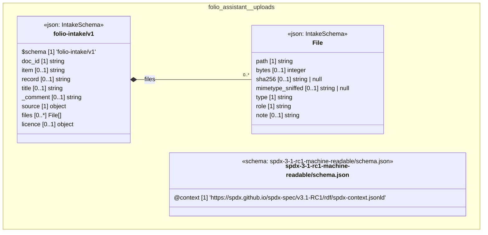

# UML — folio-assistant/uploads

Generated by `cat-harness/scripts/gen-uml-overview.ts` — do not edit. The `uploads` sub-graph of `folio-assistant` (`uploads`), with every attribute read from its node schema.

**Sources (same model):** [PlantUML](https://github.com/litlfred/folio-assistant/blob/main/cat-harness/uml/overview/folio-assistant/uploads.puml) · [Mermaid](https://github.com/litlfred/folio-assistant/blob/main/cat-harness/uml/overview/folio-assistant/uploads.mmd)

  <fieldset class="fa-uml-view-pick">
    <legend>Layout</legend>
    <input type="radio" name="fa-uml-overview_folio_assistant_uploads" id="fa-uml-overview_folio_assistant_uploads-portrait" class="fa-uml-pick-portrait" checked><label for="fa-uml-overview_folio_assistant_uploads-portrait">Portrait</label>
    <input type="radio" name="fa-uml-overview_folio_assistant_uploads" id="fa-uml-overview_folio_assistant_uploads-landscape" class="fa-uml-pick-landscape"><label for="fa-uml-overview_folio_assistant_uploads-landscape">Landscape</label>
  </fieldset>
  <figure class="bpmn-figure fa-uml-portrait">
    
  </figure>
  <figure class="bpmn-figure fa-uml-landscape">
    
  </figure>

| sub-graph | directory | graph kinds | node schema | nodes | cohesion | in | out |
|---|---|---|---|---|---|---|---|
| `folio-assistant/uploads` | `uploads` | uploads | `IntakeSchema`; `schema: spdx-3-1-rc1-machine-readable/schema.json` | *not measured* | | | |

*Nodes, cohesion, in and out* are the detangler's pinned measurements for the same directory (`bun run kg:detangle`; skill [`graph-detanglement`](https://github.com/litlfred/folio-assistant/blob/main/cat-harness/skills/kg/graph-management/graph-detanglement.md)). *Not measured* means the detangler does not scan that directory, not that it has no edges.

## Sub-graphs

- [← all of folio-assistant](../folio-assistant.html)

## The same model, drawn by Mermaid

Kept so the page renders even where the PlantUML image is missing, and because Mermaid nodes carry the CSS class that colours them from `uml.css`.

```mermaid
classDiagram
  direction TB
  namespace folio_assistant__uploads {
    class folio_assistant_uploads_folio_intake_v1_File["File"] {
      <<json: IntakeSchema>>
      path [1] string
      bytes [0..1] integer
      sha256 [0..1] string | null
      mimetype_sniffed [0..1] string | null
      type [1] string
      role [1] string
      note [0..1] string
    }
    class folio_assistant_uploads_folio_intake_v1_folio_intake_v1["folio-intake/v1"] {
      <<json: IntakeSchema>>
      $schema [1] 'folio-intake/v1'
      doc_id [1] string
      item [0..1] string
      record [0..1] string
      title [0..1] string
      _comment [0..1] string
      source [1] object
      files [0..*] File[]
      licence [0..1] object
    }
    class folio_assistant_uploads_spdx_3_1_rc1_machine_readable_schema_json_spdx_3_1_rc1_machine_readable_schema_json["spdx-3-1-rc1-machine-readable/schema.json"] {
      <<schema: spdx-3-1-rc1-machine-readable/schema.json>>
      @context [1] 'https://spdx.github.io/spdx-spec/v3.1-RC1/rdf/spdx-context.jsonld'
    }
  }
  folio_assistant_uploads_folio_intake_v1_folio_intake_v1 *-- "0..*" folio_assistant_uploads_folio_intake_v1_File : files
  cssClass "folio_assistant_uploads_folio_intake_v1_File" fa_uml_kind_uploads
  cssClass "folio_assistant_uploads_folio_intake_v1_folio_intake_v1" fa_uml_kind_uploads
  cssClass "folio_assistant_uploads_spdx_3_1_rc1_machine_readable_schema_json_spdx_3_1_rc1_machine_readable_schema_json" fa_uml_kind_uploads
```
