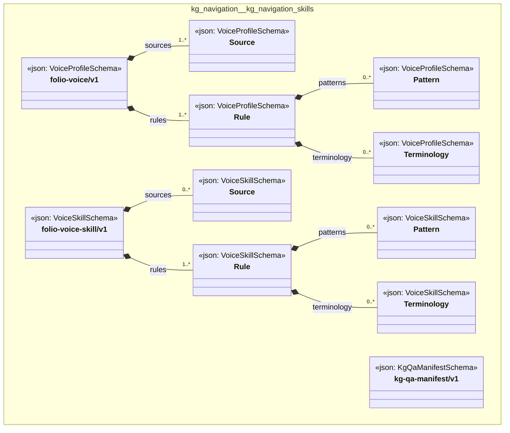

# UML — kg-navigation

Generated by `cat-harness/scripts/gen-uml-overview.ts` — do not edit. Every named sub-graph the `kg-navigation` harness declares, one box each, with the node schema kinds found in it.

**Sources (same model):** [PlantUML](https://github.com/litlfred/folio-assistant/blob/main/cat-harness/uml/overview/kg-navigation.puml) · [Mermaid](https://github.com/litlfred/folio-assistant/blob/main/cat-harness/uml/overview/kg-navigation.mmd)

| sub-graph | directory | graph kinds | node schema |
|---|---|---|---|
| `kg-navigation/kg-navigation-skills` | `kg-navigation/skills` | skills | `VoiceProfileSchema`; `VoiceSkillSchema`; `KgQaManifestSchema` |

## Sub-graphs

- [kg-navigation/kg-navigation-skills](kg-navigation/kg-navigation-skills.html)
