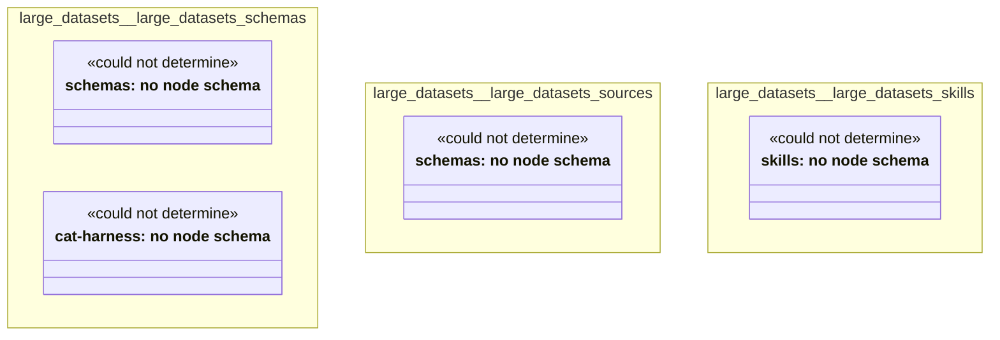

# UML — large-datasets

Generated by `cat-harness/scripts/gen-uml-overview.ts` — do not edit. Every named sub-graph the `large-datasets` harness declares, one box each, with the node schema kinds found in it.

**Sources (same model):** [PlantUML](https://github.com/litlfred/folio-assistant/blob/main/cat-harness/uml/overview/large-datasets.puml) · [Mermaid](https://github.com/litlfred/folio-assistant/blob/main/cat-harness/uml/overview/large-datasets.mmd)

| sub-graph | directory | graph kinds | node schema |
|---|---|---|---|
| `large-datasets/large-datasets-schemas` | `large-datasets/schemas` | schemas, cat-harness | schemas: *could not determine*; cat-harness: *could not determine* |
| `large-datasets/large-datasets-sources` | `large-datasets/sources` | schemas | schemas: *could not determine* |
| `large-datasets/large-datasets-skills` | `large-datasets/skills` | skills | skills: *could not determine* |

## Sub-graphs

- [large-datasets/large-datasets-schemas](large-datasets/large-datasets-schemas.html)
- [large-datasets/large-datasets-sources](large-datasets/large-datasets-sources.html)
- [large-datasets/large-datasets-skills](large-datasets/large-datasets-skills.html)
