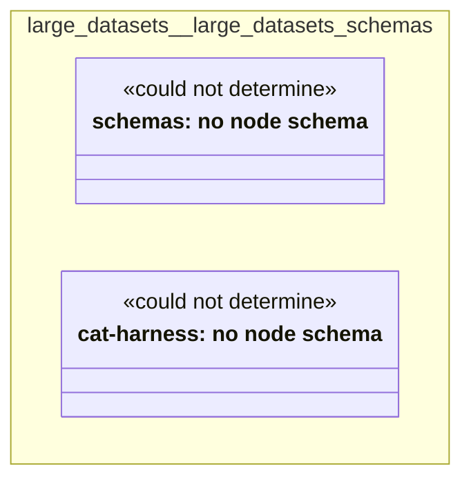

# UML — large-datasets/large-datasets-schemas

Generated by `cat-harness/scripts/gen-uml-overview.ts` — do not edit. The `large-datasets-schemas` sub-graph of `large-datasets` (`large-datasets/schemas`), with every attribute read from its node schema.

**Sources (same model):** [PlantUML](https://github.com/litlfred/folio-assistant/blob/main/cat-harness/uml/overview/large-datasets/large-datasets-schemas.puml) · [Mermaid](https://github.com/litlfred/folio-assistant/blob/main/cat-harness/uml/overview/large-datasets/large-datasets-schemas.mmd)

| sub-graph | directory | graph kinds | node schema |
|---|---|---|---|
| `large-datasets/large-datasets-schemas` | `large-datasets/schemas` | schemas, cat-harness | schemas: *could not determine*; cat-harness: *could not determine* |

## Sub-graphs

- [← all of large-datasets](../large-datasets.html)
