# UML — smart-base

Generated by `cat-harness/scripts/gen-uml-overview.ts` — do not edit. Every named sub-graph the `smart-base` harness declares, one box each, with the node schema kinds found in it.

**Sources (same model):** [PlantUML](https://github.com/litlfred/folio-assistant/blob/main/cat-harness/uml/overview/smart-base.puml) · [Mermaid](https://github.com/litlfred/folio-assistant/blob/main/cat-harness/uml/overview/smart-base.mmd)

```mermaid
classDiagram
  direction TB
  namespace smart_base__library {
    class smart_base_library_folio_document_images_v1_folio_document_images_v1["folio-document-images/v1"] {
      <<json: ImagesSidecarSchema>>
    }
    class smart_base_library_folio_image_verdicts_v1["folio-image-verdicts/v1"] {
      <<ts: VerdictFile>>
    }
  }
  namespace smart_base__methodologies {
    class n_smart_base_methodologies_methodology["methodology: no node schema"] {
      <<could not determine>>
    }
  }
  namespace smart_base__voices {
    class smart_base_voices_Source["Source"] {
      <<json: VoiceProfileSchema>>
    }
    class smart_base_voices_Pattern["Pattern"] {
      <<json: VoiceProfileSchema>>
    }
    class smart_base_voices_Terminology["Terminology"] {
      <<json: VoiceProfileSchema>>
    }
    class smart_base_voices_Rule["Rule"] {
      <<json: VoiceProfileSchema>>
    }
    class smart_base_voices_VoiceProfile["VoiceProfile"] {
      <<json: VoiceProfileSchema>>
    }
  }
  namespace smart_base__processes {
    class smart_base_processes_omg_bpmn_2_0["Business Process Model and Notation (BPMN)"] {
      <<ext: omg-bpmn-2.0>>
    }
  }
  namespace smart_base__smart_base_artifact_index {
    class smart_base_smart_base_artifact_index_folio_fhir_artifact_index_v1_Context["Context"] {
      <<json: FhirArtifactIndexSchema>>
    }
    class smart_base_smart_base_artifact_index_folio_fhir_artifact_index_v1_DakUnbound["DakUnbound"] {
      <<json: FhirArtifactIndexSchema>>
    }
    class smart_base_smart_base_artifact_index_folio_fhir_artifact_index_v1_Artifact["Artifact"] {
      <<json: FhirArtifactIndexSchema>>
    }
    class smart_base_smart_base_artifact_index_folio_fhir_artifact_index_v1_folio_fhir_artifact_index_v1["folio-fhir-artifact-index/v1"] {
      <<json: FhirArtifactIndexSchema>>
    }
    class smart_base_smart_base_artifact_index_https___json_schema_org_draft_2020_12_schema["JSON Schema 2020-12"] {
      <<ext: JSON Schema 2020-12>>
    }
  }
  namespace smart_base__tools {
    class smart_base_tools_Maintain["Maintain"] {
      <<json: ToolDefinitionSchema>>
    }
    class smart_base_tools_ToolDefinition["ToolDefinition"] {
      <<json: ToolDefinitionSchema>>
    }
  }
  cssClass "smart_base_library_folio_document_images_v1_folio_document_images_v1" fa_uml_kind_library
  cssClass "smart_base_library_folio_image_verdicts_v1" fa_uml_kind_library
  cssClass "n_smart_base_methodologies_methodology" fa_uml_kind_methodology
  cssClass "n_smart_base_methodologies_methodology" fa_uml_undetermined
  smart_base_voices_VoiceProfile *-- "1..*" smart_base_voices_Source : sources
  smart_base_voices_Rule *-- "0..*" smart_base_voices_Pattern : patterns
  smart_base_voices_Rule *-- "0..*" smart_base_voices_Terminology : terminology
  smart_base_voices_VoiceProfile *-- "1..*" smart_base_voices_Rule : rules
  cssClass "smart_base_voices_Source" fa_uml_kind_voices
  cssClass "smart_base_voices_Pattern" fa_uml_kind_voices
  cssClass "smart_base_voices_Terminology" fa_uml_kind_voices
  cssClass "smart_base_voices_Rule" fa_uml_kind_voices
  cssClass "smart_base_voices_VoiceProfile" fa_uml_kind_voices
  cssClass "smart_base_processes_omg_bpmn_2_0" fa_uml_kind_processes
  smart_base_smart_base_artifact_index_folio_fhir_artifact_index_v1_folio_fhir_artifact_index_v1 *-- "0..*" smart_base_smart_base_artifact_index_folio_fhir_artifact_index_v1_Context : contexts
  smart_base_smart_base_artifact_index_folio_fhir_artifact_index_v1_folio_fhir_artifact_index_v1 *-- "0..*" smart_base_smart_base_artifact_index_folio_fhir_artifact_index_v1_DakUnbound : dakUnbound
  smart_base_smart_base_artifact_index_folio_fhir_artifact_index_v1_folio_fhir_artifact_index_v1 *-- "0..*" smart_base_smart_base_artifact_index_folio_fhir_artifact_index_v1_Artifact : artifacts
  cssClass "smart_base_smart_base_artifact_index_folio_fhir_artifact_index_v1_Context" fa_uml_kind_fhir_artifact_index
  cssClass "smart_base_smart_base_artifact_index_folio_fhir_artifact_index_v1_DakUnbound" fa_uml_kind_fhir_artifact_index
  cssClass "smart_base_smart_base_artifact_index_folio_fhir_artifact_index_v1_Artifact" fa_uml_kind_fhir_artifact_index
  cssClass "smart_base_smart_base_artifact_index_folio_fhir_artifact_index_v1_folio_fhir_artifact_index_v1" fa_uml_kind_fhir_artifact_index
  cssClass "smart_base_smart_base_artifact_index_https___json_schema_org_draft_2020_12_schema" fa_uml_kind_fhir_artifact_index
  smart_base_tools_ToolDefinition *-- "0..*" smart_base_tools_Maintain : maintains
  cssClass "smart_base_tools_Maintain" fa_uml_kind_tools
  cssClass "smart_base_tools_ToolDefinition" fa_uml_kind_tools
```

| sub-graph | directory | graph kinds | node schema |
|---|---|---|---|
| `smart-base/library` | `smart-base/library` | library | `ImagesSidecarSchema`; `ts: VerdictFile` |
| `smart-base/methodologies` | `smart-base/methodologies` | methodology | methodology: *could not determine* |
| `smart-base/voices` | `smart-base/skills/voices` | voices | `VoiceProfileSchema` |
| `smart-base/processes` | `smart-base/methodologies/processes` | processes | `ext: omg-bpmn-2.0` |
| `smart-base/smart-base-artifact-index` | `smart-base/fhir-artifact-index` | fhir-artifact-index | `FhirArtifactIndexSchema`; `ext: JSON Schema 2020-12` |
| `smart-base/tools` | `smart-base/tools` | tools | `ToolDefinitionSchema` |

## Sub-graphs

- [smart-base/library](smart-base/library.html)
- [smart-base/methodologies](smart-base/methodologies.html)
- [smart-base/voices](smart-base/voices.html)
- [smart-base/processes](smart-base/processes.html)
- [smart-base/smart-base-artifact-index](smart-base/smart-base-artifact-index.html)
- [smart-base/tools](smart-base/tools.html)
