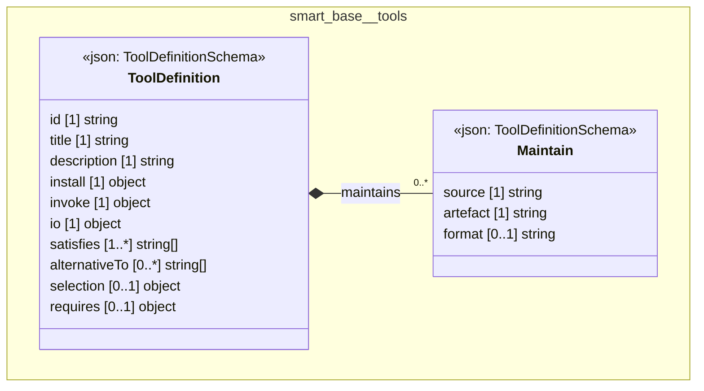

# UML — smart-base/tools

Generated by `cat-harness/scripts/gen-uml-overview.ts` — do not edit. The `tools` sub-graph of `smart-base` (`smart-base/tools`), with every attribute read from its node schema.

**Sources (same model):** [PlantUML](https://github.com/litlfred/folio-assistant/blob/main/cat-harness/uml/overview/smart-base/tools.puml) · [Mermaid](https://github.com/litlfred/folio-assistant/blob/main/cat-harness/uml/overview/smart-base/tools.mmd)

| sub-graph | directory | graph kinds | node schema |
|---|---|---|---|
| `smart-base/tools` | `smart-base/tools` | tools | `ToolDefinitionSchema` |

## Sub-graphs

- [← all of smart-base](../smart-base.html)
