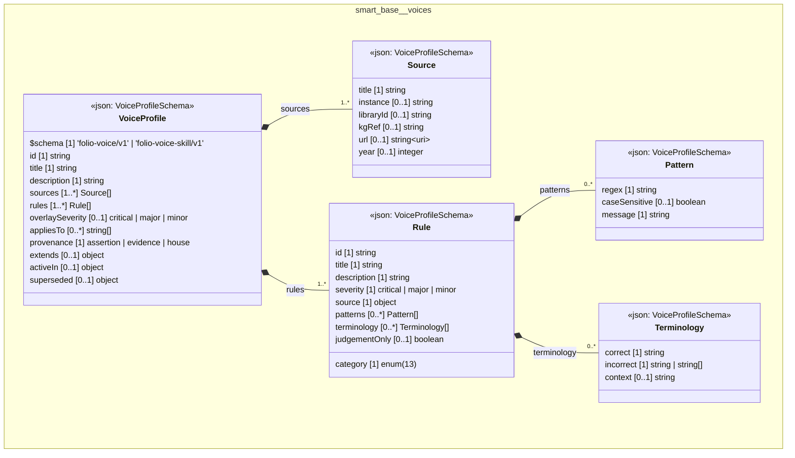

# UML — smart-base/voices

Generated by `cat-harness/scripts/gen-uml-overview.ts` — do not edit. The `voices` sub-graph of `smart-base` (`smart-base/skills/voices`), with every attribute read from its node schema.

**Sources (same model):** [PlantUML](https://github.com/litlfred/folio-assistant/blob/main/cat-harness/uml/overview/smart-base/voices.puml) · [Mermaid](https://github.com/litlfred/folio-assistant/blob/main/cat-harness/uml/overview/smart-base/voices.mmd)

<figure class="bpmn-figure">
  
</figure>

| sub-graph | directory | graph kinds | node schema |
|---|---|---|---|
| `smart-base/voices` | `smart-base/skills/voices` | voices | `VoiceProfileSchema` |

## Sub-graphs

- [← all of smart-base](../smart-base.html)

## The same model, drawn by Mermaid

Kept so the page renders even where the PlantUML image is missing, and because Mermaid nodes carry the CSS class that colours them from `uml.css`.

