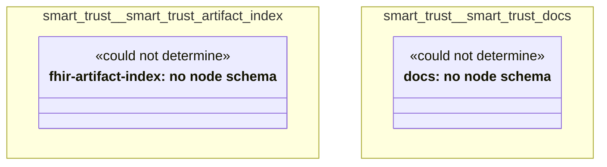

# UML — smart-trust

Generated by `cat-harness/scripts/gen-uml-overview.ts` — do not edit. Every named sub-graph the `smart-trust` harness declares, one box each, with the node schema kinds found in it.

**Sources (same model):** [PlantUML](https://github.com/litlfred/folio-assistant/blob/main/cat-harness/uml/overview/smart-trust.puml) · [Mermaid](https://github.com/litlfred/folio-assistant/blob/main/cat-harness/uml/overview/smart-trust.mmd)

| sub-graph | directory | graph kinds | node schema |
|---|---|---|---|
| `smart-trust/smart-trust-artifact-index` | `smart-trust/fhir-artifact-index` | fhir-artifact-index | fhir-artifact-index: *could not determine* |
| `smart-trust/smart-trust-docs` | `smart-trust/docs` | docs | docs: *could not determine* |

## Sub-graphs

- [smart-trust/smart-trust-artifact-index](smart-trust/smart-trust-artifact-index.html)
- [smart-trust/smart-trust-docs](smart-trust/smart-trust-docs.html)
