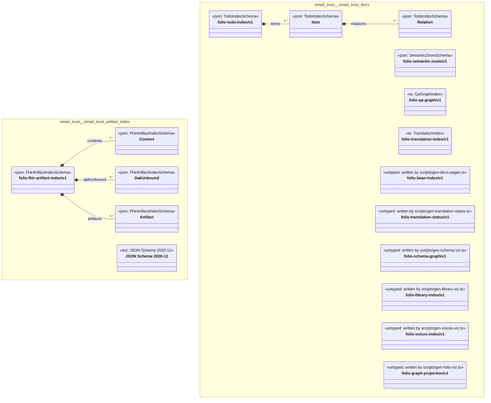

# UML — smart-trust

Generated by `cat-harness/scripts/gen-uml-overview.ts` — do not edit. Every named sub-graph the `smart-trust` harness declares, one box each, with the node schema kinds found in it.

**Sources (same model):** [PlantUML](https://github.com/litlfred/folio-assistant/blob/main/cat-harness/uml/overview/smart-trust.puml) · [Mermaid](https://github.com/litlfred/folio-assistant/blob/main/cat-harness/uml/overview/smart-trust.mmd)

| sub-graph | directory | graph kinds | node schema |
|---|---|---|---|
| `smart-trust/smart-trust-artifact-index` | `smart-trust/fhir-artifact-index` | fhir-artifact-index | `FhirArtifactIndexSchema`; `ext: JSON Schema 2020-12` |
| `smart-trust/smart-trust-docs` | `smart-trust/docs` | docs | `TodoIndexSchema`; `SemanticZoomSchema`; `ts: QaGraphIndex`; `ts: TranslationIndex`; `untyped: written by scripts/gen-docs-pages.ts`; `untyped: written by scripts/gen-translation-status.ts`; `untyped: written by scripts/gen-schema-viz.ts`; `untyped: written by scripts/gen-library-viz.ts`; `untyped: written by scripts/gen-voices-viz.ts`; `untyped: written by scripts/gen-folio-viz.ts` |

## Sub-graphs

- [smart-trust/smart-trust-artifact-index](smart-trust/smart-trust-artifact-index.html)
- [smart-trust/smart-trust-docs](smart-trust/smart-trust-docs.html)
