# UML — smart-trust

Generated by `cat-harness/scripts/gen-uml-overview.ts` — do not edit. Every named sub-graph the `smart-trust` instance declares, one box each, with the node schema kinds found in it.

**Sources (same model):** [PlantUML](https://github.com/litlfred/folio-assistant/blob/main/cat-harness/uml/overview/smart-trust.puml) · [Mermaid](https://github.com/litlfred/folio-assistant/blob/main/cat-harness/uml/overview/smart-trust.mmd)

  <fieldset class="fa-uml-view-pick">
    <legend>Layout</legend>
    <input type="radio" name="fa-uml-overview_smart_trust" id="fa-uml-overview_smart_trust-portrait" class="fa-uml-pick-portrait" checked><label for="fa-uml-overview_smart_trust-portrait">Portrait</label>
    <input type="radio" name="fa-uml-overview_smart_trust" id="fa-uml-overview_smart_trust-landscape" class="fa-uml-pick-landscape"><label for="fa-uml-overview_smart_trust-landscape">Landscape</label>
  </fieldset>
  <figure class="bpmn-figure fa-uml-portrait">
    
  </figure>
  <figure class="bpmn-figure fa-uml-landscape">
    
  </figure>

| sub-graph | directory | graph kinds | node schema |
|---|---|---|---|
| `smart-trust/smart-trust-artifact-index` | `smart-trust/fhir-artifact-index` | fhir-artifact-index | `FhirArtifactIndexSchema`; `IgMenuSchema`; `schema: dak/StructureDefinition-COSEHeader.schema.json`; `schema: dak/StructureDefinition-CWT.schema.json`; `schema: dak/StructureDefinition-CWTPayload.schema.json`; `schema: dak/StructureDefinition-HCert.schema.json`; `schema: dak/StructureDefinition-SchemeInformation.schema.json`; `schema: dak/ValueSet-Actors.displays.json`; `schema: dak/ValueSet-ConnectionTypes.displays.json`; `schema: dak/ValueSet-Domains-DEV.displays.json`; `schema: dak/ValueSet-Domains-UAT.displays.json`; `schema: dak/ValueSet-Domains.displays.json`; `schema: dak/ValueSet-KeyUsage-DEV.displays.json`; `schema: dak/ValueSet-KeyUsage-UAT.displays.json`; `schema: dak/ValueSet-KeyUsage.displays.json`; `schema: dak/ValueSet-Participants-DEV.displays.json`; `schema: dak/ValueSet-Participants-UAT.displays.json`; `schema: dak/ValueSet-Participants.displays.json`; `schema: dak/ValueSet-PayloadTypes.displays.json`; `schema: dak/ValueSet-Transactions.displays.json`; `schema: dak/ValueSet-WHORegionalOffices.displays.json`; `ext: JSON Schema 2020-12` |
| `smart-trust/smart-trust-docs` | `smart-trust/docs` | docs | docs: *could not determine* |

## Sub-graphs

- [smart-trust/smart-trust-artifact-index](smart-trust/smart-trust-artifact-index.html)
- [smart-trust/smart-trust-docs](smart-trust/smart-trust-docs.html)

## The same model, drawn by Mermaid

Kept so the page renders even where the PlantUML image is missing, and because Mermaid nodes carry the CSS class that colours them from `uml.css`.

```mermaid
classDiagram
  direction LR
  namespace smart_trust__smart_trust_artifact_index {
    class smart_trust_smart_trust_artifact_index_folio_fhir_artifact_index_v1_Context["Context"] {
      <<json: FhirArtifactIndexSchema>>
      id [1] string
      representation [1] object
      binds [0..*] string[]
    }
    class smart_trust_smart_trust_artifact_index_folio_fhir_artifact_index_v1_DakUnbound["DakUnbound"] {
      <<json: FhirArtifactIndexSchema>>
      filename [1] string
      title [0..1] string
      enumeration [1] string
      reason [1] string
    }
    class smart_trust_smart_trust_artifact_index_folio_fhir_artifact_index_v1_Artifact["Artifact"] {
      <<json: FhirArtifactIndexSchema>>
      $schema [0..1] 'folio-fhir-artifact/v1'
      key [1] string
      resourceType [1] string
      id [1] string
      name [0..1] string
      title [0..1] string
      description [0..1] string
      canonical [0..1] string
      version [0..1] string
      category [0..1] string
      published [1] object
      dak [0..1] object
      materialization [1] object
    }
    class smart_trust_smart_trust_artifact_index_folio_fhir_artifact_index_v1_folio_fhir_artifact_index_v1["folio-fhir-artifact-index/v1"] {
      <<json: FhirArtifactIndexSchema>>
      $schema [1] 'folio-fhir-artifact-index/v1'
      id [1] string
      title [1] string
      packageId [0..1] string
      version [0..1] string
      fhirVersion [0..*] string[]
      canonicalBase [0..1] string
      builtAt [0..1] string
      source [1] object
      provenance [1] object
      dakApi [1] unknown | absent | present
      contexts [0..*] Context[]
      dakUnbound [0..*] DakUnbound[]
      count [1] integer
      artifacts [0..*] Artifact[]
    }
    class smart_trust_smart_trust_artifact_index_folio_ig_menu_v1_Item["Item"] {
      <<json: IgMenuSchema>>
      label [1] string
      href [1] string
    }
    class smart_trust_smart_trust_artifact_index_folio_ig_menu_v1_Group["Group"] {
      <<json: IgMenuSchema>>
      label [1] string
      href [0..1] string
      items [0..*] Item[]
    }
    class smart_trust_smart_trust_artifact_index_folio_ig_menu_v1_folio_ig_menu_v1["folio-ig-menu/v1"] {
      <<json: IgMenuSchema>>
      $schema [1] 'folio-ig-menu/v1'
      id [1] string
      canonical [1] string~uri~
      version [0..1] string
      source [1] object
      groups [0..*] Group[]
    }
    class smart_trust_smart_trust_artifact_index_dak_StructureDefinition_COSEHeader_schema_json_COSE_Headers__DRAFT_["COSE Headers (DRAFT)"] {
      <<schema: dak/StructureDefinition-COSEHeader.schema.json>>
      1 [0..1] string
      4 [0..1] string
      resourceType [1] 'COSEHeader'
    }
    class smart_trust_smart_trust_artifact_index_dak_StructureDefinition_CWT_schema_json_CBOR_Web_Token__CWT__Claim["CBOR Web Token (CWT) Claim"] {
      <<schema: dak/StructureDefinition-CWT.schema.json>>
      resourceType [1] 'CWT'
      header [1] any
      payload [1] any
      signature [1] string
    }
    class smart_trust_smart_trust_artifact_index_dak_StructureDefinition_CWTPayload_schema_json_CBOR_Web_Token__CWT__Payload__Common_["CBOR Web Token (CWT) Payload (Common)"] {
      <<schema: dak/StructureDefinition-CWTPayload.schema.json>>
      1 [0..1] object
      4 [0..1] string~date-time~
      6 [0..1] string~date-time~
      resourceType [1] 'CWTPayload'
      -260 [0..1] any
    }
    class smart_trust_smart_trust_artifact_index_dak_StructureDefinition_HCert_schema_json_Health_Certificate["Health Certificate"] {
      <<schema: dak/StructureDefinition-HCert.schema.json>>
      1 [0..1] any
      3 [0..1] any
      4 [0..1] any
      5 [0..1] string
      resourceType [1] 'HCert'
      -6 [0..1] any
      -7 [0..1] any
    }
    class smart_trust_smart_trust_artifact_index_dak_StructureDefinition_SchemeInformation_schema_json_Scheme_Information["Scheme Information"] {
      <<schema: dak/StructureDefinition-SchemeInformation.schema.json>>
      resourceType [1] 'SchemeInformation'
      versionIdentifier [1] integer
      sequenceNumber [1] integer
      type [1] string~uri~
      operatorName [1] string
      operatorAddress [1..*] object[]
      id [0..1] object
      modifierExtension [0..*] object[]
      operatorPostalAddress [1..*] object[]
      operatorElectronicAddress [0..*] object[]
      name [1] string
      informationURI [1] string~uri~
      statusDeterminiationApproach [1] string~uri~
      schemeType [1] string~uri~
      territory [1] string
      policy [1] string~uri~
      historicalInformationPeriod [1] integer
      otherTSL [0..*] string[]
      issDateTime [1] string~date-time~
      nextUpdate [1] string~date-time~
      distributionPoints [0..*] string~uri~[]
    }
    class smart_trust_smart_trust_artifact_index_dak_ValueSet_Actors_displays_json_WHO_GDHCN_Actor_ValueSet_of_actor_codes_Display_Values["WHO GDHCN Actor ValueSet of actor codes Display Values"] {
      <<schema: dak/ValueSet-Actors.displays.json>>
      fhir:displays [1] object
    }
    class smart_trust_smart_trust_artifact_index_dak_ValueSet_ConnectionTypes_displays_json_WHO_GDHCN_Connection_Types_Display_Values["WHO GDHCN Connection Types Display Values"] {
      <<schema: dak/ValueSet-ConnectionTypes.displays.json>>
      fhir:displays [1] object
    }
    class smart_trust_smart_trust_artifact_index_dak_ValueSet_Domains_DEV_displays_json_WHO_GDHCN_Trust_Domains___DEV_Display_Values["WHO GDHCN Trust Domains - DEV Display Values"] {
      <<schema: dak/ValueSet-Domains-DEV.displays.json>>
      fhir:displays [1] object
    }
    class smart_trust_smart_trust_artifact_index_dak_ValueSet_Domains_UAT_displays_json_WHO_GDHCN_Trust_Domains___UAT_Display_Values["WHO GDHCN Trust Domains - UAT Display Values"] {
      <<schema: dak/ValueSet-Domains-UAT.displays.json>>
      fhir:displays [1] object
    }
    class smart_trust_smart_trust_artifact_index_dak_ValueSet_Domains_displays_json_WHO_GDHCN_Trust_Domains_Display_Values["WHO GDHCN Trust Domains Display Values"] {
      <<schema: dak/ValueSet-Domains.displays.json>>
      fhir:displays [1] object
    }
    class smart_trust_smart_trust_artifact_index_dak_ValueSet_KeyUsage_DEV_displays_json_WHO_GDHCN__Key_Usage_ValueSet___DEV_Display_Values["WHO GDHCN  Key Usage ValueSet - DEV Display Values"] {
      <<schema: dak/ValueSet-KeyUsage-DEV.displays.json>>
      fhir:displays [1] object
    }
    class smart_trust_smart_trust_artifact_index_dak_ValueSet_KeyUsage_UAT_displays_json_WHO_GDHCN__Key_Usage_ValueSet___UAT_Display_Values["WHO GDHCN  Key Usage ValueSet - UAT Display Values"] {
      <<schema: dak/ValueSet-KeyUsage-UAT.displays.json>>
      fhir:displays [1] object
    }
    class smart_trust_smart_trust_artifact_index_dak_ValueSet_KeyUsage_displays_json_WHO_GDHCN__Key_Usage_ValueSet_Display_Values["WHO GDHCN  Key Usage ValueSet Display Values"] {
      <<schema: dak/ValueSet-KeyUsage.displays.json>>
      fhir:displays [1] object
    }
    class smart_trust_smart_trust_artifact_index_dak_ValueSet_Participants_DEV_displays_json_WHO_GDHCN_Trust_Network_Participant___DEV_Display_Values["WHO GDHCN Trust Network Participant - DEV Display Values"] {
      <<schema: dak/ValueSet-Participants-DEV.displays.json>>
      fhir:displays [1] object
    }
    class smart_trust_smart_trust_artifact_index_dak_ValueSet_Participants_UAT_displays_json_WHO_GDHCN_Trust_Network_Participant___UAT_Display_Values["WHO GDHCN Trust Network Participant - UAT Display Values"] {
      <<schema: dak/ValueSet-Participants-UAT.displays.json>>
      fhir:displays [1] object
    }
    class smart_trust_smart_trust_artifact_index_dak_ValueSet_Participants_displays_json_WHO_GDHCN_Trust_Network_Participant_Display_Values["WHO GDHCN Trust Network Participant Display Values"] {
      <<schema: dak/ValueSet-Participants.displays.json>>
      fhir:displays [1] object
    }
    class smart_trust_smart_trust_artifact_index_dak_ValueSet_PayloadTypes_displays_json_WHO_GDHCN_Payload_Types_Display_Values["WHO GDHCN Payload Types Display Values"] {
      <<schema: dak/ValueSet-PayloadTypes.displays.json>>
      fhir:displays [1] object
    }
    class smart_trust_smart_trust_artifact_index_dak_ValueSet_Transactions_displays_json_WHO_GDHCN_Transaction_Codes_Display_Values["WHO GDHCN Transaction Codes Display Values"] {
      <<schema: dak/ValueSet-Transactions.displays.json>>
      fhir:displays [1] object
    }
    class smart_trust_smart_trust_artifact_index_dak_ValueSet_WHORegionalOffices_displays_json_WHO_Regional_Offices_Display_Values["WHO Regional Offices Display Values"] {
      <<schema: dak/ValueSet-WHORegionalOffices.displays.json>>
      fhir:displays [1] object
    }
    class smart_trust_smart_trust_artifact_index_https___json_schema_org_draft_2020_12_schema_listed["14 schema(s) with no properties"] {
      <<ext: JSON Schema 2020-12>>
      dak/ValueSet-Actors [1] enum(5) of string
      dak/ValueSet-ConnectionTypes [1] enum(2) of string
      dak/ValueSet-Domains-DEV [1] enum(4) of string
      dak/ValueSet-Domains-UAT [1] enum(4) of string
      dak/ValueSet-Domains [1] enum(4) of string
      dak/ValueSet-KeyUsage-DEV [1] enum(10) of string
      dak/ValueSet-KeyUsage-UAT [1] enum(10) of string
      dak/ValueSet-KeyUsage [1] enum(10) of string
      dak/ValueSet-Participants-DEV [1] enum(60) of string
      dak/ValueSet-Participants-UAT [1] enum(57) of string
      dak/ValueSet-Participants [1] enum(34) of string
      dak/ValueSet-PayloadTypes [1] enum(1) of string
      dak/ValueSet-Transactions [1] enum(3) of string
      dak/ValueSet-WHORegionalOffices [1] enum(7) of string
    }
  }
  namespace smart_trust__smart_trust_docs {
    class n_smart_trust_smart_trust_docs_docs["docs: no node schema"] {
      <<could not determine>>
    }
  }
  smart_trust_smart_trust_artifact_index_folio_fhir_artifact_index_v1_folio_fhir_artifact_index_v1 *-- "0..*" smart_trust_smart_trust_artifact_index_folio_fhir_artifact_index_v1_Context : contexts
  smart_trust_smart_trust_artifact_index_folio_fhir_artifact_index_v1_folio_fhir_artifact_index_v1 *-- "0..*" smart_trust_smart_trust_artifact_index_folio_fhir_artifact_index_v1_DakUnbound : dakUnbound
  smart_trust_smart_trust_artifact_index_folio_fhir_artifact_index_v1_folio_fhir_artifact_index_v1 *-- "0..*" smart_trust_smart_trust_artifact_index_folio_fhir_artifact_index_v1_Artifact : artifacts
  smart_trust_smart_trust_artifact_index_folio_ig_menu_v1_Group *-- "0..*" smart_trust_smart_trust_artifact_index_folio_ig_menu_v1_Item : items
  smart_trust_smart_trust_artifact_index_folio_ig_menu_v1_folio_ig_menu_v1 *-- "0..*" smart_trust_smart_trust_artifact_index_folio_ig_menu_v1_Group : groups
  cssClass "smart_trust_smart_trust_artifact_index_folio_fhir_artifact_index_v1_Context" fa_uml_kind_fhir_artifact_index
  cssClass "smart_trust_smart_trust_artifact_index_folio_fhir_artifact_index_v1_DakUnbound" fa_uml_kind_fhir_artifact_index
  cssClass "smart_trust_smart_trust_artifact_index_folio_fhir_artifact_index_v1_Artifact" fa_uml_kind_fhir_artifact_index
  cssClass "smart_trust_smart_trust_artifact_index_folio_fhir_artifact_index_v1_folio_fhir_artifact_index_v1" fa_uml_kind_fhir_artifact_index
  cssClass "smart_trust_smart_trust_artifact_index_folio_ig_menu_v1_Item" fa_uml_kind_fhir_artifact_index
  cssClass "smart_trust_smart_trust_artifact_index_folio_ig_menu_v1_Group" fa_uml_kind_fhir_artifact_index
  cssClass "smart_trust_smart_trust_artifact_index_folio_ig_menu_v1_folio_ig_menu_v1" fa_uml_kind_fhir_artifact_index
  cssClass "smart_trust_smart_trust_artifact_index_dak_StructureDefinition_COSEHeader_schema_json_COSE_Headers__DRAFT_" fa_uml_kind_fhir_artifact_index
  cssClass "smart_trust_smart_trust_artifact_index_dak_StructureDefinition_CWT_schema_json_CBOR_Web_Token__CWT__Claim" fa_uml_kind_fhir_artifact_index
  cssClass "smart_trust_smart_trust_artifact_index_dak_StructureDefinition_CWTPayload_schema_json_CBOR_Web_Token__CWT__Payload__Common_" fa_uml_kind_fhir_artifact_index
  cssClass "smart_trust_smart_trust_artifact_index_dak_StructureDefinition_HCert_schema_json_Health_Certificate" fa_uml_kind_fhir_artifact_index
  cssClass "smart_trust_smart_trust_artifact_index_dak_StructureDefinition_SchemeInformation_schema_json_Scheme_Information" fa_uml_kind_fhir_artifact_index
  cssClass "smart_trust_smart_trust_artifact_index_dak_ValueSet_Actors_displays_json_WHO_GDHCN_Actor_ValueSet_of_actor_codes_Display_Values" fa_uml_kind_fhir_artifact_index
  cssClass "smart_trust_smart_trust_artifact_index_dak_ValueSet_ConnectionTypes_displays_json_WHO_GDHCN_Connection_Types_Display_Values" fa_uml_kind_fhir_artifact_index
  cssClass "smart_trust_smart_trust_artifact_index_dak_ValueSet_Domains_DEV_displays_json_WHO_GDHCN_Trust_Domains___DEV_Display_Values" fa_uml_kind_fhir_artifact_index
  cssClass "smart_trust_smart_trust_artifact_index_dak_ValueSet_Domains_UAT_displays_json_WHO_GDHCN_Trust_Domains___UAT_Display_Values" fa_uml_kind_fhir_artifact_index
  cssClass "smart_trust_smart_trust_artifact_index_dak_ValueSet_Domains_displays_json_WHO_GDHCN_Trust_Domains_Display_Values" fa_uml_kind_fhir_artifact_index
  cssClass "smart_trust_smart_trust_artifact_index_dak_ValueSet_KeyUsage_DEV_displays_json_WHO_GDHCN__Key_Usage_ValueSet___DEV_Display_Values" fa_uml_kind_fhir_artifact_index
  cssClass "smart_trust_smart_trust_artifact_index_dak_ValueSet_KeyUsage_UAT_displays_json_WHO_GDHCN__Key_Usage_ValueSet___UAT_Display_Values" fa_uml_kind_fhir_artifact_index
  cssClass "smart_trust_smart_trust_artifact_index_dak_ValueSet_KeyUsage_displays_json_WHO_GDHCN__Key_Usage_ValueSet_Display_Values" fa_uml_kind_fhir_artifact_index
  cssClass "smart_trust_smart_trust_artifact_index_dak_ValueSet_Participants_DEV_displays_json_WHO_GDHCN_Trust_Network_Participant___DEV_Display_Values" fa_uml_kind_fhir_artifact_index
  cssClass "smart_trust_smart_trust_artifact_index_dak_ValueSet_Participants_UAT_displays_json_WHO_GDHCN_Trust_Network_Participant___UAT_Display_Values" fa_uml_kind_fhir_artifact_index
  cssClass "smart_trust_smart_trust_artifact_index_dak_ValueSet_Participants_displays_json_WHO_GDHCN_Trust_Network_Participant_Display_Values" fa_uml_kind_fhir_artifact_index
  cssClass "smart_trust_smart_trust_artifact_index_dak_ValueSet_PayloadTypes_displays_json_WHO_GDHCN_Payload_Types_Display_Values" fa_uml_kind_fhir_artifact_index
  cssClass "smart_trust_smart_trust_artifact_index_dak_ValueSet_Transactions_displays_json_WHO_GDHCN_Transaction_Codes_Display_Values" fa_uml_kind_fhir_artifact_index
  cssClass "smart_trust_smart_trust_artifact_index_dak_ValueSet_WHORegionalOffices_displays_json_WHO_Regional_Offices_Display_Values" fa_uml_kind_fhir_artifact_index
  cssClass "smart_trust_smart_trust_artifact_index_https___json_schema_org_draft_2020_12_schema_listed" fa_uml_kind_fhir_artifact_index
  cssClass "n_smart_trust_smart_trust_docs_docs" fa_uml_kind_docs
  cssClass "n_smart_trust_smart_trust_docs_docs" fa_uml_undetermined
```

