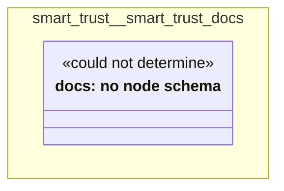

# UML — smart-trust/smart-trust-docs

Generated by `cat-harness/scripts/gen-uml-overview.ts` — do not edit. The `smart-trust-docs` sub-graph of `smart-trust` (`smart-trust/docs`), with every attribute read from its node schema.

**Sources (same model):** [PlantUML](https://github.com/litlfred/folio-assistant/blob/main/cat-harness/uml/overview/smart-trust/smart-trust-docs.puml) · [Mermaid](https://github.com/litlfred/folio-assistant/blob/main/cat-harness/uml/overview/smart-trust/smart-trust-docs.mmd)

| sub-graph | directory | graph kinds | node schema |
|---|---|---|---|
| `smart-trust/smart-trust-docs` | `smart-trust/docs` | docs | docs: *could not determine* |

## Sub-graphs

- [← all of smart-trust](../smart-trust.html)
