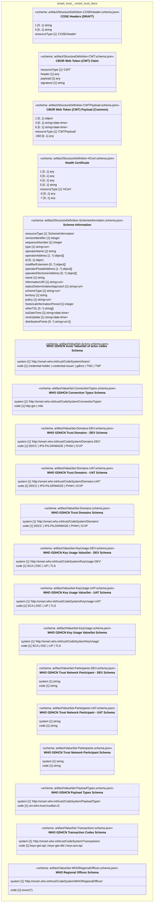

# UML — smart-trust/smart-trust-docs

Generated by `cat-harness/scripts/gen-uml-overview.ts` — do not edit. The `smart-trust-docs` sub-graph of `smart-trust` (`smart-trust/docs`), with every attribute read from its node schema.

**Sources (same model):** [PlantUML](https://github.com/litlfred/folio-assistant/blob/main/cat-harness/uml/overview/smart-trust/smart-trust-docs.puml) · [Mermaid](https://github.com/litlfred/folio-assistant/blob/main/cat-harness/uml/overview/smart-trust/smart-trust-docs.mmd)

  <fieldset class="fa-uml-view-pick">
    <legend>Layout</legend>
    <input type="radio" name="fa-uml-overview_smart_trust_smart_trust_docs" id="fa-uml-overview_smart_trust_smart_trust_docs-portrait" class="fa-uml-pick-portrait" checked><label for="fa-uml-overview_smart_trust_smart_trust_docs-portrait">Portrait</label>
    <input type="radio" name="fa-uml-overview_smart_trust_smart_trust_docs" id="fa-uml-overview_smart_trust_smart_trust_docs-landscape" class="fa-uml-pick-landscape"><label for="fa-uml-overview_smart_trust_smart_trust_docs-landscape">Landscape</label>
  </fieldset>
  <figure class="bpmn-figure fa-uml-portrait">
    
  </figure>
  <figure class="bpmn-figure fa-uml-landscape">
    
  </figure>

| sub-graph | directory | graph kinds | node schema | nodes | cohesion | in | out |
|---|---|---|---|---|---|---|---|
| `smart-trust/smart-trust-docs` | `smart-trust/docs` | docs | `schema: artifact/StructureDefinition-COSEHeader.schema.json`; `schema: artifact/StructureDefinition-CWT.schema.json`; `schema: artifact/StructureDefinition-CWTPayload.schema.json`; `schema: artifact/StructureDefinition-HCert.schema.json`; `schema: artifact/StructureDefinition-SchemeInformation.schema.json`; `schema: artifact/ValueSet-Actors.schema.json`; `schema: artifact/ValueSet-ConnectionTypes.schema.json`; `schema: artifact/ValueSet-Domains-DEV.schema.json`; `schema: artifact/ValueSet-Domains-UAT.schema.json`; `schema: artifact/ValueSet-Domains.schema.json`; `schema: artifact/ValueSet-KeyUsage-DEV.schema.json`; `schema: artifact/ValueSet-KeyUsage-UAT.schema.json`; `schema: artifact/ValueSet-KeyUsage.schema.json`; `schema: artifact/ValueSet-Participants-DEV.schema.json`; `schema: artifact/ValueSet-Participants-UAT.schema.json`; `schema: artifact/ValueSet-Participants.schema.json`; `schema: artifact/ValueSet-PayloadTypes.schema.json`; `schema: artifact/ValueSet-Transactions.schema.json`; `schema: artifact/ValueSet-WHORegionalOffices.schema.json` | *not measured* | | | |

*Nodes, cohesion, in and out* are the detangler's pinned measurements for the same directory (`bun run kg:detangle`; skill [`graph-detanglement`](https://github.com/litlfred/folio-assistant/blob/main/cat-harness/skills/kg/graph-management/graph-detanglement.md)). *Not measured* means the detangler does not scan that directory, not that it has no edges.

## Sub-graphs

- [← all of smart-trust](../smart-trust.html)

## The same model, drawn by Mermaid

Kept so the page renders even where the PlantUML image is missing, and because Mermaid nodes carry the CSS class that colours them from `uml.css`.

```mermaid
classDiagram
  direction TB
  namespace smart_trust__smart_trust_docs {
    class smart_trust_smart_trust_docs_artifact_StructureDefinition_COSEHeader_schema_json_COSE_Headers__DRAFT_["COSE Headers (DRAFT)"] {
      <<schema: artifact/StructureDefinition-COSEHeader.schema.json>>
      1 [0..1] string
      4 [0..1] string
      resourceType [1] 'COSEHeader'
    }
    class smart_trust_smart_trust_docs_artifact_StructureDefinition_CWT_schema_json_CBOR_Web_Token__CWT__Claim["CBOR Web Token (CWT) Claim"] {
      <<schema: artifact/StructureDefinition-CWT.schema.json>>
      resourceType [1] 'CWT'
      header [1] any
      payload [1] any
      signature [1] string
    }
    class smart_trust_smart_trust_docs_artifact_StructureDefinition_CWTPayload_schema_json_CBOR_Web_Token__CWT__Payload__Common_["CBOR Web Token (CWT) Payload (Common)"] {
      <<schema: artifact/StructureDefinition-CWTPayload.schema.json>>
      1 [0..1] object
      4 [0..1] string~date-time~
      6 [0..1] string~date-time~
      resourceType [1] 'CWTPayload'
      -260 [0..1] any
    }
    class smart_trust_smart_trust_docs_artifact_StructureDefinition_HCert_schema_json_Health_Certificate["Health Certificate"] {
      <<schema: artifact/StructureDefinition-HCert.schema.json>>
      1 [0..1] any
      3 [0..1] any
      4 [0..1] any
      5 [0..1] string
      resourceType [1] 'HCert'
      -6 [0..1] any
      -7 [0..1] any
    }
    class smart_trust_smart_trust_docs_artifact_StructureDefinition_SchemeInformation_schema_json_Scheme_Information["Scheme Information"] {
      <<schema: artifact/StructureDefinition-SchemeInformation.schema.json>>
      resourceType [1] 'SchemeInformation'
      versionIdentifier [1] integer
      sequenceNumber [1] integer
      type [1] string~uri~
      operatorName [1] string
      operatorAddress [1..*] object[]
      id [0..1] object
      modifierExtension [0..*] object[]
      operatorPostalAddress [1..*] object[]
      operatorElectronicAddress [0..*] object[]
      name [1] string
      informationURI [1] string~uri~
      statusDeterminiationApproach [1] string~uri~
      schemeType [1] string~uri~
      territory [1] string
      policy [1] string~uri~
      historicalInformationPeriod [1] integer
      otherTSL [0..*] string[]
      issDateTime [1] string~date-time~
      nextUpdate [1] string~date-time~
      distributionPoints [0..*] string~uri~[]
    }
    class smart_trust_smart_trust_docs_artifact_ValueSet_Actors_schema_json_WHO_GDHCN_Actor_ValueSet_of_actor_codes_Schema["WHO GDHCN Actor ValueSet of actor codes Schema"] {
      <<schema: artifact/ValueSet-Actors.schema.json>>
      system [1] 'http://smart.who.int/trust/CodeSystem/Actors'
      code [1] credential-holder | credential-issuer | gdhcn | TNG | TNP
    }
    class smart_trust_smart_trust_docs_artifact_ValueSet_ConnectionTypes_schema_json_WHO_GDHCN_Connection_Types_Schema["WHO GDHCN Connection Types Schema"] {
      <<schema: artifact/ValueSet-ConnectionTypes.schema.json>>
      system [1] 'http://smart.who.int/trust/CodeSystem/ConnectionTypes'
      code [1] http-get | mtls
    }
    class smart_trust_smart_trust_docs_artifact_ValueSet_Domains_DEV_schema_json_WHO_GDHCN_Trust_Domains___DEV_Schema["WHO GDHCN Trust Domains - DEV Schema"] {
      <<schema: artifact/ValueSet-Domains-DEV.schema.json>>
      system [1] 'http://smart.who.int/trust/CodeSystem/Domains-DEV'
      code [1] DDCC | IPS-PILGRIMAGE | PH4H | ICVP
    }
    class smart_trust_smart_trust_docs_artifact_ValueSet_Domains_UAT_schema_json_WHO_GDHCN_Trust_Domains___UAT_Schema["WHO GDHCN Trust Domains - UAT Schema"] {
      <<schema: artifact/ValueSet-Domains-UAT.schema.json>>
      system [1] 'http://smart.who.int/trust/CodeSystem/Domains-UAT'
      code [1] DDCC | IPS-PILGRIMAGE | PH4H | ICVP
    }
    class smart_trust_smart_trust_docs_artifact_ValueSet_Domains_schema_json_WHO_GDHCN_Trust_Domains_Schema["WHO GDHCN Trust Domains Schema"] {
      <<schema: artifact/ValueSet-Domains.schema.json>>
      system [1] 'http://smart.who.int/trust/CodeSystem/Domains'
      code [1] DDCC | IPS-PILGRIMAGE | PH4H | ICVP
    }
    class smart_trust_smart_trust_docs_artifact_ValueSet_KeyUsage_DEV_schema_json_WHO_GDHCN__Key_Usage_ValueSet___DEV_Schema["WHO GDHCN  Key Usage ValueSet - DEV Schema"] {
      <<schema: artifact/ValueSet-KeyUsage-DEV.schema.json>>
      system [1] 'http://smart.who.int/trust/CodeSystem/KeyUsage-DEV'
      code [1] SCA | DSC | UP | TLS
    }
    class smart_trust_smart_trust_docs_artifact_ValueSet_KeyUsage_UAT_schema_json_WHO_GDHCN__Key_Usage_ValueSet___UAT_Schema["WHO GDHCN  Key Usage ValueSet - UAT Schema"] {
      <<schema: artifact/ValueSet-KeyUsage-UAT.schema.json>>
      system [1] 'http://smart.who.int/trust/CodeSystem/KeyUsage-UAT'
      code [1] SCA | DSC | UP | TLS
    }
    class smart_trust_smart_trust_docs_artifact_ValueSet_KeyUsage_schema_json_WHO_GDHCN__Key_Usage_ValueSet_Schema["WHO GDHCN  Key Usage ValueSet Schema"] {
      <<schema: artifact/ValueSet-KeyUsage.schema.json>>
      system [1] 'http://smart.who.int/trust/CodeSystem/KeyUsage'
      code [1] SCA | DSC | UP | TLS
    }
    class smart_trust_smart_trust_docs_artifact_ValueSet_Participants_DEV_schema_json_WHO_GDHCN_Trust_Network_Participant___DEV_Schema["WHO GDHCN Trust Network Participant - DEV Schema"] {
      <<schema: artifact/ValueSet-Participants-DEV.schema.json>>
      system [1] string
      code [1] string
    }
    class smart_trust_smart_trust_docs_artifact_ValueSet_Participants_UAT_schema_json_WHO_GDHCN_Trust_Network_Participant___UAT_Schema["WHO GDHCN Trust Network Participant - UAT Schema"] {
      <<schema: artifact/ValueSet-Participants-UAT.schema.json>>
      system [1] string
      code [1] string
    }
    class smart_trust_smart_trust_docs_artifact_ValueSet_Participants_schema_json_WHO_GDHCN_Trust_Network_Participant_Schema["WHO GDHCN Trust Network Participant Schema"] {
      <<schema: artifact/ValueSet-Participants.schema.json>>
      system [1] string
      code [1] string
    }
    class smart_trust_smart_trust_docs_artifact_ValueSet_PayloadTypes_schema_json_WHO_GDHCN_Payload_Types_Schema["WHO GDHCN Payload Types Schema"] {
      <<schema: artifact/ValueSet-PayloadTypes.schema.json>>
      system [1] 'http://smart.who.int/trust/CodeSystem/PayloadTypes'
      code [1] urn:who:trust:trustlist:v2
    }
    class smart_trust_smart_trust_docs_artifact_ValueSet_Transactions_schema_json_WHO_GDHCN_Transaction_Codes_Schema["WHO GDHCN Transaction Codes Schema"] {
      <<schema: artifact/ValueSet-Transactions.schema.json>>
      system [1] 'http://smart.who.int/trust/CodeSystem/Transactions'
      code [1] keys-get-api | keys-get-did | keys-put-api
    }
    class smart_trust_smart_trust_docs_artifact_ValueSet_WHORegionalOffices_schema_json_WHO_Regional_Offices_Schema["WHO Regional Offices Schema"] {
      <<schema: artifact/ValueSet-WHORegionalOffices.schema.json>>
      system [1] 'http://smart.who.int/trust/CodeSystem/WHORegionalOffices'
      code [1] enum(7)
    }
  }
  cssClass "smart_trust_smart_trust_docs_artifact_StructureDefinition_COSEHeader_schema_json_COSE_Headers__DRAFT_" fa_uml_kind_docs
  cssClass "smart_trust_smart_trust_docs_artifact_StructureDefinition_CWT_schema_json_CBOR_Web_Token__CWT__Claim" fa_uml_kind_docs
  cssClass "smart_trust_smart_trust_docs_artifact_StructureDefinition_CWTPayload_schema_json_CBOR_Web_Token__CWT__Payload__Common_" fa_uml_kind_docs
  cssClass "smart_trust_smart_trust_docs_artifact_StructureDefinition_HCert_schema_json_Health_Certificate" fa_uml_kind_docs
  cssClass "smart_trust_smart_trust_docs_artifact_StructureDefinition_SchemeInformation_schema_json_Scheme_Information" fa_uml_kind_docs
  cssClass "smart_trust_smart_trust_docs_artifact_ValueSet_Actors_schema_json_WHO_GDHCN_Actor_ValueSet_of_actor_codes_Schema" fa_uml_kind_docs
  cssClass "smart_trust_smart_trust_docs_artifact_ValueSet_ConnectionTypes_schema_json_WHO_GDHCN_Connection_Types_Schema" fa_uml_kind_docs
  cssClass "smart_trust_smart_trust_docs_artifact_ValueSet_Domains_DEV_schema_json_WHO_GDHCN_Trust_Domains___DEV_Schema" fa_uml_kind_docs
  cssClass "smart_trust_smart_trust_docs_artifact_ValueSet_Domains_UAT_schema_json_WHO_GDHCN_Trust_Domains___UAT_Schema" fa_uml_kind_docs
  cssClass "smart_trust_smart_trust_docs_artifact_ValueSet_Domains_schema_json_WHO_GDHCN_Trust_Domains_Schema" fa_uml_kind_docs
  cssClass "smart_trust_smart_trust_docs_artifact_ValueSet_KeyUsage_DEV_schema_json_WHO_GDHCN__Key_Usage_ValueSet___DEV_Schema" fa_uml_kind_docs
  cssClass "smart_trust_smart_trust_docs_artifact_ValueSet_KeyUsage_UAT_schema_json_WHO_GDHCN__Key_Usage_ValueSet___UAT_Schema" fa_uml_kind_docs
  cssClass "smart_trust_smart_trust_docs_artifact_ValueSet_KeyUsage_schema_json_WHO_GDHCN__Key_Usage_ValueSet_Schema" fa_uml_kind_docs
  cssClass "smart_trust_smart_trust_docs_artifact_ValueSet_Participants_DEV_schema_json_WHO_GDHCN_Trust_Network_Participant___DEV_Schema" fa_uml_kind_docs
  cssClass "smart_trust_smart_trust_docs_artifact_ValueSet_Participants_UAT_schema_json_WHO_GDHCN_Trust_Network_Participant___UAT_Schema" fa_uml_kind_docs
  cssClass "smart_trust_smart_trust_docs_artifact_ValueSet_Participants_schema_json_WHO_GDHCN_Trust_Network_Participant_Schema" fa_uml_kind_docs
  cssClass "smart_trust_smart_trust_docs_artifact_ValueSet_PayloadTypes_schema_json_WHO_GDHCN_Payload_Types_Schema" fa_uml_kind_docs
  cssClass "smart_trust_smart_trust_docs_artifact_ValueSet_Transactions_schema_json_WHO_GDHCN_Transaction_Codes_Schema" fa_uml_kind_docs
  cssClass "smart_trust_smart_trust_docs_artifact_ValueSet_WHORegionalOffices_schema_json_WHO_Regional_Offices_Schema" fa_uml_kind_docs
```
