# UML — who-iris

Generated by `cat-harness/scripts/gen-uml-overview.ts` — do not edit. Every named sub-graph the `who-iris` harness declares, one box each, with the node schema kinds found in it.

**Sources (same model):** [PlantUML](https://github.com/litlfred/folio-assistant/blob/main/cat-harness/uml/overview/who-iris.puml) · [Mermaid](https://github.com/litlfred/folio-assistant/blob/main/cat-harness/uml/overview/who-iris.mmd)

```mermaid
classDiagram
  direction TB
  namespace who_iris__library {
    class n_who_iris_library_library["library: no node schema"] {
      <<could not determine>>
    }
  }
  namespace who_iris__who_iris_catalogue {
    class n_who_iris_who_iris_catalogue_catalogue["catalogue: no node schema"] {
      <<could not determine>>
    }
  }
  namespace who_iris__who_iris_uploads {
    class n_who_iris_who_iris_uploads_uploads["uploads: no node schema"] {
      <<could not determine>>
    }
  }
  namespace who_iris__who_iris_skills {
    class n_who_iris_who_iris_skills_skills["skills: no node schema"] {
      <<could not determine>>
    }
  }
  namespace who_iris__who_iris_themes {
    class n_who_iris_who_iris_themes_themes["themes: no node schema"] {
      <<could not determine>>
    }
  }
  namespace who_iris__who_iris_docs {
    class n_who_iris_who_iris_docs_docs["docs: no node schema"] {
      <<could not determine>>
    }
  }
  cssClass "n_who_iris_library_library" fa_uml_kind_library
  cssClass "n_who_iris_library_library" fa_uml_undetermined
  cssClass "n_who_iris_who_iris_catalogue_catalogue" fa_uml_kind_catalogue
  cssClass "n_who_iris_who_iris_catalogue_catalogue" fa_uml_undetermined
  cssClass "n_who_iris_who_iris_uploads_uploads" fa_uml_kind_uploads
  cssClass "n_who_iris_who_iris_uploads_uploads" fa_uml_undetermined
  cssClass "n_who_iris_who_iris_skills_skills" fa_uml_kind_skills
  cssClass "n_who_iris_who_iris_skills_skills" fa_uml_undetermined
  cssClass "n_who_iris_who_iris_themes_themes" fa_uml_kind_themes
  cssClass "n_who_iris_who_iris_themes_themes" fa_uml_undetermined
  cssClass "n_who_iris_who_iris_docs_docs" fa_uml_kind_docs
  cssClass "n_who_iris_who_iris_docs_docs" fa_uml_undetermined
```

| sub-graph | directory | graph kinds | node schema |
|---|---|---|---|
| `who-iris/library` | `who-iris/library` | library | library: *could not determine* |
| `who-iris/who-iris-catalogue` | `who-iris/catalogue` | catalogue | catalogue: *could not determine* |
| `who-iris/who-iris-uploads` | `who-iris/uploads` | uploads | uploads: *could not determine* |
| `who-iris/who-iris-skills` | `who-iris/skills` | skills | skills: *could not determine* |
| `who-iris/who-iris-themes` | `who-iris/themes` | themes | themes: *could not determine* |
| `who-iris/who-iris-docs` | `who-iris/docs` | docs | docs: *could not determine* |

## Sub-graphs

- [who-iris/library](who-iris/library.html)
- [who-iris/who-iris-catalogue](who-iris/who-iris-catalogue.html)
- [who-iris/who-iris-uploads](who-iris/who-iris-uploads.html)
- [who-iris/who-iris-skills](who-iris/who-iris-skills.html)
- [who-iris/who-iris-themes](who-iris/who-iris-themes.html)
- [who-iris/who-iris-docs](who-iris/who-iris-docs.html)
