# UML — who-iris

Generated by `cat-harness/scripts/gen-uml-overview.ts` — do not edit. Every named sub-graph the `who-iris` harness declares, one box each, with the node schema kinds found in it.

**Sources (same model):** [PlantUML](https://github.com/litlfred/folio-assistant/blob/main/cat-harness/uml/overview/who-iris.puml) · [Mermaid](https://github.com/litlfred/folio-assistant/blob/main/cat-harness/uml/overview/who-iris.mmd)

```mermaid
classDiagram
  direction TB
  namespace who_iris__library {
    class who_iris_library_folio_document_images_v1_folio_document_images_v1["folio-document-images/v1"] {
      <<json: ImagesSidecarSchema>>
    }
    class who_iris_library_folio_image_verdicts_v1["folio-image-verdicts/v1"] {
      <<ts: VerdictFile>>
    }
  }
  namespace who_iris__who_iris_catalogue {
    class who_iris_who_iris_catalogue_folio_dublin_core_v1_Value["Value"] {
      <<json: DublinCoreRecordSchema>>
    }
    class who_iris_who_iris_catalogue_folio_dublin_core_v1_Field["Field"] {
      <<json: DublinCoreRecordSchema>>
    }
    class who_iris_who_iris_catalogue_folio_dublin_core_v1_folio_dublin_core_v1["folio-dublin-core/v1"] {
      <<json: DublinCoreRecordSchema>>
    }
    class who_iris_who_iris_catalogue_folio_catalogue_node_v1_MaskedRegion["MaskedRegion"] {
      <<json: CatalogueNodeSchema>>
    }
    class who_iris_who_iris_catalogue_folio_catalogue_node_v1_Bitstream["Bitstream"] {
      <<json: CatalogueNodeSchema>>
    }
    class who_iris_who_iris_catalogue_folio_catalogue_node_v1_folio_catalogue_node_v1["folio-catalogue-node/v1"] {
      <<json: CatalogueNodeSchema>>
    }
    class who_iris_who_iris_catalogue_folio_catalogue_v1_folio_catalogue_v1["folio-catalogue/v1"] {
      <<json: CatalogueSchema>>
    }
  }
  namespace who_iris__who_iris_uploads {
    class who_iris_who_iris_uploads_folio_extraction_v1_Asset["Asset"] {
      <<json: ExtractionSchema>>
    }
    class who_iris_who_iris_uploads_folio_extraction_v1_Omitted["Omitted"] {
      <<json: ExtractionSchema>>
    }
    class who_iris_who_iris_uploads_folio_extraction_v1_folio_extraction_v1["folio-extraction/v1"] {
      <<json: ExtractionSchema>>
    }
    class who_iris_who_iris_uploads_folio_intake_v1["folio-intake/v1"] {
      <<untyped: written by scripts/library-graph.ts>>
    }
  }
  namespace who_iris__who_iris_skills {
    class who_iris_who_iris_skills_folio_voice_v1_Source["Source"] {
      <<json: VoiceProfileSchema>>
    }
    class who_iris_who_iris_skills_folio_voice_v1_Pattern["Pattern"] {
      <<json: VoiceProfileSchema>>
    }
    class who_iris_who_iris_skills_folio_voice_v1_Terminology["Terminology"] {
      <<json: VoiceProfileSchema>>
    }
    class who_iris_who_iris_skills_folio_voice_v1_Rule["Rule"] {
      <<json: VoiceProfileSchema>>
    }
    class who_iris_who_iris_skills_folio_voice_v1_folio_voice_v1["folio-voice/v1"] {
      <<json: VoiceProfileSchema>>
    }
    class who_iris_who_iris_skills_folio_voice_skill_v1_Source["Source"] {
      <<json: VoiceSkillSchema>>
    }
    class who_iris_who_iris_skills_folio_voice_skill_v1_Pattern["Pattern"] {
      <<json: VoiceSkillSchema>>
    }
    class who_iris_who_iris_skills_folio_voice_skill_v1_Terminology["Terminology"] {
      <<json: VoiceSkillSchema>>
    }
    class who_iris_who_iris_skills_folio_voice_skill_v1_Rule["Rule"] {
      <<json: VoiceSkillSchema>>
    }
    class who_iris_who_iris_skills_folio_voice_skill_v1_folio_voice_skill_v1["folio-voice-skill/v1"] {
      <<json: VoiceSkillSchema>>
    }
    class who_iris_who_iris_skills_kg_qa_manifest_v1_kg_qa_manifest_v1["kg-qa-manifest/v1"] {
      <<json: KgQaManifestSchema>>
    }
  }
  namespace who_iris__who_iris_themes {
    class who_iris_who_iris_themes_Override["Override"] {
      <<json: ThemeSchema>>
    }
    class who_iris_who_iris_themes_Theme["Theme"] {
      <<json: ThemeSchema>>
    }
  }
  namespace who_iris__who_iris_docs {
    class who_iris_who_iris_docs_folio_todo_index_v1_Relation["Relation"] {
      <<json: TodoIndexSchema>>
    }
    class who_iris_who_iris_docs_folio_todo_index_v1_Item["Item"] {
      <<json: TodoIndexSchema>>
    }
    class who_iris_who_iris_docs_folio_todo_index_v1_folio_todo_index_v1["folio-todo-index/v1"] {
      <<json: TodoIndexSchema>>
    }
    class who_iris_who_iris_docs_folio_semantic_zoom_v1_folio_semantic_zoom_v1["folio-semantic-zoom/v1"] {
      <<json: SemanticZoomSchema>>
    }
    class who_iris_who_iris_docs_folio_qa_graph_v1["folio-qa-graph/v1"] {
      <<ts: QaGraphIndex>>
    }
    class who_iris_who_iris_docs_folio_translation_index_v1["folio-translation-index/v1"] {
      <<ts: TranslationIndex>>
    }
    class who_iris_who_iris_docs_folio_bean_index_v1["folio-bean-index/v1"] {
      <<untyped: written by scripts/gen-docs-pages.ts>>
    }
    class who_iris_who_iris_docs_folio_translation_status_v1["folio-translation-status/v1"] {
      <<untyped: written by scripts/gen-translation-status.ts>>
    }
    class who_iris_who_iris_docs_folio_schema_graph_v1["folio-schema-graph/v1"] {
      <<untyped: written by scripts/gen-schema-viz.ts>>
    }
    class who_iris_who_iris_docs_folio_library_index_v1["folio-library-index/v1"] {
      <<untyped: written by scripts/gen-library-viz.ts>>
    }
    class who_iris_who_iris_docs_folio_voices_index_v1["folio-voices-index/v1"] {
      <<untyped: written by scripts/gen-voices-viz.ts>>
    }
    class who_iris_who_iris_docs_folio_graph_projection_v1["folio-graph-projection/v1"] {
      <<untyped: written by scripts/gen-folio-viz.ts>>
    }
  }
  cssClass "who_iris_library_folio_document_images_v1_folio_document_images_v1" fa_uml_kind_library
  cssClass "who_iris_library_folio_image_verdicts_v1" fa_uml_kind_library
  who_iris_who_iris_catalogue_folio_dublin_core_v1_Field *-- "1..*" who_iris_who_iris_catalogue_folio_dublin_core_v1_Value : values
  who_iris_who_iris_catalogue_folio_dublin_core_v1_folio_dublin_core_v1 *-- "1..*" who_iris_who_iris_catalogue_folio_dublin_core_v1_Field : fields
  who_iris_who_iris_catalogue_folio_catalogue_node_v1_Bitstream *-- "1..*" who_iris_who_iris_catalogue_folio_catalogue_node_v1_MaskedRegion : maskedRegions
  who_iris_who_iris_catalogue_folio_catalogue_node_v1_folio_catalogue_node_v1 *-- "0..*" who_iris_who_iris_catalogue_folio_catalogue_node_v1_Bitstream : bitstreams
  cssClass "who_iris_who_iris_catalogue_folio_dublin_core_v1_Value" fa_uml_kind_catalogue
  cssClass "who_iris_who_iris_catalogue_folio_dublin_core_v1_Field" fa_uml_kind_catalogue
  cssClass "who_iris_who_iris_catalogue_folio_dublin_core_v1_folio_dublin_core_v1" fa_uml_kind_catalogue
  cssClass "who_iris_who_iris_catalogue_folio_catalogue_node_v1_MaskedRegion" fa_uml_kind_catalogue
  cssClass "who_iris_who_iris_catalogue_folio_catalogue_node_v1_Bitstream" fa_uml_kind_catalogue
  cssClass "who_iris_who_iris_catalogue_folio_catalogue_node_v1_folio_catalogue_node_v1" fa_uml_kind_catalogue
  cssClass "who_iris_who_iris_catalogue_folio_catalogue_v1_folio_catalogue_v1" fa_uml_kind_catalogue
  who_iris_who_iris_uploads_folio_extraction_v1_folio_extraction_v1 *-- "0..*" who_iris_who_iris_uploads_folio_extraction_v1_Asset : assets
  who_iris_who_iris_uploads_folio_extraction_v1_folio_extraction_v1 *-- "0..*" who_iris_who_iris_uploads_folio_extraction_v1_Omitted : omitted
  cssClass "who_iris_who_iris_uploads_folio_extraction_v1_Asset" fa_uml_kind_uploads
  cssClass "who_iris_who_iris_uploads_folio_extraction_v1_Omitted" fa_uml_kind_uploads
  cssClass "who_iris_who_iris_uploads_folio_extraction_v1_folio_extraction_v1" fa_uml_kind_uploads
  cssClass "who_iris_who_iris_uploads_folio_intake_v1" fa_uml_kind_uploads
  who_iris_who_iris_skills_folio_voice_v1_folio_voice_v1 *-- "1..*" who_iris_who_iris_skills_folio_voice_v1_Source : sources
  who_iris_who_iris_skills_folio_voice_v1_Rule *-- "0..*" who_iris_who_iris_skills_folio_voice_v1_Pattern : patterns
  who_iris_who_iris_skills_folio_voice_v1_Rule *-- "0..*" who_iris_who_iris_skills_folio_voice_v1_Terminology : terminology
  who_iris_who_iris_skills_folio_voice_v1_folio_voice_v1 *-- "1..*" who_iris_who_iris_skills_folio_voice_v1_Rule : rules
  who_iris_who_iris_skills_folio_voice_skill_v1_folio_voice_skill_v1 *-- "0..*" who_iris_who_iris_skills_folio_voice_skill_v1_Source : sources
  who_iris_who_iris_skills_folio_voice_skill_v1_Rule *-- "0..*" who_iris_who_iris_skills_folio_voice_skill_v1_Pattern : patterns
  who_iris_who_iris_skills_folio_voice_skill_v1_Rule *-- "0..*" who_iris_who_iris_skills_folio_voice_skill_v1_Terminology : terminology
  who_iris_who_iris_skills_folio_voice_skill_v1_folio_voice_skill_v1 *-- "1..*" who_iris_who_iris_skills_folio_voice_skill_v1_Rule : rules
  cssClass "who_iris_who_iris_skills_folio_voice_v1_Source" fa_uml_kind_skills
  cssClass "who_iris_who_iris_skills_folio_voice_v1_Pattern" fa_uml_kind_skills
  cssClass "who_iris_who_iris_skills_folio_voice_v1_Terminology" fa_uml_kind_skills
  cssClass "who_iris_who_iris_skills_folio_voice_v1_Rule" fa_uml_kind_skills
  cssClass "who_iris_who_iris_skills_folio_voice_v1_folio_voice_v1" fa_uml_kind_skills
  cssClass "who_iris_who_iris_skills_folio_voice_skill_v1_Source" fa_uml_kind_skills
  cssClass "who_iris_who_iris_skills_folio_voice_skill_v1_Pattern" fa_uml_kind_skills
  cssClass "who_iris_who_iris_skills_folio_voice_skill_v1_Terminology" fa_uml_kind_skills
  cssClass "who_iris_who_iris_skills_folio_voice_skill_v1_Rule" fa_uml_kind_skills
  cssClass "who_iris_who_iris_skills_folio_voice_skill_v1_folio_voice_skill_v1" fa_uml_kind_skills
  cssClass "who_iris_who_iris_skills_kg_qa_manifest_v1_kg_qa_manifest_v1" fa_uml_kind_skills
  who_iris_who_iris_themes_Theme *-- "0..*" who_iris_who_iris_themes_Override : overrides
  cssClass "who_iris_who_iris_themes_Override" fa_uml_kind_themes
  cssClass "who_iris_who_iris_themes_Theme" fa_uml_kind_themes
  who_iris_who_iris_docs_folio_todo_index_v1_Item *-- "0..*" who_iris_who_iris_docs_folio_todo_index_v1_Relation : relations
  who_iris_who_iris_docs_folio_todo_index_v1_folio_todo_index_v1 *-- "0..*" who_iris_who_iris_docs_folio_todo_index_v1_Item : items
  cssClass "who_iris_who_iris_docs_folio_todo_index_v1_Relation" fa_uml_kind_docs
  cssClass "who_iris_who_iris_docs_folio_todo_index_v1_Item" fa_uml_kind_docs
  cssClass "who_iris_who_iris_docs_folio_todo_index_v1_folio_todo_index_v1" fa_uml_kind_docs
  cssClass "who_iris_who_iris_docs_folio_semantic_zoom_v1_folio_semantic_zoom_v1" fa_uml_kind_docs
  cssClass "who_iris_who_iris_docs_folio_qa_graph_v1" fa_uml_kind_docs
  cssClass "who_iris_who_iris_docs_folio_translation_index_v1" fa_uml_kind_docs
  cssClass "who_iris_who_iris_docs_folio_bean_index_v1" fa_uml_kind_docs
  cssClass "who_iris_who_iris_docs_folio_translation_status_v1" fa_uml_kind_docs
  cssClass "who_iris_who_iris_docs_folio_schema_graph_v1" fa_uml_kind_docs
  cssClass "who_iris_who_iris_docs_folio_library_index_v1" fa_uml_kind_docs
  cssClass "who_iris_who_iris_docs_folio_voices_index_v1" fa_uml_kind_docs
  cssClass "who_iris_who_iris_docs_folio_graph_projection_v1" fa_uml_kind_docs
```

| sub-graph | directory | graph kinds | node schema |
|---|---|---|---|
| `who-iris/library` | `who-iris/library` | library | `ImagesSidecarSchema`; `ts: VerdictFile` |
| `who-iris/who-iris-catalogue` | `who-iris/catalogue` | catalogue | `DublinCoreRecordSchema`; `CatalogueNodeSchema`; `CatalogueSchema` |
| `who-iris/who-iris-uploads` | `who-iris/uploads` | uploads | `ExtractionSchema`; `untyped: written by scripts/library-graph.ts` |
| `who-iris/who-iris-skills` | `who-iris/skills` | skills | `VoiceProfileSchema`; `VoiceSkillSchema`; `KgQaManifestSchema` |
| `who-iris/who-iris-themes` | `who-iris/themes` | themes | `ThemeSchema` |
| `who-iris/who-iris-docs` | `who-iris/docs` | docs | `TodoIndexSchema`; `SemanticZoomSchema`; `ts: QaGraphIndex`; `ts: TranslationIndex`; `untyped: written by scripts/gen-docs-pages.ts`; `untyped: written by scripts/gen-translation-status.ts`; `untyped: written by scripts/gen-schema-viz.ts`; `untyped: written by scripts/gen-library-viz.ts`; `untyped: written by scripts/gen-voices-viz.ts`; `untyped: written by scripts/gen-folio-viz.ts` |

## Sub-graphs

- [who-iris/library](who-iris/library.html)
- [who-iris/who-iris-catalogue](who-iris/who-iris-catalogue.html)
- [who-iris/who-iris-uploads](who-iris/who-iris-uploads.html)
- [who-iris/who-iris-skills](who-iris/who-iris-skills.html)
- [who-iris/who-iris-themes](who-iris/who-iris-themes.html)
- [who-iris/who-iris-docs](who-iris/who-iris-docs.html)
