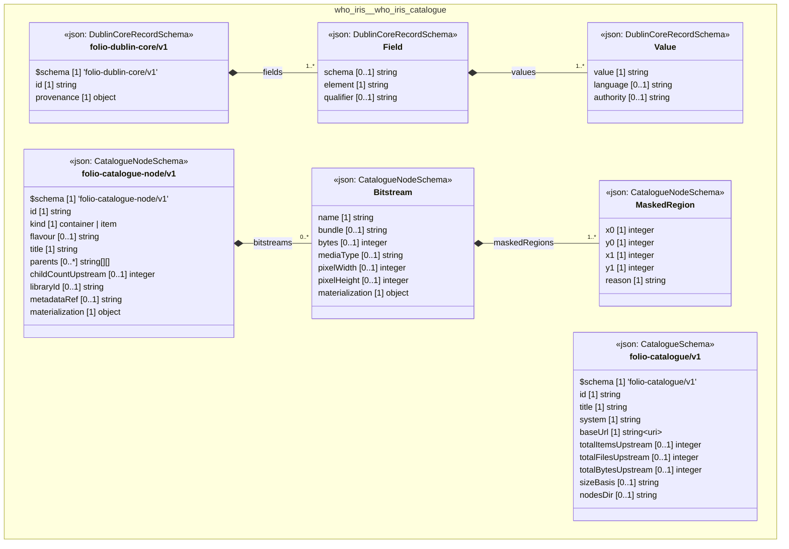

# UML — who-iris/who-iris-catalogue

Generated by `cat-harness/scripts/gen-uml-overview.ts` — do not edit. The `who-iris-catalogue` sub-graph of `who-iris` (`who-iris/catalogue`), with every attribute read from its node schema.

**Sources (same model):** [PlantUML](https://github.com/litlfred/folio-assistant/blob/main/cat-harness/uml/overview/who-iris/who-iris-catalogue.puml) · [Mermaid](https://github.com/litlfred/folio-assistant/blob/main/cat-harness/uml/overview/who-iris/who-iris-catalogue.mmd)

| sub-graph | directory | graph kinds | node schema |
|---|---|---|---|
| `who-iris/who-iris-catalogue` | `who-iris/catalogue` | catalogue | `DublinCoreRecordSchema`; `CatalogueNodeSchema`; `CatalogueSchema` |

## Sub-graphs

- [← all of who-iris](../who-iris.html)
