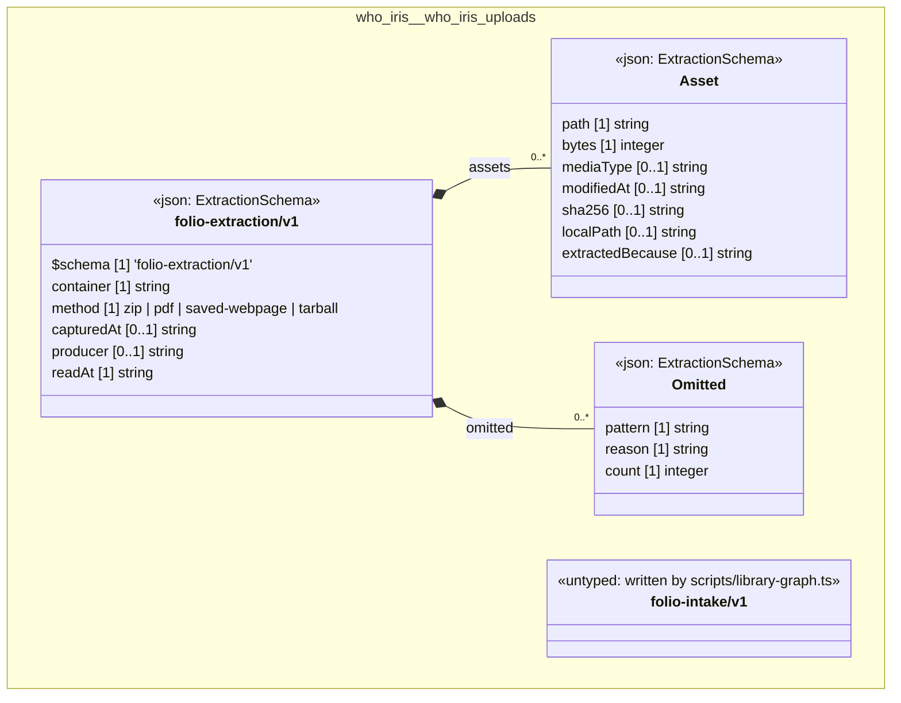

# UML — who-iris/who-iris-uploads

Generated by `cat-harness/scripts/gen-uml-overview.ts` — do not edit. The `who-iris-uploads` sub-graph of `who-iris` (`who-iris/uploads`), with every attribute read from its node schema.

**Sources (same model):** [PlantUML](https://github.com/litlfred/folio-assistant/blob/main/cat-harness/uml/overview/who-iris/who-iris-uploads.puml) · [Mermaid](https://github.com/litlfred/folio-assistant/blob/main/cat-harness/uml/overview/who-iris/who-iris-uploads.mmd)

<figure class="bpmn-figure">
  
</figure>

| sub-graph | directory | graph kinds | node schema |
|---|---|---|---|
| `who-iris/who-iris-uploads` | `who-iris/uploads` | uploads | `ExtractionSchema`; `untyped: written by scripts/library-graph.ts` |

## Sub-graphs

- [← all of who-iris](../who-iris.html)

## The same model, drawn by Mermaid

Kept so the page renders even where the PlantUML image is missing, and because Mermaid nodes carry the CSS class that colours them from `uml.css`.

