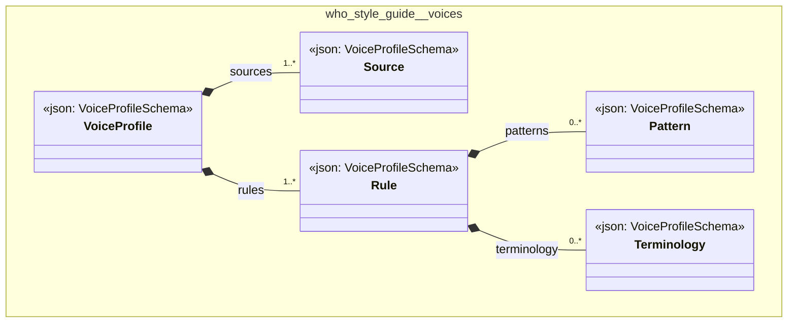

# UML — who-style-guide

Generated by `cat-harness/scripts/gen-uml-overview.ts` — do not edit. Every named sub-graph the `who-style-guide` harness declares, one box each, with the node schema kinds found in it.

**Sources (same model):** [PlantUML](https://github.com/litlfred/folio-assistant/blob/main/cat-harness/uml/overview/who-style-guide.puml) · [Mermaid](https://github.com/litlfred/folio-assistant/blob/main/cat-harness/uml/overview/who-style-guide.mmd)

| sub-graph | directory | graph kinds | node schema |
|---|---|---|---|
| `who-style-guide/voices` | `who-style-guide/skills/voices` | voices | `VoiceProfileSchema` |

## Sub-graphs

- [who-style-guide/voices](who-style-guide/voices.html)
