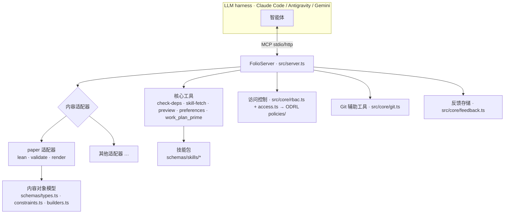

# 架构
{: .no_toc }

1. TOC
{:toc}

---

## 概述

> **本页背后的规则。** 架构描述形态；技能掌管决策。针对画像的适配器 ——
> [`content-profiles`](reference/skill-instructions/content-profiles.html)。
> 在创建新节点之前确定其归属 ——
> [`placement`](reference/skill-instructions/placement.html)。仓库布局及每种图类型 ——
> [`directory-conventions`](reference/skill-instructions/directory-conventions.html)。
> 组装并验证 MCP 接口界面 ——
> [`mcp-assembly`](reference/skill-instructions/mcp-assembly.html) 与
> [`mcp-contract`](reference/skill-instructions/mcp-contract.html)。
> 当本页面与某项技能存在分歧时，以技能为准。

folio-assistant 是一个 **MCP 服务器**，具备可插拔的**内容适配器**层、**技能**系统、类型化**内容对象模型**、**RBAC** 以及部署方案。它所操作的内容存放在*独立的*仓库中 —— 平台本身与内容无关。

## 关注点分离 —— 现状与未来规划

当前该仓库是**同一检出（checkout）中的工具仓库兼内容仓库**。Issue
[#223](https://github.com/litlfred/folio-assistant/issues/223) 规划将其拆分为五个可组合的 folio-assistant 实例。各子页面分别阐述了相关内容：

| 页面 | 说明的内容 |
|---|---|
| [仓库分类体系](architecture/repo-taxonomy.html) | 存在哪些类型的仓库 —— 工具（Tool）、测试（Test）、内容（Content）、消费者（Consumer） —— 以及各仓库可包含的内容 |
| [当前状态](architecture/current-state.html) | 本仓库当前的实际内容、度量数据以及混杂之处 |
| [未来规划](architecture/future-state.html) | 五个目标仓库以及各目录分别落入哪个仓库 |
| [迁移计划](architecture/migration-plan.html) | Phase 0/I/II/III、各项关卡以及尚未决定的事项 |
| [最小化 `cat-harness`](architecture/cat-harness-minimum.html) | 将“非自说明性”作为检验标准时，harness 中保留下来的内容 |
| [Harness 实例](architecture/harness-instances.html) | 实例的本质是什么 —— 原理图、可视化、工具；四个目录；默认渲染 |

最后两项看似相互矛盾 —— 最小化页面指出 harness 不产出供人类查看的任何内容，而实例页面指出实例默认会进行渲染。但它们并无矛盾：这项要求是一个**不断上升的基线**，其中
`bootstrap` 免于可视化器约束，并改由其自身提供 `.json`/`.jsonld`，而 `cat-harness` 则是其余要求开始适用的层级。参见
[要求从何处开始](architecture/harness-instances.html#where-the-requirement-starts--bootstrap-is-the-exception)。

本页的其余部分描述**当前现状**下的架构。

## 仓库布局

| 路径 | 包含内容 |
|------|-----------------|
| `src/` | MCP 服务器（`server.ts`）、入口点（`index.ts`）、核心（`git`、`rbac`、`cache`、`feedback`、`logging`）以及核心工具（`tools/`） |
| `adapters/` | 内容适配器 —— `paper/`（Lean + LaTeX）以及独立的 `mcp-server/` |
| `schemas/` | 内容对象模型（`types.ts`、`constraints.ts`、`builders.ts`）和各项技能专属的 JSON Schema（`schemas/skills/*`） |
| `skills/` | 技能**包**（`content-lifecycle`、`authoring-math`、`authoring-who-smart-guidelines`）及其 Docker 清单文件 |
| `content/` | 内容**流水线**工具（验证器、QA、渲染辅助工具）—— 而非内容本身 |
| `ui/`、`viewer/`、`home_page/` | Web UI、交互式查看器以及示例 Pages 站点 |
| `deploy/` | 部署（Caddy、docker-compose、置备、OAuth） |
| `docs/` | 本文档站点 |
| `.github/` | CI 工作流与脚本（构建、发布、QA、文档） |
| `.claude/skills/` | 本地智能体技能 + 能力钩子 |

## MCP 服务器

`FolioServer`（`src/server.ts`）注册核心工具，随后请求当前激活的**内容适配器**注册其专有工具。它支持两种传输方式 —— `--stdio`（由 harness 启动的方式）和 `--http`（共享的长期运行实例）。工具调用均带有耗时记录。

## 内容适配器

内容适配器封装了所有与特定类型相关的逻辑：存在哪些制品、如何验证它们、如何构建/渲染它们，以及注册哪些额外的 MCP 工具。`document` 适配器（`adapters/document/`）是散文类 folio 的基础；`paper` 适配器（`adapters/paper/`）对其进行了扩展，并提供 Lean 生命周期工具（`lean_setup`/`build`/`check`/`status`）、验证以及渲染（`paper_render_pdf`/`html`、`formula_render`）。添加新的内容类型需要新增适配器 —— 参见[添加内容类型](guides/new-content-type.html)。

## 技能与技能包

**技能**（skill）是一个经过文档记录、受模式（schema）约束的工作单元（例如 `lean-formalization`）。多项技能组合为**技能包**（packages），技能包通过 `package-manifest.json` 声明其 Docker/运行时依赖。LLM 通过 `skill_list` 发现技能，并通过 `skill_fetch` 加载指令。完整的技能与角色列表 —— 以及它们如何与 LLM 组合协同（RBAC、能力、需求） —— 详见[技能与角色](skills.html)页面；每项技能的输入/输出契约发布在[技能模式参考](reference/skills/)中。

## 内容对象模型

对于论文，内容是一棵由类型化**块**（blocks）构成的树，在运行时通过 Zod 进行验证：

- `schemas/types.ts` —— `Block`、`Section`、`Chapter`、`Paper` 以及各类块类型
- `schemas/constraints.ts` —— Zod 模式与约束规则
- `schemas/builders.ts` —— 经过验证的构造函数（`definition()`、`theorem()` 等）

这些内容记录在自动生成的 [TypeScript API 参考](api/)中。

## 访问控制 —— ODRL，在每项任务前执行检查

系统中存在统一的权限体系，即 W3C ODRL 2.2（issue #1180）：操作定义在 `skills/permissions/permissions.json` 中，授权定义在 `policies/*.jsonld` 中，由 `schemas/odrl.ts` 中的 `permits()` / `decide()` 进行评估。有两个调用方会对其进行查询：

- **BPMN 执行器**，在每项任务和决策前调用（`src/workflow/authorize.ts`）：参与者是否已认证、是否具备泳道角色的资质、是否被允许在此处执行 `perform-task`，以及是否被允许触碰该内容？目前属于建议性质：若结果为 `deny` 或角色不匹配则拒绝，若为 `unknown` 则予以记录。
- **HTTP 路由**，通过 `src/core/rbac.ts` 调用：每个路由指明其执行的操作（`content-authoring`、`review-comments`、`adjudication`），且认证网关的会话被声明为参与者，其授权规则来自 `policies/http-gateway.jsonld`。在此处，`unknown` 会被拒绝。

在 issue #1207（2026-09-23）之前，`rbac.ts` 是一套独立的 viewer < collaborator < owner 阶梯式权限，而执行器不做任何检查。现在的规范原则见 [`task-authorization`](reference/skill-instructions/task-authorization.html) 技能。

## 工作计划引导（跨 harness）

工作计划存储在 `beans` 中，并通过三种方式呈现，以使任何 harness 都能获得完全相同的初始引导：

1. **`AGENTS.md`** —— 静态规程，由所有智能体原生读取。
2. **`SessionStart` 钩子** —— 每个 harness 运行共享的 `scripts/session-start-coord-sweep.sh` 引导脚本。
3. **`work_plan_prime` MCP 工具** —— 为任何通过 MCP 连接的智能体提供实时引导。

有关完整的跨智能体设计，请参见 `docs/folio-assistant-migration.md`。

## 部署

`deploy/` 包含 Caddy 反向代理模板、`docker-compose.yml`、置备脚本、Google OAuth 配置，以及用于运行共享 HTTP 实例的自动更新脚本。技能包的 Docker 清单文件会将 apt/pip/npm 依赖聚合到每个活动包集对应的单一镜像中。
