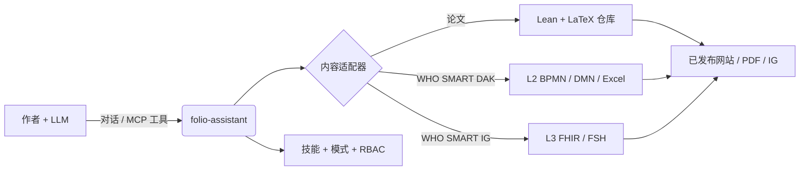
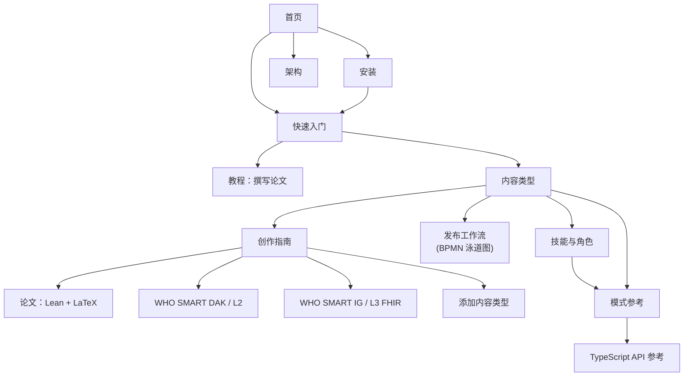

# folio-assistant
{: .fs-9 }


一个与内容无关的智能体技能框架，用于利用大语言模型创作严谨的内容——科学论文与专著、WHO SMART 指南以及 FHIR 实施指南——由 MCP 服务器、基于角色的访问控制（RBAC）和类型化内容对象模型提供支持。
{: .fs-6 .fw-300 }

[开始使用](../getting-started.html){: .btn .btn-primary .fs-5 .mb-4 .mb-md-0 .mr-2 }
[安装](../installation.html){: .btn .fs-5 .mb-4 .mb-md-0 .mr-2 }
[在 GitHub 上查看](https://github.com/litlfred/folio-assistant){: .btn .fs-5 .mb-4 .mb-md-0 }

---

## 按顺序的四件事

**1. 工作计划是你说明自己在做什么的地方。**
不是聊天消息，也不是评论，而是 [beans]({{ '/beans-and-todos.html' | relative_url }})——一个纳入版本管理、任何会话或智能体都能读取的存储。开始工作前先认领，以免并行会话领取同一项；最终不需要的 bean 标记为 `scrapped` 并写明原因，绝不删除。

```sh
cat-harness/scripts/install-beans.sh && export PATH="$HOME/.local/bin:$PATH"
beans list                          # 有哪些待办
beans create "<title>"              # ……先确认该标题尚不存在
beans <id> --status in-progress     # 认领它，让大家可见
```

**2. 创建你的第一个 folio。** 本仓库是*平台*；你的内容存放在它自己的仓库中。一条命令即可搭好框架——清单、声明、智能体文件以及指回这里的链接：

```sh
bun run init-folio --help
```

然后，[快速入门]({{ '/getting-started.html' | relative_url }}) 会带着第一个块走完验证、渲染和审阅。

**3. 弄清你在写哪一类东西。** *文档*是结构化的散文；*论文*（paper）在此之上还包含那些断言为形式化命题的块类型，由 Lean 支撑并通过 LaTeX 排版。这一选择决定了哪些块合法、哪些检查会运行：[内容类型]({{ '/content-types.html' | relative_url }})。

**4. 你永远不会读的文档。**
[全部文档]({{ '/guides/index.html' | relative_url }})——写作指南、架构、发布流程、自动生成的模式与技能参考。它就在这里，内容详尽，而实话实说，你多半会在某样东西出问题的那一刻从搜索引擎来到这里。这样用它完全没问题。上面三步才是现在值得读的。

如果让你困惑的是*机制*而不是写作——谁做某件事、在哪个流程中、用哪项技能——请从 [平台]({{ '/platform.html' | relative_url }}) 开始。那里的一句话承载了整个模型，其中每个词都是一个单独声明的对象。

---

## 什么是 folio-assistant？

**folio-assistant** 是*平台*——它本身不包含内容。它提供技能、模式、工具链以及一个 MCP（Model Context Protocol）服务器，供 LLM 驱动的智能体用于规划、撰写、验证、审阅、测试和发布存放在独立仓库中的内容**作品集（folio）**。

> **关注点分离。** 本篇文档阐述了*框架的形式化规范*与*如何使用 folio-assistant*——刻意**与任何具体内容保持独立**。当这些页面中出现具体内容时，它纯粹是说明性的（作为*示例*），绝非规范性制品。



## 支持的内容类型

folio-assistant 是**可插拔的**——每种内容类型都由一个内容适配器和对应的技能包处理。当前支持的类型包括：

| 内容类型 | 制品 | 技能包 |
|---|---|---|
| **科学论文与专著** | Lean 4 形式化 + LaTeX/Markdown | [`authoring-math`](../content-types.html#scientific-papers--books) |
| **WHO SMART 指南 DAK** | L2 制品——BPMN、DMN、Excel 数据字典、用户画像（personas） | [`authoring-who-smart-guidelines`](../content-types.html#who-smart-guidelines-daks-l2) |
| **WHO SMART 实施指南** | L3 FHIR 资源、FSH、IG Publisher 输出 | [`authoring-who-smart-guidelines`](../content-types.html#who-smart-implementation-guides-l3) |
| **其他** | 可插拔——添加新适配器 + 技能包 | [添加内容类型](../guides/new-content-type.html) |

通用横切 [`content-lifecycle`](../content-types.html#the-content-lifecycle)
包（规划 → 创作 → 验证 → 审阅 → 测试 → 发布 → 反馈 → 归档）适用于每种内容类型。[发布工作流](../publication-workflow.html)对其进行了规范建模——采用 BPMN 泳道图形式，涵盖各项角色、HCI 验证关卡以及共享工作计划。

## 后续指引

- **[安装](../installation.html)** — 前置要求、克隆、`bun install`、能力检查。
- **[快速入门](../getting-started.html)** — 将 MCP 服务器连接至您的 LLM 并运行您的第一个技能。
- **[教程：使用 folio-assistant 撰写论文](../guides/writing-a-paper.html)** — 包含模拟对话会话的完整 LLM 驱动演练。
- **[内容类型](../content-types.html)** — 各个创作领域的形式化规范。
- **[发布工作流](../publication-workflow.html)** — 编辑与发布流程的 BPMN 泳道图。
- **[智能体引导](../guides/agent-onboarding.html)** — 针对接入 folio 的 LLM 智能体指引。
- **[技能与角色](../skills.html)** — 详述各项技能与角色，以及它们如何与 LLM 协同工作。
- **[技能模式参考](../reference/skills/)** — 为每项技能生成的输入/输出契约。
- **[TypeScript API 参考](../api/)** — 内容对象模型（`Block`、`Chapter`、`Paper`、构建器、Zod 约束）。
- **[架构](../architecture.html)** — 适配器、MCP 服务器、RBAC、块模型。

## 文档全景图



> 导图节点可在文档网站上点击。
