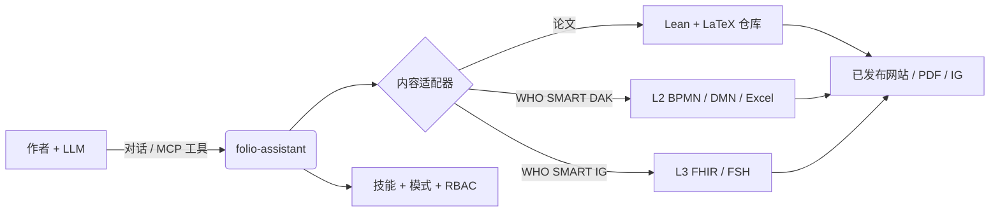
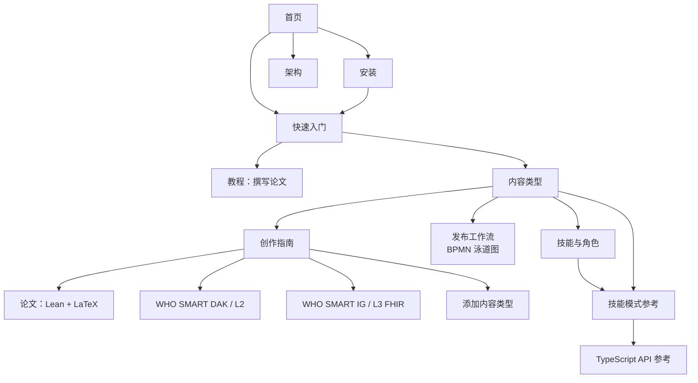

# folio-assistant
{: .fs-9 }


一个与内容无关的智能体技能框架，用于利用大语言模型创作严谨的内容——科学论文与专著、WHO SMART 指南以及 FHIR 实施指南——由 MCP 服务器、基于角色的访问控制（RBAC）和类型化内容对象模型提供支持。
{: .fs-6 .fw-300 }

<!--
  `View on GitHub` STAYS. The site-wide `aux_links` GitHub text was removed from
  the chrome above every page (bean `udx8`, PR #352), and the obvious follow-up
  is to delete this button for consistency. Do not. Put to the repo owner on
  2026-09-19: this button is part of the landing page's own readme/description
  note — authored content on one page, not chrome — and the forge remains
  reachable from the navbar's Source tile regardless.
-->
[开始使用]({{ '/docs/cat-harness/getting-started.html' | relative_url }}){: .btn .btn-primary .fs-5 .mb-4 .mb-md-0 .mr-2 }
[安装]({{ '/docs/cat-harness/installation.html' | relative_url }}){: .btn .fs-5 .mb-4 .mb-md-0 .mr-2 }
[在 GitHub 上查看](https://github.com/litlfred/folio-assistant){: .btn .fs-5 .mb-4 .mb-md-0 }

---

## 按顺序的四件事

**1. 工作计划是你说明自己在做什么的地方。**
不是聊天消息，也不是评论——而是 [beans]({{ '/docs/cat-harness/beans-and-todos.html' | relative_url }})，一个纳入版本管理、任何会话或智能体都能读取的存储。开始工作前先认领，以免并行会话领取同一项；最终不需要的 bean 标记为 `scrapped` 并写明原因，绝不删除。

```sh
cat-harness/scripts/install-beans.sh && export PATH="$HOME/.local/bin:$PATH"
beans list                          # 有哪些待办
beans create "<title>"              # ……先确认该标题尚不存在
beans <id> --status in-progress     # 认领它，让大家可见
```

**2. 创建你的第一个 folio。** 本仓库是*平台*；你的内容存放在它自己的仓库中。一条命令即可搭好框架——清单、声明、智能体文件以及指回这里的链接：

```sh
bun run init-folio --help
```

然后，[开始使用]({{ '/docs/cat-harness/getting-started.html' | relative_url }}) 会带着第一个块走完验证、渲染和审阅。

**3. 弄清你在写哪一类东西。** *文档*是结构化的散文；*论文*（paper）在此之上还包含那些断言为形式化命题的块类型，由 Lean 支撑并通过 LaTeX 排版。这一选择决定了哪些块合法、哪些检查会运行：[内容类型]({{ '/docs/cat-harness/content-types.html' | relative_url }})。

**4. 你永远不会读的文档。**
[全部文档]({{ '/docs/cat-harness/guides/index.html' | relative_url }})——写作指南、架构、发布流程、自动生成的模式与技能参考。它就在这里，内容详尽，而实话实说，你多半会在某样东西出问题的那一刻从搜索引擎来到这里。这样用它完全没问题。上面三步才是现在值得读的。

如果让你困惑的是*机制*而不是写作——谁做某件事、在哪个流程中、用哪项技能——请从 [平台]({{ '/docs/cat-harness/platform.html' | relative_url }}) 开始。那里的一句话承载了整个模型，其中每个词都是一个单独声明的对象。

---

## 什么是 folio-assistant？

**folio-assistant** 是*平台*——它本身不包含内容。它提供技能、模式、工具链以及一个 MCP（Model Context Protocol）服务器，供 LLM 驱动的智能体用于规划、撰写、验证、审阅、测试和发布存放在独立仓库中的内容**作品集（folio）**。

> **关注点分离。** 本篇文档阐述了*框架的形式化规范*与*如何使用 folio-assistant*——刻意**与任何具体内容保持独立**。当这些页面中出现具体内容时，它纯粹是说明性的（作为*示例*），绝非规范性制品。


```mermaid
flowchart LR
    A[作者 + LLM] -->|对话 / MCP 工具| B(folio-assistant)
    B --> C{内容适配器}
    C -->|论文| D[Lean + LaTeX 仓库]
    C -->|WHO SMART DAK| E[L2 BPMN / DMN / Excel]
    C -->|WHO SMART IG| F[L3 FHIR / FSH]
    B --> G[技能 + 模式 + RBAC]
    D & E & F --> H[已发布网站 / PDF / IG]
```

## 支持的内容类型

folio-assistant 是**可插拔的**——每种内容类型都由一个内容*适配器*和对应的技能*包*处理。当前支持的类型包括：

| 内容类型 | 制品 | 技能包 |
|--------------|-----------|---------------|
| **科学论文与专著** | Lean 4 形式化 + LaTeX/Markdown | [`authoring-math`]({{ '/docs/cat-harness/content-types.html' | relative_url }}#scientific-papers--books) |
| **WHO SMART 指南 DAK** | L2 制品——BPMN、DMN、Excel 数据字典、用户画像（personas） | [`authoring-who-smart-guidelines`]({{ '/docs/cat-harness/content-types.html' | relative_url }}#who-smart-guidelines-daks-l2) |
| **WHO SMART 实施指南** | L3 FHIR 资源、FSH、IG Publisher 输出 | [`authoring-who-smart-guidelines`]({{ '/docs/cat-harness/content-types.html' | relative_url }}#who-smart-implementation-guides-l3) |
| **其他** | 可插拔——添加新适配器 + 技能包 | [添加内容类型]({{ '/docs/cat-harness/guides/new-content-type.html' | relative_url }}) |

通用横切 [`content-lifecycle`]({{ '/docs/cat-harness/content-types.html' | relative_url }}#the-content-lifecycle)
包（规划 → 创作 → 验证 → 审阅 → 测试 → 发布 → 反馈 → 归档）适用于每种内容类型。
[发布工作流]({{ '/docs/cat-harness/publication-workflow.html' | relative_url }})对其进行了规范建模——采用 BPMN 泳道图形式，涵盖各项角色、HCI 验证关卡以及共享工作计划。

## 后续指引

- **[安装 (Installation)]({{ '/docs/cat-harness/installation.html' | relative_url }})** — 前置要求、克隆、`bun install`、能力检查。
- **[快速入门 (Getting started)]({{ '/docs/cat-harness/getting-started.html' | relative_url }})** — 将 MCP 服务器连接至您的 LLM 并运行您的第一个技能。
- **[教程：使用 folio-assistant 撰写论文 (Tutorial: Writing a paper with folio-assistant)]({{ '/docs/cat-harness/guides/writing-a-paper.html' | relative_url }})** — 包含模拟对话会话的完整 LLM 驱动演练。
- **[内容类型 (Content types)]({{ '/docs/cat-harness/content-types.html' | relative_url }})** — 各个创作领域的形式化规范。
- **[发布工作流 (Publication workflow)]({{ '/docs/cat-harness/publication-workflow.html' | relative_url }})** — 编辑与发布流程的 BPMN 泳道图：HCI 验证关卡、人员分工审阅以及共享工作计划。
- **[智能体引导 (Agent onboarding)]({{ '/docs/cat-harness/guides/agent-onboarding.html' | relative_url }})** — 针对接入 folio 的 LLM 智能体指引：入门步骤、查找技能、内容对象模型、QA 伴随文件。
- **[技能与角色 (Skills & roles)]({{ '/docs/cat-harness/skills.html' | relative_url }})** — 详述各项技能与角色，以及它们如何与 LLM 协同工作。
- **[工作计划与待办事项 (Beans and todos)]({{ '/docs/cat-harness/beans-and-todos.html' | relative_url }})** — 共享工作计划，以及为何将其纳入版本控制。
- **[文档摄取 (Document ingestion)]({{ '/docs/cat-harness/document-ingestion.html' | relative_url }})** — 上传文件如何转化为 L1 源：提取结构、衍生内容、构建 L1 知识图谱与完整性关卡。
- **[证据评估 (Evidence)]({{ '/docs/cat-harness/evidence.html' | relative_url }})** — 证据检索、提取与审阅流程。
- **[技能模式参考 (Skill schema reference)](../reference/skills/)** — 为每项技能生成的输入/输出契约。
- **[TypeScript API 参考 (TypeScript API reference)](../api/)** — 内容对象模型（`Block`、`Chapter`、`Paper`、构建器、Zod 约束）。
- **[架构 (Architecture)]({{ '/docs/cat-harness/architecture.html' | relative_url }})** — 适配器、MCP 服务器、RBAC、块模型。
- **[知识图谱 (The Knowledge Graph)]({{ '/docs/cat-harness/knowledge-graph.html' | relative_url }})** — 子图分类法、引用的流向以及仓库之间如何划分工作。
- **[测试框架 (The Harness)]({{ '/docs/cat-harness/harness.html' | relative_url }})** — 实例化、依赖遍历以及对目录进行测试封装所承担的义务。

在阅读上述页面之前，有两项技能值得先行了解，因为其他所有内容都以它们为前提：[`getting-started`](../reference/skill-instructions/getting-started.html) 用于指引你实际要完成的目标，而 [`placement`](../reference/skill-instructions/placement.html) 则在创建新节点之前确定其归属位置。

## 文档全景图


```mermaid
flowchart TD
    Home[首页] --> Install[安装]
    Home --> GS[快速入门]
    Install --> GS
    GS --> Tut[教程：撰写论文]
    GS --> CT[内容类型]
    CT --> Skills[技能与角色]
    CT --> WF["发布工作流<br/>BPMN 泳道图"]
    CT --> Guides[创作指南]
    Guides --> Paper[论文：Lean + LaTeX]
    Guides --> DAK[WHO SMART DAK / L2]
    Guides --> IG[WHO SMART IG / L3 FHIR]
    Guides --> New[添加内容类型]
    Skills --> Ref[技能模式参考]
    CT --> Ref
    Ref --> API[TypeScript API 参考]
    Home --> Arch[架构]

    click Skills "skills.html" "Skills & roles"
    click WF "publication-workflow.html" "Publication workflow (BPMN)"
    click Install "installation.html" "Installation"
    click GS "getting-started.html" "Getting started"
    click Tut "guides/writing-a-paper.html" "Tutorial: writing a paper"
    click CT "content-types.html" "Content types"
    click Guides "guides/" "Authoring guides"
    click Paper "guides/writing-a-paper.html" "Papers: Lean + LaTeX"
    click DAK "guides/who-smart-dak.html" "WHO SMART DAK (L2)"
    click IG "guides/who-smart-ig.html" "WHO SMART IG (L3 FHIR)"
    click New "guides/new-content-type.html" "Add a content type"
    click Ref "reference/skills/" "Skill schema reference"
    click API "api/" "TypeScript API reference"
    click Arch "architecture.html" "Architecture"
```

> 导图节点可在文档网站上点击。
