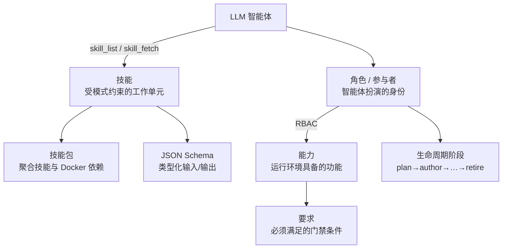

# 技能与角色
{: .no_toc }

本页面是 folio-assistant 中所有**技能**（skill）与**角色**（role）的总览清单，并阐述了它们如何与大语言模型（LLM）协同工作。关于各个技能的类型化输入/输出契约，请参阅[技能模式参考](reference/skills/)。

1. TOC
{:toc}

---

## 如何与大语言模型协同工作

folio-assistant 为 LLM 智能体提供了一种结构化的方式来执行实际的创作工作。由以下五个概念组合而成：

1. **技能（Skill）** — 具备文档记录且受模式（schema）约束的工作单元（例如 `lean-formalization`）。智能体使用 `skill_list` MCP 工具发现技能，并使用 `skill_fetch` 加载技能的操作指南。每项技能都有类型化的[输入/输出契约](reference/skills/)。
2. **技能包（Skill package）** — 一组相关技能的集合，同时声明了其 Docker/运行时依赖项（`package-manifest.json`）。
3. **角色（参与者）／Role (actor)** — 智能体*代表谁*行动。**参与者**（actor）由于其所在的 BPMN 泳道而承担某种**角色**（role）。参与者可以**做什么**由 `policies/` 中的 W3C ODRL 策略定义，而非角色本身的固有属性。在每个任务开始前，执行器都会检查身份验证、角色分配、策略及内容访问权限（[`task-authorization`](reference/skill-instructions/task-authorization.html)）；HTTP 路由也通过 `src/core/rbac.ts` 查询相同的策略。
4. **能力（Capability）** — 具体的运行环境能力（例如 `latex-compiler`、`lean-toolchain`）。技能需要特定能力支持；`check_dependencies` 会对这些能力进行探测检测。
5. **门禁要求（Requirement）** — 在阶段推进之前或推进期间必须满足的门禁关卡（例如 `commit-hygiene`、`lean-verification`）。

在实践中，这一循环过程如下：智能体预置工作计划（`work_plan_prime`），检查是否具备所需能力（`check_dependencies`），列出并加载对应的技能（`skill_list` → `skill_fetch`），以用户角色的身份开展工作（受 RBAC 约束），并通过内容适配器的工具进行验证、构建与发布。

---

## 技能

### 技能存放位置（及其当前状态）

技能并不是定义在单一文件中的，而是跨越若干层次进行定义。对于任何一项技能：

| 层次 | 位置 | 状态 |
|-------|----------|--------|
| **定义**（角色、所需能力、门禁要求、路由模式、生命周期阶段、模式引用） | `.claude/skills/local/<skill>.json` | ✅ 全部 22 项创作技能 — 由 `scripts/validate-skills.ts` 在 CI 中验证 |
| **类型化契约**（输入/输出 JSON Schema） | `schemas/skills/<skill>/` | ✅ 全部 22 项 — 参见[参考](reference/skills/) |
| **指令正文**（LLM 加载的文字操作指南） — 可在[技能指令](reference/skill-instructions/)参考中查阅 | `skills/content-lifecycle/*.md`、`skills/folio-*-adapter/*.md`、`src/skills/*.md` | ✅ lifecycle、agent、platform-bundle 以及 **folio-document-adapter** 技能；⏳ **authoring-math / authoring-who-smart-guidelines 正文待补充**（这些技能包已提供清单 + JSON 定义） |
| **技能包**（Docker/运行时依赖项） | `skills/<package>/package-manifest.json` | ✅ 全部四个技能包 |

所以，*是的，这些技能确实存在* — 表现为结构化定义与类型化模式，且生命周期和智能体技能已随附详细的文本指南。`skill_fetch` MCP 工具当前提供 `src/skills/*.md` 指令正文；创作技能的文本正文是后续待补充的内容（它们所属的定义和契约均已就绪）。

### 跨领域通用：`content-lifecycle`

适用于**所有**内容类型的生命周期阶段：

| 技能 | 阶段 | 用途 |
|-------|-------|---------|
| [`content-plan`](reference/skills/content-plan.html) | plan | 范围、团队、时间线、治理 |
| [`content-author`](reference/skills/content-author.html) | author | 创建结构化制品 |
| [`content-validate`](reference/skills/content-validate.html) | validate | 检查模式（schema）与约束 |
| [`content-review`](reference/skills/content-review.html) | review | 正式审阅与批准 |
| [`content-test`](reference/skills/content-test.html) | test | 端到端 QA / 构建绿灯（build green） |
| [`content-publish`](reference/skills/content-publish.html) | publish | 渲染与部署 |
| [`content-feedback`](reference/skills/content-feedback.html) | feedback | 收集与分流反馈 |
| `content-retire` | retire | 弃用 / 归档 |

### 文档与政策指南：`folio-document-adapter`

| 技能 | 用途 |
|-------|---------|
| [`document-authoring`](reference/skills/document-authoring.html) | 在纯文本（prose）folio 中创建并修订块 |
| [`document-structure`](reference/skills/document-structure.html) | 章节与小节 — 添加、删除、重新排序 |
| [`normative-statements`](reference/skills/normative-statements.html) | 承载建议、要求或规则 |
| [`document-publishing`](reference/skills/document-publishing.html) | Markdown → HTML / PDF，无需 TeX |

### 论文与专著：`authoring-math`

| 技能 | 用途 |
|-------|---------|
| [`lean-formalization`](reference/skills/lean-formalization.html) | 在 Lean 4 中形式化陈述与证明 |
| [`latex-authoring`](reference/skills/latex-authoring.html) | 撰写 LaTeX 文档 |
| [`proof-verification`](reference/skills/proof-verification.html) | 验证证明，审计 `sorry` / 公理 |
| `scientific-visualization` | 图表与示意图 |
| `hypothesis-generation` | 提出猜想与研究方向 |
| `scientific-critical-thinking` | 对论证进行对抗性审阅（adversarial review） |

### WHO SMART 指南：`authoring-who-smart-guidelines`

| 技能 | 用途 |
|-------|---------|
| [`l2-dak-authoring`](reference/skills/l2-dak-authoring.html) | L2 DAK 制品（数据字典等） |
| [`l3-fhir-authoring`](reference/skills/l3-fhir-authoring.html) | 通过 FSH 编写 L3 FHIR 资源 |
| [`bpmn-authoring`](reference/skills/bpmn-authoring.html) | BPMN 2.0 业务流程 |
| [`dmn-authoring`](reference/skills/dmn-authoring.html) | DMN 决策表 |
| [`terminology-management`](reference/skills/terminology-management.html) | 代码系统（code systems）与值集（value sets） |
| [`fhir-validation`](reference/skills/fhir-validation.html) | 对照 FHIR Profile（配置文件）进行验证 |
| [`ig-publication`](reference/skills/ig-publication.html) | 构建并发布 IG（实施指南） |
| [`quality-control`](reference/skills/quality-control.html) | 质量保证（QA）门禁 |

### 智能体／平台技能（`src/skills`）

LLM 在仓库中高效工作所使用的技能（通过 `skill_fetch` 加载，包名为 `folio-assistant`）：

| 技能 | 用途 |
|-------|---------|
| `corpus-grep` | 在整个内容语料库中检索 |

> `editor`、`readability-editing`、`todo-review`、`symbiotic-interaction` 和 `deployment-auth` 现已（通用化后）移至下方的 **`folio-core`** 捆绑包中 — 请使用 `package_name="folio-core"` 获取它们。

论文 folio 同样需要 `folio-document-adapter` 技能：论文*本质上是*包含了 Lean 块的文档，因此 `document-structure` 与 `document-publishing` 适用于两者。这两个技能包是一个完整内容模型的两半，而不是二选一的替代关系。

### 本地协调技能（`.claude/skills/local`）

| 技能 | 用途 |
|-------|---------|
| `prepare-merge` | 将分支带入干净、绿灯、可合并的状态（另请参阅 `/watch`） |
| `bean-coordination` | 多智能体认领与协作规范 |
| `todo-manager` | 以 bean 作为待办事项（todo）的管理规范 |

### 平台技能包（`skills/folio-core`、`skills/folio-document-adapter`、`skills/folio-paper-adapter`）

更大型的**平台技能包**（platform bundles），其中两个从 qou 内容仓库迁移而来（参见[迁移记录](migrations/2026-06-29-platform-skills-migration.html)以及 issue [#27](https://github.com/litlfred/folio-assistant/issues/27)）。它们与具体内容无关，旨在同步到任何 folio 中：

| 技能包 | 技能数 | 范围 |
|--------|-------:|-------|
| **`folio-core`** | 43 | 智能体协作、watcher 框架、QA／渲染／参考文献／词汇表流水线、文档、部署 — 适用于*任何*内容类型。 |
| **`folio-document-adapter`** | 4 | 纯文本（prose）folio：块创作、章/节结构、规范性陈述，以及无 TeX 发布路径。同样适用于论文。 |
| **`folio-paper-adapter`** | 40 | 形式化数学论文适配器（任何 Lean 4 + LaTeX 论文）：Lean 工作流、证明工具链、内容对象验证、LaTeX、论文结构、导入、模拟器。 |

不可削减的 QOU 物理专用技能已被跳过；其余技能中特定于 QOU 的示例均已完成通用化。每个技能包都附带一份 `package-manifest.json`。

> 技能**模式（schema）**（创作技能的类型化输入/输出）自动生成到[技能模式参考](reference/skills/)中 — 绝不会与框架验证的规则脱节。

---

## 角色（参与者）

角色回答的是*智能体代表谁在行动*。当前用户通过 `role-assignments.json` 映射到特定角色，而该角色的能力界定了智能体可以执行的操作（基于角色的访问控制 RBAC）。角色支持**继承**（例如 `author` 继承 `reviewer`）。

> 如需以*泳道*的形式了解这些角色 — 谁负责编辑、谁负责审阅、谁负责签批，以及智能体可自主执行哪些步骤 — 请阅读[发布工作流 → 角色分工（Who is who）](publication-workflow.html#who-is-who)。

### 人员角色

| 角色 | 可执行的操作 |
|------|------------------|
| `viewer` | 基础只读。查看内容，不作任何更改。 |
| `reviewer` | 查看 + 审阅批注；无直接修改权限。 |
| `author` | 创建/修改内容（继承 `reviewer`）。 |
| `admin` | 完全管理权限 — 角色、配置及所有内容。 |
| `programme-manager` | 确定范围、团队组建、时间线、利益相关方治理。 |
| `technical-officer` | 规划领域协调员 + 第一轮初审人。 |
| `business-analyst` | L2 DAK 创作者（BPMN、数据字典、决策逻辑、指标）。 |
| `clinical-sme` | 临床验证员 / 事实基准（ground-truth）提供者。 |
| `terminologist` | 术语治理（ICD-11、SNOMED CT、LOINC）。 |
| `fhir-modeller` | L3 FHIR 制品（FSH、SUSHI、CQL、IG Publisher）。 |
| `content-reviewer` | 正式批准 / 阶段转换签批。 |
| `qc-reviewer` | 跨层次的发布就绪度 QA。 |
| `publication-manager` | 发布版本、IG 配置、构建、版本管理、出版。 |
| `translator` | 面向联合国支持语言的本地化。 |

### 系统参与者

| 参与者 | 提供能力 | 不可执行的操作 |
|-------|----------|--------|
| `authoring-agent` | 起草并修订对内容块的**提议**变更 | 提交（Commit） — 其输出通过验证门禁流转给编辑人员 |
| `review-agent` | 非机械性验证：准确性、语调风貌（voice）、表述阐释 | 批准（Approve） — 仅报告审查发现 |
| `lean-mcp` | 通过 MCP 提供 Lean 4 证明检查与诊断 | — |
| `ig-publisher-service` | FHIR IG Publisher 构建与 QA 报告 | — |

它们各自在流程中所处的位置 — 以及智能体可以与不可决定的事项 — 均在[发布工作流](publication-workflow.html)的 BPMN 图中进行了建模。

### 角色分配

`role-assignments.json` 按优先级将用户身份（取自 git 配置／认证信息）映射到角色。系统预置的默认配置为：

| 模式 | 来源 | 角色 | 优先级 |
|---------|--------|------|----------|
| `litlfred@gmail.com` | git-config | `admin` | 100 |
| `*@who.int` | git-config | `author` | 50 |
| `*` | default | `viewer` | 0 |

---

## 能力与要求

**能力（Capabilities）**是某项技能可能需要的具体运行环境功能；`check_dependencies` MCP 工具负责探测检查这些能力：

`bun-runtime` · `node-runtime` · `python3` · `git-push` · `docker` ·
`latex-compiler` · `lean-toolchain` · `lean-mcp` · `ig-publisher` ·
`sushi-compiler` · `java-runtime` · `jekyll` · `plantuml` · `graphviz`

**要求（Requirements）**是工作推进过程中必须满足的门禁条件：

`commit-hygiene` · `lean-verification` · `fhir-validation` ·
`content-lifecycle` · `session-start`

---

## 另请参阅

- [发布工作流](publication-workflow.html) — BPMN 泳道：哪个步骤运行哪项技能，以及由谁做出决策
- [技能指令](reference/skill-instructions/) — LLM 加载的文本指南正文
- [技能模式参考](reference/skills/) — 每项技能的类型化输入/输出
- [内容类型](content-types.html) — 每种内容类型使用的技能
- [架构](architecture.html) — RBAC、适配器与 MCP 服务器
- [入门指南](getting-started.html) — 运行您的第一项技能
