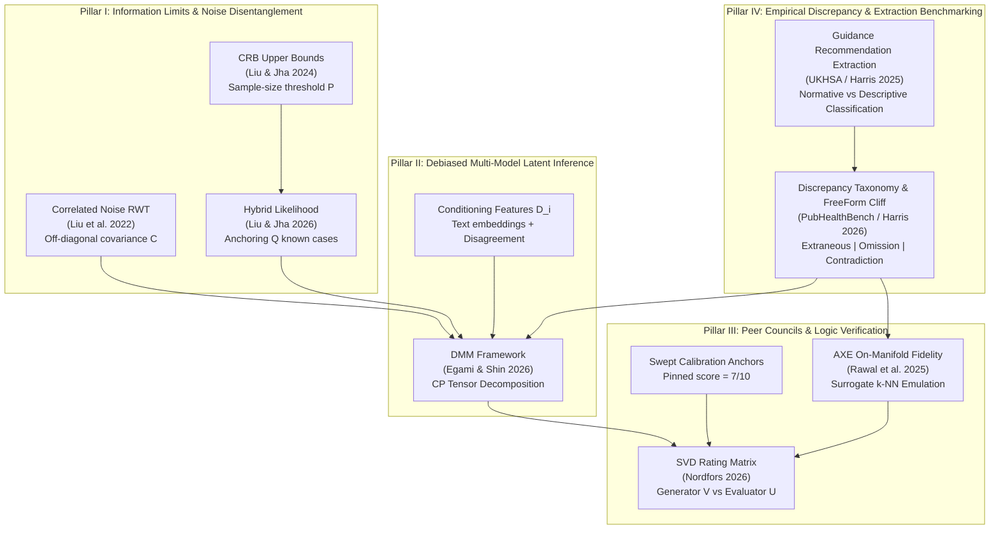
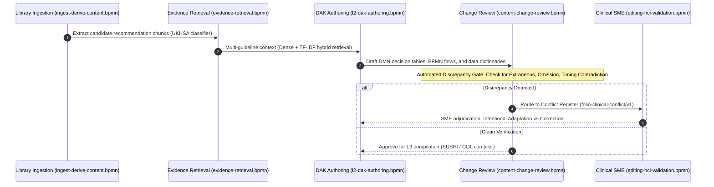

# Verifiable AI Guideline Evaluation: Multi-Measurement Debiased Inference, Peer Councils, and Hybrid Bounds

**Adopted 2026-10-08** (bean `folio-assistant-tn3d`, issue [#2513](https://github.com/litlfred/folio-assistant/issues/2513)).
Expanded with UK Health Security Agency (UKHSA) public health benchmark evidence and recommendation discrepancy analysis.
All eight foundational sources were ingested into `library/` and verified before this methodology was adopted.

---

## 1. The Load-Bearing Idea, in One Sentence

> **Clinical AI cannot be verified by uncalibrated model self-grading or exhaustive expert inspection: rigorous evaluation without gold standards requires decomposing multi-model error covariances, conditioning on document complexity, anchoring against known benchmark fragments, verifying decision logic on-manifold, and gating recommendation discrepancies through structured DAK decision models before executable code generation.**

---

## 2. The Methodological Quadriad

Traditional evaluation paradigms fail in healthcare guidelines:
* *Naive Gold Standards* do not exist for newly authored guidelines (e.g. HIV PrEP L2/L3), while historical guidelines (e.g. Immunization) contain real-world conflicting statements across publication years.
* *Uncalibrated LLM-as-a-Judge* suffers from cardinal rating drift (one rater's "8" is another's "6"), peer collusion, and shared prompt/inductive biases.
* *The Recognition vs Generation Illusion*: UKHSA's PubHealthBench (`arXiv:2505.06046v4`) demonstrates that while frontier models achieve >90% on Multiple Choice Question Answering (MCQA), their generative accuracy collapses to 57–74% in free-form clinical guidance advice. Direct generative authoring from narrative L1 prose into executable L3 logic is therefore inherently hazardous.
* *Exhaustive Human SME Review* is economically impossible: WHO clinical panels cannot manually verify thousands of generated CQL lines, FHIR StructureDefinitions, and decision logic rows.

This methodology combines four rigorous statistical and empirical pillars into an integrated evaluation engine:



### Pillar I: Information Limits & Noise Disentanglement
1. **The Cramér-Rao Bound for Ranking (Liu & Jha 2024, `2403.16873`)**:
   Parameterizes measurement systems as $\hat{a}_{p,k} = u_k a_p + v_k + \epsilon_{p,k}$, where $\text{NSR}_k = \sigma_k / u_k$.
   The Fisher Information Matrix $\mathcal{I}(\Gamma)$ dictates the theoretical upper bound on correctly ranking models without ground truth. If the number of guideline recommendations $P$ is below this threshold, ranking outcomes is statistically meaningless.
2. **Accounting for Correlated Noise (Liu et al. 2022, `2203.02010`)**:
   Models joint errors across pipelines sharing foundation models via covariance matrix $\mathbf{C}$ with off-diagonal elements $\sigma_{k, k'}$.
   Disentangles genuine precision from shared training biases, preventing hallucinated consensus from being mistaken for clinical truth.
3. **Hybrid Ground-Truth Integration (Liu & Jha 2026, `2603.27124`)**:
   Combines unlabelled guideline extractions ($P$ patient/recommendation cases) with verified historical guideline fragments ($Q$ ground-truth anchors, e.g. validated immunization schedules):
   $$\mathcal{L}_{\text{total}}(\Theta, \Sigma, \Omega) = \mathcal{L}_{\text{unlabelled}} + \mathcal{L}_{\text{ground\_truth}}$$
   Anchoring scale $u_k$ and bias $v_k$ with $Q$ known cases reduces parameter variance by over 70%, enabling high-precision ranking on small corpora.

### Pillar II: Debiased Inference without Gold Standards (DMM)
*(Egami & Shin 2026, `2608.18294`)*
When evaluating downstream clinical workflow adherence or automated DAK generation across $J \ge 3$ imperfect AI models:
* Latent true labels $X^*$ are identified via CANDECOMP/PARAFAC (CP) tensor decomposition without human labels.
* **Conditioning Set ($D_i$)**: To preserve conditional independence ($X^{(1)} \perp \dots \perp X^{(J)} \mid X^*, D_i, W_i$), the evaluation explicitly conditions on guideline unit features:
  - Clinical complexity metrics (syntactic tree depth, clinical concept density, drug-drug interaction count).
  - Dense text embeddings of the input recommendation.
  - Multi-model disagreement scores (measuring task ambiguity).
* Yields $\sqrt{n}$-consistent and asymptotically normal downstream parameters $\beta$, allowing rigorous hypothesis testing (e.g. testing if Route B with KG significantly outperforms Route A without KG).

### Pillar III: Peer Councils & On-Manifold Logic Verification
1. **SVD Council of Peers & Swept Anchors (Nordfors 2026, `2606.21008`)**:
   * Multi-model evaluation matrix $M \in \mathbb{R}^{E \times G}$ is decomposed via SVD ($M = U \Sigma V^T$). Right singular vectors $V$ measure pure generator authoring capability; left singular vectors $U$ measure rater evaluation competence.
   * **Swept Calibration Anchors**: Every evaluation call includes an anonymized, constant reference artifact pinned at score 7/10. This anchors evaluator scale drift and restores discriminative dynamic range at the ceiling.
2. **AXE: On-Manifold Logic Fidelity & Anti-Fairwashing (Rawal et al. 2025, `2505.10399`)**:
   * Evaluates extracted DAK decision tables and CQL expressions by testing whether the identified input variables allow an on-manifold surrogate (e.g. local $k$-NN) to emulate the actual recommendation output.
   * Adheres to three core principles: *Local Contextualization*, *Model Relativism*, and *On-Manifold Evaluation*.
   * Detects "fairwashing" and rationale hallucinations: catches when an LLM claims a clinical action was governed by valid guideline criteria when it was actually driven by irrelevant context tokens.

### Pillar IV: Empirical Discrepancy & Extraction Benchmarking
*(Harris et al. 2025 `2405.14766`, Harris et al. 2026 `2505.06046`)*
1. **Guidance Recommendation Classification**:
   * Demonstrates that extracting actionable clinical guidance requires discrete classification of narrative text chunks into normative recommendations (specific, actionable instructions/requests conditioned on patient state) versus descriptive clinical background.
2. **The MCQA vs Free-Form Generative Cliff**:
   * SOTA LLMs achieve >90% on MCQA extraction benchmarks but drop below 75% on free-form generation, with clinical guidance demonstrating the steepest drop (o1=71%, GPT-4.1=65%, GPT-4o=60%, Claude Sonnet 3.7=57%).
   * Unconstrained generative pipelines introduce critical errors even when models possess underlying factual knowledge.
3. **Tripartite Taxonomy of Recommendation Discrepancies**:
   * **Type 1: Extraneous Advice**: Adding clinical actions, supplementary tests, or unapproved prophylactic measures not grounded in source guidance.
   * **Type 2: Omission of Critical Criteria**: Omitting vital eligibility criteria, laboratory monitoring gates, or contraindications (e.g., immunosuppression, pregnancy).
   * **Type 3: Contradiction & Timing Deviations**: Recommending clinical interventions too early (premature treatment before diagnosis) or too late (waiting periods contradicting urgent notification mandates), or making statements directly conflicting with official policy.
4. **Temporal Update Asynchrony**:
   * Evaluates performance degradation when guidelines undergo periodic updates (e.g. 31% of UKHSA guidance updated in 2024 post-training cutoff). Static models persistently emit superseded clinical advice unless bound to declared knowledge graph nodes.

---

## 3. Discrepancy Analysis in L1, L2, L3 Authoring, Editing, and Adaptation

The WHO SMART Guidelines framework establishes a three-layer translation hierarchy:
* **L1**: Narrative clinical guidelines (WHO recommendations, national health ministry guidance).
* **L2**: Digital Adaptation Kit (DAK) — human-readable, machine-processable operational artifacts (Personas, Workflows/BPMN, Data Dictionary, Decision Tables/DMN, Indicators).
* **L3**: Computable FHIR / CQL Implementation Guides (Profiles, ValueSets, PlanDefinitions, Library logic).

```
+---------------------------------------------------------------------------------------------------+
| L1: Narrative Clinical Guidelines (WHO & National MOH Guidance)                                   |
| - Unstructured text, multi-guideline publications, historical revisions                           |
| - Challenge: Chunk extraction, identifying normative recommendations, cross-guideline conflicts  |
+---------------------------------------------------------------------------------------------------+
                                                  |
                  [UKHSA Recommendation Extractor + AXE Discrepancy Gating]
                                                  v
+---------------------------------------------------------------------------------------------------+
| L2: Digital Adaptation Kit (DAK) — The Insulating Bridge                                          |
| - DMN Decision Tables: Condition-Action matrices with explicit boundaries                         |
| - BPMN Workflows: Deterministic activity sequences eliminating intervention timing errors         |
| - Core Data Dictionary: Standardized concepts, LOINC/SNOMED codes, FHIR logical models            |
| - Adaptation Register: Separates intentional national adaptation from accidental hallucination    |
+---------------------------------------------------------------------------------------------------+
                                                  |
                     [Deterministic Compiler Gates: cql-translation & sushi]
                                                  v
+---------------------------------------------------------------------------------------------------+
| L3: Executable FHIR Implementation Guide & CQL Library                                            |
| - StructureDefinitions, PlanDefinitions, deterministic CQL evaluation engine                      |
| - Fully shielded from LLM free-form generative hallucination cliff (MCQA vs FreeForm Gap)         |
+---------------------------------------------------------------------------------------------------+
```

### Where Recommendation Discrepancies Arise and Fit

| Layer | Nature of Discrepancy | Mechanism for Detection & Resolution |
|---|---|---|
| **L1 Authoring & Intake** | **Narrative Ambiguity & Cross-Source Contradiction**: Divergence between WHO global guidelines and national guidance (e.g. UKHSA), or between historical editions (e.g. Measles 9mo endemic vs 6mo outbreak). | **UKHSA Recommendation Classifier** filters text chunks for actionable recommendations. **AXE on-manifold testing** identifies mutual exclusion between source assertions. Contradictions are parked in the **Conflict Register** (`folio-clinical-conflict/v1`) rather than papered over by LLM consensus. |
| **L2 DAK Authoring** | **Logic Omissions & Intervention Timing Errors**: The primary free-form failure modes identified in PubHealthBench (o1 suggesting interventions too early or too late, or omitting contraindications). | **DMN Decision Tables** force all conditions to be explicit; missing branches or uncovered input combinations are caught structurally. **BPMN Workflows** strictly fix temporal execution gates, eliminating timing drift. |
| **L2 National Adaptation** | **Intentional Contextual Adaptation vs Hallucinated Drift**: National guideline adaptations adjust thresholds based on local disease burden, drug availability, and diagnostics. | The framework cross-references adaptations against the **DAK Adaptation Register**. Intentional adjustments citing local epidemiological features ($D_i$) are accepted; ungrounded deviations are flagged as Type 1 or Type 3 discrepancies. |
| **L3 Executable Authoring** | **Code Synthesis Deviations**: Direct L1 $\to$ L3 translation fails due to the 25–43% generative error cliff. | L3 FHIR `PlanDefinition` and CQL logic are generated **mechanically** from L2 DMN decision tables and Data Dictionaries, completely bypassing generative free-form prompts for clinical logic. |

---

## 4. Integration with Core BPMN Workflows

The evaluation framework maps directly onto the executable BPMN workflows declared in core workflow processes:



### Specific Workflow Gating Points

1. **Ingest and derive content process (`ingest-derive-content.bpmn`)**:
   - Executes UKHSA-style *Guidance Recommendation Classification* (`2405.14766`) on ingested L1 sections.
   - Tags text chunks carrying actionable clinical recommendations with `folio-guidance-recommendation/v1`.
2. **Evidence retrieval process (`evidence-retrieval.bpmn`)**:
   - Executes hybrid retrieval combining dense text embeddings (`text-embedding-3-large`) and sparse lexical scoring (TF-IDF), reproducing the PubHealthBench multi-chunk context retrieval architecture to provide complete reference grounding for clinical questions.
3. **Document and DAK authoring processes (`authoring-a-document.bpmn` & `l2-dak-authoring.bpmn`)**:
   - Translates extracted L1 recommendations into DAK decision tables (`dmn-authoring`) and workflows (`bpmn-authoring`).
   - Ensures clinical conditions are isolated in decision tables prior to executable coding.
4. **Content change review process (`content-change-review.bpmn`)**:
   - Acts as **Layer 2 (Agentic Council & Discrepancy Gate)**:
     - Runs AXE on-manifold verification on proposed DMN logic.
     - Performs multi-model consistency checking across $J \ge 3$ model families.
     - Classifies candidate diffs against the tripartite discrepancy taxonomy (Extraneous, Omission, Contradiction).
5. **Editing and HCI validation process (`editing-hci-validation.bpmn`)**:
   - Acts as **Layer 3 (Human SME Triage)**:
     - Displays curated packets containing only genuine clinical conflicts, ungrounded discrepancies, and declared national adaptation choices.
     - Eliminates SME fatigue by ensuring all mechanical syntax and agentic consensus checks are cleared beforehand.

---

## 5. Resolution of Research Questions R1 to R7

### R1: Immunization L1 -> L2/L3 Reproduction & Conflict Register
* **Evaluation Protocol**: Use human-authored L2/L3 artifacts in reference SMART guideline implementations (such as immunization packages) as known ground-truth anchors $Q$. Apply Hybrid RWT (`2603.27124`) to estimate extraction precision $\sigma_k$ and scale $u_k$.
* **Conflict Register Discipline**: When source guideline documents contradict each other (e.g. vaccination age thresholds in endemic vs outbreak settings):
  1. The pipeline does NOT invent a synthetic harmonization.
  2. AXE (`2505.10399`) tests both candidate decision table branches on-manifold. If they emulate divergent recommendations from the same clinical input, a conflict is detected.
  3. The conflict is logged directly to the **Conflict Register** (`folio-clinical-conflict/v1`) with: verbatim sources, conflict typology, proposed DAK handling rule, and audit trail, parked for Layer 3 SME adjudication.

### R2: HIV PrEP Clinical Complexity Axis (Unlabelled Generation)
* **Evaluation Protocol**: HIV PrEP represents new content with high clinical branching and no human L2/L3 ground truth.
* Apply DMM (`2608.18294`) with $J \ge 3$ distinct model families. Condition on dense clinical text embeddings and sentence complexity metrics ($D_i$) to guarantee valid asymptotic inference without ground truth.
* Verify via CRB bounds (`2403.16873`) that the number of extracted rules $P$ meets the ranking stability threshold.
* Measure both L1 graph capture (via `l1-coverage.ts`) and downstream DAK products separately (DEC-007).

### R3: Knowledge Graph Value Add (Route B vs Route A)
* **Evaluation Protocol**: Compare Route B (Skills + Knowledge Graph) vs Route A (Skills alone, no KG) across identical model endpoints.
* Model joint errors using Correlated Noise RWT (`2203.02010`) to eliminate foundation model correlation.
* Compute the reduction in Noise-to-Signal Ratio ($\text{NSR}_B$ vs $\text{NSR}_A$).
* Sub-question R3.1: Decompose value across DAK components: Core Data Dictionary (binding correctness), Decision Tables (completeness), and BPMN processes (deadlock avoidance).

### R4: Baseline Characterization (Route 0 vs Routes A & B)
* **Evaluation Protocol**: Benchmark Route 0 (raw unguided LLM) to establish the error baseline.
* Quantify failure modes: schema hallucination, non-existent FHIR attributes, uncompilable CQL expressions, and AXE-detected fairwashing.
* Incorporate PubHealthBench findings demonstrating that unguided zero-shot free-form generation exhibits up to a 43% failure rate on complex clinical guidance.

### R5: Layered Validation Feasibility & Phrasing Coverage
* **Evaluation Protocol**: Track filtering efficacy across the three validation layers.
* Measure SME review time per packet (target: $>80\%$ reduction in SME hours).
* Compute agentic agreement with final human verdicts ($\kappa$ and DMM misclassification rates).
* Test phrasing coverage by evaluating variations of clinical prompt phrasing against standardized DAK personas.

### R6: Proprietary vs Open-Source KG Pipelines
* **Evaluation Protocol**: Feed identical L1 corpora into proprietary vs open-source KG extraction pipelines.
* Benchmark node precision, relation recall, and graph completeness using RWT with correlated error correction.
* Evaluate whether the marginal performance delta of proprietary pipelines justifies the vendor dependency and infrastructure cost.

### R7: Frontier vs Open-Weight Models & Benchmark Integrity
* **Evaluation Protocol**: Run cross-model evaluation across frontier APIs (Claude 3.7, GPT-4o, Gemini 2.0 Pro) and open-weight models (Llama 3.3 70B, DeepSeek V3, Qwen 2.5).
* Apply SVD factorisation and swept calibration anchors (`2606.21008`) to eliminate evaluator grading drift.
* Test whether open-weight models under Route B (with KG constraint enforcement) achieve parity with unassisted frontier models under Route A.

---

## 6. Artifact & Manifest Specifications

### Conflict Register Schema (`folio-clinical-conflict/v1`)
```json
{
  "$schema": "folio-clinical-conflict/v1",
  "conflictId": "CONF-IMM-0042",
  "sources": [
    {
      "doc": "library/arxiv-260327124v1",
      "section": "2.1",
      "statement": "Administer first dose at 9 months in endemic settings."
    },
    {
      "doc": "library/arxiv-2203.02010v1",
      "section": "3.1",
      "statement": "In outbreak settings, supplementary dose given from 6 months."
    }
  ],
  "conflictType": "contextual_exception_vs_general_rule",
  "discrepancyClass": "contradiction_and_timing_deviation",
  "proposedHandlingRule": "Differentiate endemic baseline schedule from outbreak supplementary schedule in DAK decision table.",
  "status": "parked_for_sme",
  "axeVerification": {
    "fidelityScore": 0.94,
    "onManifold": true
  },
  "smeDecision": null,
  "auditTrail": [
    {
      "timestamp": "2026-10-08T10:30:00Z",
      "agent": "eval-harness"
    }
  ]
}
```

### Benchmark Run Manifest Schema (`schemas/evaluation-run-manifest.ts`)
* Pinned model identifiers, temperatures ($T=0$), and random seeds.
* Declared route (Route 0, Route A, Route B).
* Swept anchor calibration portfolio vector.
* DMM unit conditioning vector ($D_i$).
* Discrepancy evaluation settings (MCQA vs FreeForm prompt modes, reference guidance chunks).
