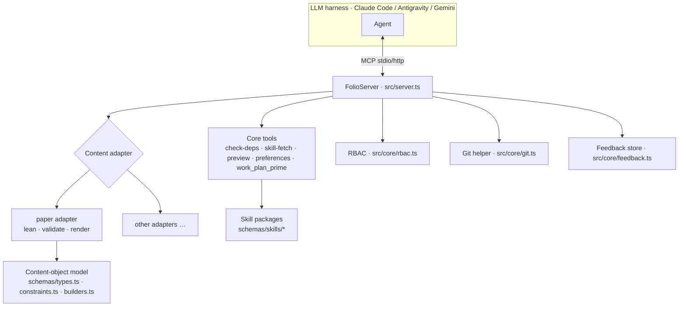

# Architecture
{: .no_toc }

1. TOC
{:toc}

---

## Overview

folio-assistant is an **MCP server** with a pluggable **content adapter** layer,
a **skill** system, a typed **content-object model**, **RBAC**, and a deploy
story. The content it operates on lives in a *separate* repository — the
platform is content-agnostic.

## Repository layout

| Path | What lives here |
|------|-----------------|
| `src/` | The MCP server (`server.ts`), entry point (`index.ts`), core (`git`, `rbac`, `cache`, `feedback`, `logging`), and core tools (`tools/`) |
| `adapters/` | Content adapters — `paper/` (Lean + LaTeX) and the standalone `mcp-server/` |
| `schemas/` | The content-object model (`types.ts`, `constraints.ts`, `builders.ts`) and per-skill JSON Schemas (`schemas/skills/*`) |
| `skills/` | Skill **packages** (`content-lifecycle`, `authoring-math`, `authoring-who-smart-guidelines`) with their Docker manifests |
| `content/` | Content **pipeline** tooling (validators, QA, render helpers) — not content itself |
| `ui/`, `viewer/`, `home_page/` | Web UI, interactive viewer, and the example Pages site |
| `deploy/` | Deployment (Caddy, docker-compose, provisioning, OAuth) |
| `docs/` | This documentation site |
| `.github/` | CI workflows and scripts (build, publish, QA, docs) |
| `.claude/skills/` | Local agent skills + capability hooks |

## The MCP server

`FolioServer` (`src/server.ts`) registers the core tools, then asks the active
**content adapter** to register its tools. It supports two transports — `--stdio`
(what harnesses launch) and `--http` (a shared long-running instance). Tool calls
are logged with timing.

## Content adapters

A content adapter encapsulates everything type-specific: which artifacts exist,
how to validate them, how to build/render them, and which extra MCP tools to
register. The `paper` adapter (`adapters/paper/`) provides Lean lifecycle tools
(`lean_setup`/`build`/`check`/`status`), validation, and rendering
(`paper_render_pdf`/`html`, `formula_render`). New content types add a new
adapter — see [Adding a content type](guides/new-content-type.html).

## Skills and skill packages

A **skill** is a documented, schema-bounded unit of work (e.g.
`lean-formalization`). Skills are grouped into **packages** that declare their
Docker/runtime dependencies via a `package-manifest.json`. The LLM discovers
skills with `skill_list` and loads instructions with `skill_fetch`. The full
list of skills and roles — and how they compose with the LLM (RBAC, capabilities,
requirements) — is on the [Skills & roles](skills.html) page; each skill's
input/output contract is published in the
[Skill schema reference](reference/skills/).

## The content-object model

For papers, content is a tree of typed **blocks** validated at runtime with Zod:

- `schemas/types.ts` — `Block`, `Section`, `Chapter`, `Paper`, and block kinds
- `schemas/constraints.ts` — Zod schemas and constraint rules
- `schemas/builders.ts` — validated constructors (`definition()`, `theorem()`, …)

These are documented in the generated [TypeScript API reference](api/).

## RBAC

`src/core/rbac.ts` provides role-based access control so multi-actor workflows
(business analyst, FHIR modeller, terminologist, clinical SME, …) have scoped
permissions over lifecycle stages.

## Work-plan priming (cross-harness)

The work-plan is stored in `beans` and surfaced three ways so any harness is
primed identically:

1. **`AGENTS.md`** — static discipline, read natively by every agent.
2. **`SessionStart` hook** — each harness runs the shared
   `scripts/session-start-coord-sweep.sh` primer.
3. **`work_plan_prime` MCP tool** — live priming for any MCP-connected agent.

See `docs/folio-assistant-migration.md` for the full cross-agent design.

## Deployment

`deploy/` contains a Caddy reverse-proxy template, `docker-compose.yml`, a
provisioning script, Google OAuth setup, and a self-update script for running a
shared HTTP instance. The skill-package Docker manifests aggregate apt/pip/npm
dependencies into a single image per active package set.
