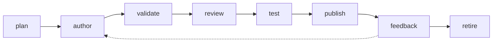
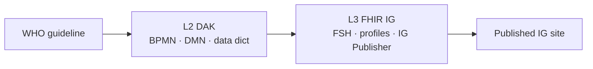

# Content types
{: .no_toc }

folio-assistant is **content-agnostic**: the platform knows nothing about any
particular paper or guideline. Each *kind* of content is supported by a
**content adapter** (code that knows how to validate/build/render that kind) and
a **skill package** (the authoring formalism — what an author and the LLM do).

> This page describes the **formalism** of each content type. It is intentionally
> kept separate from any concrete content; concrete artifacts live in their own
> content repository.

1. TOC
{:toc}

---

## The content lifecycle

Every content type moves through the same lifecycle, provided by the
cross-cutting **`content-lifecycle`** skill package:

| Stage | Skill | What happens |
|-------|-------|--------------|
| plan | `content-plan` | Scope the work, identify artifacts and actors |
| author | `content-author` | Create structured artifacts from source material |
| validate | `content-validate` | Check against schema + constraints |
| review | `content-review` | Human / SME review against criteria |
| test | `content-test` | Automated QA, build green, proofs/validators pass |
| publish | `content-publish` | Render and deploy the published form |
| feedback | `content-feedback` | Capture and route reviewer feedback |
| retire | `content-retire` | Deprecate or archive an artifact |

The lifecycle stages are the same regardless of content type — what differs is
the *authoring* skills and the *artifacts* each type produces. For the full list
of skills and the roles that drive them, see **[Skills & roles](skills.html)**.

---

## Scientific papers & books

**Skill package:** `authoring-math` ·
**Adapter:** `paper` ·
**Guide:** [Writing a paper](guides/writing-a-paper.html)

Rigorous scientific papers and books where prose and mathematics are backed by a
machine-checked **Lean 4** formalization and rendered through **LaTeX**.

- **Source model** — content is a tree of typed *blocks* (`definition`,
  `theorem`, `lemma`, `proof`, `equation`, `prose`, …). See the
  [TypeScript API reference](api/) for `Block`, `Chapter`, and `Paper`.
- **Formalization** — `lean-formalization` and `proof-verification` skills drive
  Lean; each theorem-like block can be tracked against its Lean counterpart, and
  every `sorry` is auditable.
- **Rendering** — `latex-authoring` plus the paper adapter's
  `paper_render_pdf` / `paper_render_html` tools.

| Block kind | Label prefix | Lean? |
|------------|-------------|-------|
| `definition` | `def:` | required |
| `theorem` / `lemma` / `proposition` / `corollary` | `thm:` / `lem:` / … | expected |
| `conjecture` | `conj:` | optional |
| `example` / `remark` / `proof` | `ex:` / `rem:` / `prf:` | optional |
| `prose` / `equation` / `diagram` | — / `eq:` / `fig:` | n/a |

Relevant skill schemas:
[`latex-authoring`](reference/skills/latex-authoring.html),
[`lean-formalization`](reference/skills/lean-formalization.html),
[`proof-verification`](reference/skills/proof-verification.html).

---

## WHO SMART Guidelines DAKs (L2)

**Skill package:** `authoring-who-smart-guidelines` ·
**Guide:** [Authoring a WHO SMART DAK](guides/who-smart-dak.html)

A **Digital Adaptation Kit (DAK)** is the *L2* (machine-readable, but
implementation-neutral) representation of a WHO guideline. folio-assistant
authors the L2 artifacts:

- **Business processes** — BPMN 2.0 workflows (`bpmn-authoring`)
- **Decision logic** — DMN decision tables (`dmn-authoring`)
- **Data dictionaries / core data elements** — Excel / structured tables
- **Terminology** — code systems and value sets (`terminology-management`)
- **Personas, scenarios, indicators, requirements**

Relevant skill schemas:
[`l2-dak-authoring`](reference/skills/l2-dak-authoring.html),
[`bpmn-authoring`](reference/skills/bpmn-authoring.html),
[`dmn-authoring`](reference/skills/dmn-authoring.html),
[`terminology-management`](reference/skills/terminology-management.html).

---

## WHO SMART Implementation Guides (L3)

**Skill package:** `authoring-who-smart-guidelines` ·
**Guide:** [Authoring a WHO SMART IG](guides/who-smart-ig.html)

The *L3* layer turns an L2 DAK into a computable **FHIR Implementation Guide**:

- **FHIR resources** authored as **FSH** (FHIR Shorthand) and compiled with
  **SUSHI** (`l3-fhir-authoring`)
- **Validation** against FHIR profiles (`fhir-validation`)
- **Publication** with the **HL7 FHIR IG Publisher** (`ig-publication`)
- **Quality control** gates (`quality-control`)

Relevant skill schemas:
[`l3-fhir-authoring`](reference/skills/l3-fhir-authoring.html),
[`fhir-validation`](reference/skills/fhir-validation.html),
[`ig-publication`](reference/skills/ig-publication.html),
[`quality-control`](reference/skills/quality-control.html).

---

## Others — extending folio-assistant

New content types are first-class: add a content **adapter** and a skill
**package**, and the lifecycle, RBAC, and MCP plumbing come for free. See
[Adding a content type](guides/new-content-type.html).
